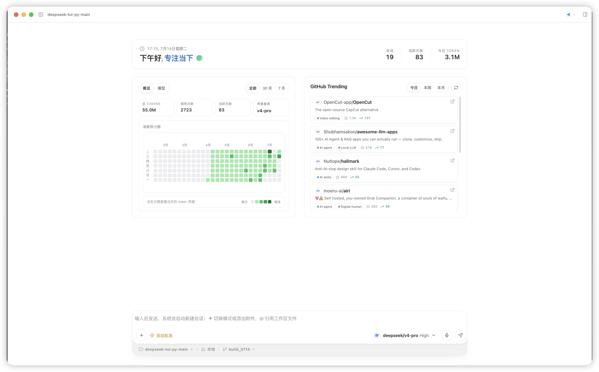

# DeepSeek Workbench

**本地 AI 编程工作台。** 聊天、改代码、看用量、跑自动化——一个 Electron 窗口搞定。

<p align="center">
  
</p>

<p align="center">
  <em>下午好，专注当下 —— 会话、活跃天数、今日 Token，一眼尽收</em>
</p>

---

## 为什么是它

多数 AI 助手只给你一个对话框。Workbench 给你的是**一整块桌面工作台**：

| 你想要的 | 它怎么给 |
|---------|---------|
| 改仓库里的代码 | Agent 读写本地工作区，Diff / 审批一眼过 |
| 知道自己烧了多少 Token | 用量概览 + GitHub 式活跃热力图，点日期看当天 |
| 跟上开源风向 | 主屏右侧 GitHub Trending，今日 / 本周 / 本月 |
| 可信任的执行 | 写文件、跑命令、联网都可审批，策略可记本会话 |
| 扩展能力 | Skills、Plugins、MCP 连接器、自动化任务、飞书投递 |

底层是完整的 Python Agent Runtime（70+ 工具、子代理、策略沙箱）；上面是打磨过的桌面 GUI——不是网页套壳。

> 也喜欢终端？同仓库还带 `deepseek-tui` 文本界面，见文末。

---

## 三分钟启动

**环境**：Python 3.10+（推荐 3.12）、Node.js 20、DeepSeek API Key。

```bash
git clone https://github.com/fjw1049/deepseek-tui-py.git
cd deepseek-tui-py

# 1. Python 运行时
uv venv .venv --python 3.12
uv sync --extra dev

# 2. 配置 Key（任选）
export DEEPSEEK_API_KEY=sk-your-key-here
# 或：mkdir -p .deepseek && cp config.example.toml .deepseek/config.toml  # 填入 api_key

# 3. 安装 GUI 并启动（首次会下载 Electron，约 3–6 分钟）
cd packages/workbench && npm ci && cd ../..
unset ELECTRON_RUN_AS_NODE   # 在 Cursor 里开发时建议执行
./scripts/dev-workbench.sh
```

启动后请用 **Electron 窗口**聊天。`http://127.0.0.1:7878` 是后台 Runtime API，不是界面。

---

## 主界面一览

从上图你能直接看到：

- **问候与状态条**：日期时间 + 会话数 / 活跃天数 / 今日 Token
- **用量概览**：总 Token、调用次数、最高使用模型，以及可点击的活跃热力图
- **GitHub Trending**：今日 / 本周 / 本月热门仓库，刷灵感不切窗口
- **智能体输入框**：`+` 切换模式或加附件，`@` 引用工作区文件；模型与推理强度就在手边

打开会话后还有：流式回复与推理过程、工具调用轨迹、右侧编辑器 / 变更 / 终端 / 预览面板、桌面宠物（可关）。

---

## 功能清单

- **多会话 Agent 聊天** — 流式输出、推理过程、工具卡片、待办与子代理
- **本地工作区** — 绑定项目目录，Agent 直接读写你的代码
- **工具审批** — 写文件 / 跑命令 / 联网可允许、拒绝，或本会话记住
- **变更与 Diff** — 看 Agent 改了什么，再决定进编辑器
- **用量与热力图** — 个人 Token 账本，点日期下钻
- **联网搜索** — AnySearch + Tavily 合并结果，可抓网页
- **智能记忆** — 可选 L0→L3 分层记忆（默认关）
- **自动化任务** — 定时 / 触发式 Agent，结果可投递飞书或邮件
- **MCP 连接器** — `.deepseek/mcp.json` 接外部工具；`@连接器名` 聚焦本轮
- **Skills / Plugins** — 扩展能力面，侧边栏一站管理
- **设置** — 模型、审批策略、外观、Runtime、记忆、自动化、宠物

输入框示例：`@src/main.py 解释这段` · `@yahoo-finance 查英伟达股价`

---

## 常见问题

| 现象 | 处理 |
|------|------|
| 启动报错 `Cannot read properties of undefined` | `unset ELECTRON_RUN_AS_NODE` 后再跑 `./scripts/dev-workbench.sh` |
| 浏览器打开 7878 只有 JSON | 正常——请用 **Electron 窗口** |
| 首次启动很慢 | 第一次 `npm ci` 要下 Electron（~150MB） |
| 连不上 Runtime | 检查 API Key；确认 `.deepseek/config.toml` 或环境变量 |

更细排错见 [`packages/workbench/README.md`](packages/workbench/README.md)。

---

## 配置

运行时数据默认在 `~/.deepseek/`（也可用仓库内 `.deepseek/` 作项目覆盖）：

```toml
# .deepseek/config.toml
provider = "deepseek"
model = "deepseek-v4-pro"

[providers.deepseek]
api_key = "sk-your-key-here"

# 可选：联网搜索（任一 Key 即可）
# anysearch_api_key = ""
# tavily_api_key = ""

[features]
tasks = true
automations = true
mcp = true
```

也可用 `DEEPSEEK_API_KEY`。完整项见 [`config.example.toml`](config.example.toml)。  
MCP 默认：`~/.deepseek/mcp.json`；CLI：`deepseek-tui mcp list|add|enable|focus|…`。

---

## 终端模式（可选）

```bash
uv run deepseek-tui                    # 交互 TUI
uv run deepseek-tui -p "你好"          # 单次问答
uv run deepseek-tui doctor             # 健康检查
```

只起 API：

```bash
uv run deepseek-tui serve --http --host 127.0.0.1 --port 7878 \
  --config .deepseek/config.toml --insecure
```

---

## 开发与测试

```bash
uv sync --extra dev
uv run pytest tests/contract -q
uv run pytest -q -m "not live and not e2e"
cd packages/workbench && npm run typecheck && npm test
./scripts/smoke-workbench-chat.sh      # 需 Runtime 已在 7878
```

内部备忘：[`docs/HANDOVER.md`](docs/HANDOVER.md)。

---

## 仓库结构

```
deepseek-tui-py/
├── packages/workbench/     # Electron 桌面 GUI（React + Vite）
├── src/deepseek_tui/       # Python Runtime / TUI / CLI / 引擎 / 工具 / MCP …
├── scripts/dev-workbench.sh
├── contracts/              # OpenAPI + SSE Schema
├── config.example.toml
└── docs/assets/            # README 截图等
```

基于 [DeepSeek-TUI](https://github.com/deepseek-ai/DeepSeek-TUI)（Rust）的 Python 复刻，含完整 Agent 能力栈。

---

## 许可证

MIT License
