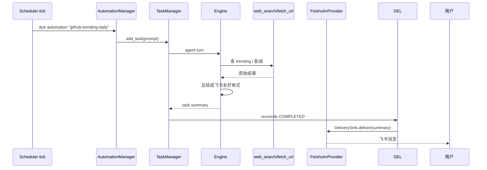
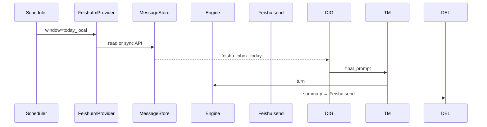
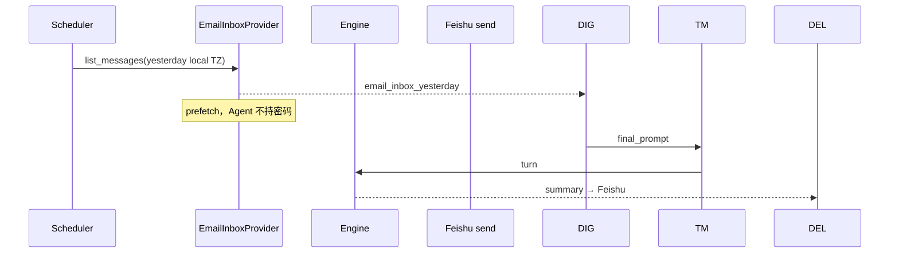
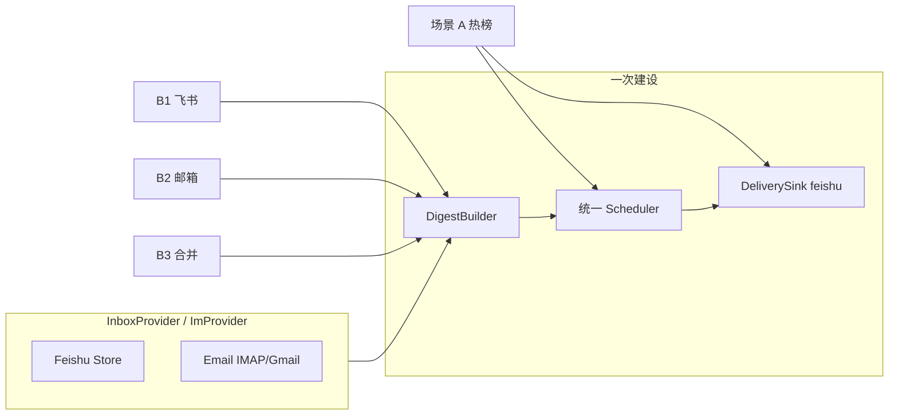

# 自动化框架设计（AUTOMATION_FRAMEWORK）

> 将 OpenHuman 的「多触发源 → 可选门禁 → 多执行器 → 多投递面」模式，**增量适配**到 deepseek-tui-py 已有子系统上。  
> 不另起第二套调度器；Claw 与 `AutomationManager` 收敛为同一条流水线。

**相关文档**：[`WORKBENCH_BACKLOG.md`](./WORKBENCH_BACKLOG.md)（Claw 待办）、[`HANDOVER.md`](./HANDOVER.md)（Automation 已接通条目）、[`SANDBOX_ARCHITECTURE.md`](./SANDBOX_ARCHITECTURE.md)（Task / Automation / SubAgent）。

---

## 1. 目标与边界

### 1.1 目标

| 目标 | 说明 |
|------|------|
| **泛化** | 定时、Webhook、IM 入站、手动 `run_now` 都走同一 `TriggerEnvelope` |
| **兼容** | 现有 `AutomationManager` + `scheduler_tick` 行为不变（默认 `triage=skip`） |
| **可测** | 每层可单测；飞书场景用 Mock IM + 可选真机手验 |
| **可扩展** | 新场景 = 新 `TriggerSource` + 可选 `DeliverySink`，不重写 Engine |

### 1.2 非目标（本阶段不做）

- 完整复刻 OpenHuman Rust EventBus / Composio / 多 channel provider
- Workbench GUI 暴露 Claw Tab（Phase 3 之后）
- 独立 systemd 守护进程（默认仍随 `deepseek serve --http` 进程内 scheduler）

### 1.3 与 OpenHuman 的对照（概念映射）

| OpenHuman | deepseek-tui-py（现状 / 规划） |
|-----------|--------------------------------|
| Cron Agent（无 triage） | ✅ `AutomationManager.scheduler_tick` → `TaskManager` |
| Cron Shell | ⬜ `executor=shell`（可选） |
| Webhook + Triage | ⬜ `POST /v1/triggers` + `triage.py` |
| Composio trigger | ⬜ Phase 4+ 通用 webhook 先行 |
| Channel inbound 全 turn | ⬜ `/v1/claw/webhook/{channel_id}` → 独立 thread |
| Proactive / announce 投递 | ⬜ `delivery=feishu` / `notify` / `thread_sse` |
| `hooks` webhook 外发 | ✅ 已有 — **勿与自动化入站混淆** |

---

## 2. 已有能力（事实基线）

### 2.1 已接通：Automation → Task → Engine

```
AutomationRecord (RRULE)
  → scheduler_tick (15s asyncio loop, features.automations)
  → AutomationRunRecord
  → TaskManager.add_task(prompt, mode=agent, auto_approve=True)
  → Engine 完整 agent turn
```

- 持久化：`$DEEPSEEK_AUTOMATIONS_DIR` 或 `~/.deepseek/automations/`
- 依赖：`features.automations` 且 **`features.tasks=True`**（构造期 fail-fast）
- 测试：`tests/parity/phase_c/test_automation_manager.py`（48 用例）

### 2.2 骨架未接通：Claw / 飞书

- **前端**：`packages/workbench/src/shared/app-settings.ts` — `ClawSettingsV1`、定时任务类型、IM webhook 配置、`buildClawRuntimePrompt`
- **后端**：**无** `claw_schedule_*` 工具、无 webhook 路由、无 Feishu SDK/长连接
- **Backlog**：见 [`WORKBENCH_BACKLOG.md`](./WORKBENCH_BACKLOG.md) P2 Claw 小节

### 2.3 工具面对示范场景的支撑

| 能力 | A：GitHub 热榜 → 飞书 | B1：飞书谁找我 | B2：昨日邮箱有人发信吗 |
|------|----------------------|----------------|------------------------|
| 定时调度 | ✅ Automation RRULE | ✅ | ✅ |
| 拉取数据 | ⚠️ `web_search` / `fetch_url` | ❌ Feishu 入站 Store / API | ❌ **无现成邮件工具**（需 `InboxProvider`） |
| LLM 总结 | ✅ Engine | ✅ Engine | ✅ Engine |
| 发到飞书 | ❌ `ImProvider.send` | ❌ 同上 | ❌ 同上（投递面可共用） |

**结论**：

- **调度 + Agent 归纳** 三类场景都能复用同一条流水线。
- **阻塞**在「外部收件箱适配器」：飞书 = `ImProvider` + `MessageStore`；邮箱 = 新建 `EmailInboxProvider`（IMAP 或 Gmail API）。
- B1 / B2 / 合并简报 **不要各写一套 cron**，应共用 §5.3 的 **Inbox Digest** 模板。

### 2.4 OpenHuman 源码精读（实现真相，非 README 摘要）

阅读路径以 **`src/openhuman/cron/scheduler.rs`** 为准；`cron/README.md` 写 agent job 走 triage，**与调度器实际代码不一致**（文档滞后）。

#### 2.4.1 四条路径对照表

| 路径 | 入口文件 | 是否 triage | 执行 | 投递 |
|------|----------|-------------|------|------|
| **Cron Shell** | `cron/scheduler.rs` `run_job_command` | 否 | 本地 shell + SecurityPolicy | job output / 通知 |
| **Cron Agent** | `cron/scheduler.rs` `run_agent_job` | **否** | `Agent::run_single(prefixed_prompt)` 隔离 agent | `deliver_if_configured` |
| **Webhook** | `webhooks/bus.rs` / `webhooks/ops.rs` | 是 | `TriggerEnvelope::from_webhook` → `run_triage` → `apply_decision` | 依决策 |
| **Composio** | `composio/bus.rs` | 是（可配置 skip） | `from_composio` → `run_triage` → `apply_decision` | 历史 + 子代理 |
| **Channel inbound** | `channels/bus.rs` | **否** | `web::start_chat` 全量 turn | REST 回 channel |

#### 2.4.2 Cron Agent 真实链路（与你的 Automation 最像）

```text
process_due_jobs
  → execute_job_with_retry
    → JobType::Agent => run_agent_job()     # 直接 run_single，无 triage
  → persist_job_result
    → deliver_if_configured(job, output)  # 执行成功后才投递
```

`run_agent_job` 要点（`scheduler.rs:316-450`）：

- Prompt 前缀：`[cron:{job_id} {name}] {prompt}`
- 可选 `agent_id` → `AgentDefinitionRegistry` 覆盖 model / max_iterations / 内置 prompt（如 `morning_briefing`）
- `Agent::from_config` + `run_single`；**不经过** `TriggerEnvelope::from_cron` + triage
- 失败分类：`classify_agent_anyhow_for_user`（用户可见文案与内部 error 分离）

`deliver_if_configured`（`scheduler.rs:541-595`）：

| `delivery.mode` | 行为 |
|-----------------|------|
| `proactive` | `publish_global(ProactiveMessageRequested)` → `channels/proactive.rs` 发 Socket + 可选外渠 |
| `announce` | `CronDeliveryRequested` → `cron/bus.rs` → `Channel::send` |
| 其它 / 空 | 仅 `last_output` 落库 |

`morning_briefing` 种子（`cron/seed.rs`）：`FREQ` 每天 7:00、`agent_id=morning_briefing`、`delivery.mode=proactive`。

#### 2.4.3 Triage 真实链路（外部事件，不是你的定时日报）

```text
TriggerEnvelope { source, external_id, display_label, payload, received_at }
  → run_triage()          # agent/triage/evaluator.rs，小模型分类
  → apply_decision()      # agent/triage/escalation.rs
       Drop / Acknowledge / React(trigger_reactor) / Escalate(orchestrator)
```

- 信封构造：`agent/triage/envelope.rs`（`from_composio` / `from_webhook` / `from_cron` 等工厂）
- Composio：`composio/bus.rs` — `tokio::spawn` 异步 triage，不阻塞 bus
- **注意**：`from_cron` 供 RPC/手动 triage 用；**调度器里的 agent job 不走这条**

#### 2.4.4 进程内解耦：EventBus

OpenHuman 用 `publish_global(DomainEvent::…)` + 订阅者（`cron/bus.rs`、`channels/proactive.rs`）。

Python **不必复刻**完整 EventBus；用 **`asyncio` 回调 / 轻量 `AutomationBus`** 即可：

- 定时任务完成 → 调用 `DeliverySink.deliver(summary)`
- 等价于 `deliver_if_configured`，无需 broadcast 基础设施

---

### 2.5 deepseek-tui-py 与 OpenHuman 的兼容映射（文件级）

| OpenHuman | 你这边已有 | 差距 | 兼容策略 |
|-----------|------------|------|----------|
| `CronJob` + scheduler | `AutomationRecord` + `scheduler_tick` | 字段名不同，语义同 | Phase 1：record → envelope，**不改 JSON 语义** |
| `run_agent_job` | `_enqueue_run_task` → `TaskManager.add_task` | 你是队列 + worker，OH 是同步 `run_single` | **保留 TaskManager**（已有 48 测 + 并发） |
| `deliver_if_configured` | **无** | 任务结果只在 run/task 文件 | Phase 2：`reconcile` 成功后调 `DeliverySink` |
| `DeliveryConfig` | **无** | — | 扩展 `AutomationRecord` 可选字段 `delivery`（默认 `silent`） |
| `AgentDefinitionRegistry` | **无** | 仅 `prompt` 字符串 | MVP 用长 prompt；后可加 `agent_profile` 字段 |
| `ProactiveMessageSubscriber` | Workbench SSE + 系统通知 | 无 `proactive:` thread | `delivery.thread` → `RuntimeThreadManager`；`delivery.feishu` → ImProvider |
| `run_triage` | **无** | — | Phase 4；IM/webhook 才需要 |
| `SubAgent` react | `SubAgentManager` | 已有 | triage `React` → `subagent` executor |
| `ChannelInboundSubscriber` | **无** | Claw 骨架 | Phase 3a：webhook → **二选一**（见 §3.6） |
| `real_task_executor` 隔离 Engine | `engine/executors.py` | task 内 `automations=False` | **保持** — 后台任务不嵌套调度器 |
| `hooks` WebhookHookSink | `hooks/sinks.py` | 向外发事件 | **禁止**与入站 webhook 混用 |
| `user_memory` + turn 注入 | `memory/user_memory.py` + `prompts.py` | 无跨会话 memory 域 | Digest **预取块**注入 user 消息（类似 OH enriched user message） |

---

## 3. 统一架构

### 3.1 总览

```mermaid
flowchart TB
  subgraph sources [TriggerSource 触发源]
    A1[automation_rrule]
    A2[claw_schedule]
    A3[http_trigger]
    A4[im_inbound]
    A5[manual_run_now]
  end

  subgraph core [automation/ 泛化内核]
    ENV[TriggerEnvelope]
    TRI{TriageGate optional}
    EXE[ExecutorRouter]
  end

  subgraph exec [已有执行层 不替换]
    TM[TaskManager.add_task]
    RTE[real_task_executor]
    ENG[Engine.run_single_turn]
    SUB[SubAgentManager]
  end

  subgraph out [DeliverySink 投递]
    F1[feishu_message]
    F2[workbench_sse]
    F3[os_notify]
    F4[run_record_only]
  end

  sources --> ENV
  ENV --> TRI
  TRI -->|drop_ack| END1[结束]
  TRI --> EXE
  EXE --> TM
  TM --> RTE
  RTE --> ENG
  EXE --> SUB
  ENG --> out
  Note over TM,RTE: reconcile 完成后 DeliverySink 对齐 OH deliver_if_configured
```

### 3.2 执行顺序（对齐 OpenHuman，避免常见设计错误）

OpenHuman cron agent 固定为 **先执行、后投递**（`persist_job_result` 内先 `deliver_if_configured`）。

你的兼容实现必须同样：

```text
1. DigestBuilder.prefetch(envelope)   # 邮箱/飞书列表 → XML 块，OH 无对应（你扩展）
2. 拼接 final_prompt = prefix + digest_block + record.prompt
3. TaskManager.add_task(final_prompt)  # 现有 _enqueue_run_task
4. real_task_executor → run_single_turn
5. reconcile_run_statuses → terminal
6. DeliverySink.deliver(task.summary) # 新增，对齐 deliver_if_configured
```

**错误做法**：让 LLM 在 turn 内调「发送到飞书」工具 — 易漏调、难测、难审批。框架层在 step 6 统一投递。

### 3.3 TriggerEnvelope（规划字段）

```python
# 规划位置: src/deepseek_tui/automation/envelope.py

@dataclass
class TriggerEnvelope:
    id: str
    kind: Literal[
        "cron_rrule",      # AutomationManager
        "claw_interval",   # Claw GUI 定时
        "http_webhook",
        "im_inbound",
        "manual",
    ]
    source_id: str          # automation_id / channel_id / route name
    prompt: str
    workspace: str | None
    mode: Literal["agent", "plan"] = "agent"
    triage_policy: Literal["skip", "auto", "rules"] = "skip"
    executor: Literal["task", "subagent", "shell"] = "task"
    delivery: DeliverySpec   # 见下
    metadata: dict[str, Any] = field(default_factory=dict)
```

**默认值（向后兼容）**：从现有 `AutomationRecord` 映射时  
`triage_policy=skip`, `executor=task`, `delivery=run_record_only`。

### 3.4 DeliverySpec（对齐 OpenHuman `DeliveryConfig`）

| mode | OpenHuman 对应 | 行为 |
|------|----------------|------|
| `silent` | delivery 空 / 未配置 | 仅 `AutomationRunRecord` + task 文件（**当前默认**） |
| `proactive` | `mode=proactive` | Workbench：`thread_id=proactive:{job_name}` + SSE；可选再发飞书 |
| `announce` | `mode=announce` + channel + to | `ImProvider.send` / 未来多 channel |
| `feishu` | 无 OH 同名（你的主投递面） | `ImProvider.send(chat_id, summary)` |
| `notify` | 部分重叠 alerts | Electron 系统通知（已有基础设施） |

`AutomationRecord` 扩展（向后兼容）：

```json
{
  "delivery": {
    "mode": "feishu",
    "chat_id": "ou_xxx",
    "best_effort": true
  },
  "digest": {
    "sources": ["email:yesterday_local", "feishu:today_local"]
  },
  "triage_policy": "skip"
}
```

缺省 `delivery` / `digest` 时行为与今天完全一致。

### 3.5 Triage（可选，默认关）

对齐 OpenHuman webhook 路径，**cron / automation 永不 triage**：

| 决策 | 动作 | 执行器 |
|------|------|--------|
| drop | 记日志，结束 | — |
| acknowledge | 短回复 IM | 模板或 1 句 LLM |
| react | 轻量处理 | `SubAgentManager` explore |
| escalate | 完整 agent | `TaskManager` |

实现建议：Phase 4；MVP 全部 `skip`。

### 3.6 IM 入站：Task 路径 vs RuntimeThread 路径

| | **TaskManager**（推荐后台定时/日报） | **RuntimeThreadManager**（推荐交互式 IM） |
|--|--------------------------------------|------------------------------------------|
| 对齐 OH | `run_agent_job` + 隔离 agent | `channels/bus.rs` `start_chat` |
| Workbench | 任务列表 / jobs API，侧栏不刷屏 | Timeline SSE 可见对话 |
| 隔离 | `real_task_executor` 独立 Engine | per-thread Engine LRU |
| 回复飞书 | `DeliverySink` 在 turn 完成后 | turn 结束同样可调 `DeliverySink` |

**兼容决策**：

- **场景 A/B 定时日报** → 继续 **TaskManager** + `delivery.feishu`
- **用户主动给 bot 发消息** → **RuntimeThreadManager** + `thread_id=claw:feishu:…` + `buildClawRuntimePrompt`
- 共用 `ImProvider.send` 回复，共用 `MessageStore` 供 B1 读取

### 3.7 与 Hooks 的区分

| 系统 | 方向 | 用途 |
|------|------|------|
| `deepseek_tui.hooks` | Engine **向外** POST | 审计、CI、外部日志 |
| `automation` + Claw webhook | **向内** 触发 turn | 飞书消息、外部 cron |

---

## 4. 目录与阶段

### Phase 0 — 本文档 + 类型契约 ✅

- 字段约定、场景映射、测试策略（下文 §6、§7）

### Phase 1 — 信封 + 执行器门面（Python only，零行为变化）

新增 `src/deepseek_tui/automation/`：

| 模块 | 职责 |
|------|------|
| `envelope.py` | `TriggerEnvelope`, `TriggerSource`, `TimeWindow` |
| `digest.py` | `DigestBuilder` — 调 `InboxProvider` / `MessageStore` 拼 XML |
| `dispatch.py` | `dispatch(envelope, *, task_manager)` — 包装现有 `_enqueue_run_task` |
| `delivery.py` | `DeliverySink` 协议 + `SilentDeliverySink` |

改动点（最小侵入）：

1. `AutomationManager.scheduler_tick`：due 时 `dispatch()` 代替直接 `_enqueue_run_task`
2. `AutomationManager.reconcile_run_statuses`：run → `COMPLETED` 时若 `delivery.mode != silent`，读 `task.summary` 调 `DeliverySink`（对齐 OH **执行后投递**）
3. **不**改 `real_task_executor`、`create_tool_runtime` 契约

**回归**：`tests/parity/phase_c/test_automation_manager.py` 全绿；新增 envelope 默认字段测试。

### Phase 2 — 投递面 + HTTP 入站

- `FeishuDeliverySink` / `NotifyDeliverySink` / `ProactiveThreadSink`（Workbench store）
- `POST /v1/triggers` — 构造 envelope，`triage_policy` 默认 `skip` 或 `auto`
- 可选 `GET /v1/automations*`（HANDOVER 债）
- **不在此阶段**做完整 triage

### Phase 3a — 飞书 IM（Claw 后端）

顺序与 backlog 一致：

1. `ImProvider` 协议：`send_message`, `list_messages_since`, `on_event`（可选长连接）
2. `FeishuImProvider`：app_id / app_secret，发消息 API
3. `POST /v1/claw/webhook/{channel_id}` 或事件订阅 → `im_inbound` envelope
4. **不新增** `claw_schedule_*` 工具（避免与 `automation_*` 重复）— Claw GUI 任务写入 **同一** `AutomationRecord` 存储，打 `metadata.source=claw_gui`
5. `buildClawRuntimePrompt`（`app-settings.ts`）作为 **PromptAdapter**，在 `dispatch` 拼 prompt 时调用

**Thread 隔离（推荐）**：

- `thread_id = claw:feishu:{channel_id}:{conversation_id}`
- `workspace` = `~/.deepseekgui/claw/feishu/...`（已有 settings-store 建目录逻辑）

### Phase 3b — 邮箱收件箱（与 3a 平级）

仓库 **当前无** Gmail/IMAP 工具；邮箱日报依赖本阶段。

1. `InboxProvider` 协议（与 `ImProvider` 对称）：

   ```text
   list_messages(window: TimeWindow) -> list[InboxMessage]
   # InboxMessage: id, from, subject, snippet, received_at, labels?, thread_id?
   ```

2. 实现选型（MVP 推荐顺序）：

   | 实现 | 优点 | 缺点 |
   |------|------|------|
   | **IMAP + app password** | 通用（Gmail/QQ/企业邮）、无 Google Cloud 项目 | 需存凭据；Gmail 要开「应用专用密码」 |
   | **Gmail API + OAuth** | 官方、可增量 sync | 配置重；token 刷新要保管 |
   | **Agent 自己 fetch_url** | 零代码 | ❌ 无法读私有收件箱，**不可用** |

3. 凭据：`~/.deepseek/secrets/email.toml`（gitignore）或环境变量；**禁止**写进 automation JSON。

4. 在 `dispatch()` **进 Engine 之前** 由框架注入 `<email_inbox_yesterday>`（与飞书块同理），Agent **只读已脱敏块**，不直接拿密码。

5. 可选工具 `email_inbox_list`（只读、需审批）供交互场景；**定时日报推荐框架预取**，避免 LLM 漏调工具。

### Phase 4 — Triage + 子代理分流

- webhook / IM 可 `triage_policy=auto`；cron 仍 `skip`

### Phase 5 — 记忆增强（正交）

- 自动化 turn 开启 `memory_enabled` + `working_set`（Engine 已接线）
- 不做 OpenHuman 全量 memory 域

---

## 5. 示范场景（产品级）

### 5.1 场景 A：每天定时把「GitHub 热榜」发到飞书

**用户故事**：每天早上 8:00，飞书收到一条消息：今日 GitHub Trending 摘要（Top N）。



**实现要点**：

| 项 | 说明 |
|----|------|
| 调度 | `FREQ=DAILY;BYHOUR=8;BYMINUTE=0` |
| 热榜数据 | `web_search` / `fetch_url`（`github_tools` 仅 issue/PR，无 trending） |
| 审批 | `auto_approve=True`（现 `_enqueue_run_task` 默认） |
| 投递 | Phase 2 `delivery.feishu` — **框架在 reconcile 后发送**，不是 Agent 调工具 |
| 测试 | Mock `DeliverySink` 断言 `summary` 非空；见 §6 |

**可行性**：✅ **逻辑完全可实现**；当前缺飞书 **出站**，调度与 agent 已有。

---

### 5.2 场景 B 族：收件箱日报（Inbox Digest）

三类需求本质是 **同一产品模式**：定时拉取「某收件箱」→ 结构化上下文 → Agent 归纳 → **统一投递到飞书**（或邮件/桌面通知）。

| 子场景 | 时间窗 | 数据源 | 典型 cron |
|--------|--------|--------|-----------|
| **B1 飞书** | 今天 00:00 → now | `MessageStore` / Feishu API | 每天 18:00 |
| **B2 邮箱** | **昨天** 00:00–23:59（本地时区） | `EmailInboxProvider` IMAP/Gmail | 每天 08:00 |
| **B3 合并早报** | 昨日邮件 + 今日飞书 | 两者 | 每天 08:00 一条消息 |

用户口头说的「今天飞书谁找我」和「昨天邮箱有没有人发信」——**时间窗不同**，实现时应显式配置 `window`，不要混在 prompt 里用自然语言猜。

#### 5.2.1 B1 — 飞书：今天谁找过我



| 项 | 说明 |
|----|------|
| 数据来源 | **入站写 Store**（webhook）优先；补拉 API 作兜底 |
| 飞书限制 | 汇总范围 = **机器人能收到的会话**；不是用户账号下全部聊天 |
| 测试 | Mock Store 3 条消息 → 断言摘要含 sender |

**可行性**：✅ bot 可见范围内可实现。

#### 5.2.2 B2 — 邮箱：昨天是否有人给我发邮件



| 项 | 说明 |
|----|------|
| 查询 | IMAP `SINCE`/`BEFORE` 或 Gmail `q=newer_than:1d older_than:0d` 按 **本地日历昨天** 换算 UTC |
| 输出结构 | 建议固定四段：①有无邮件 ②发件人列表 ③每封 1 句摘要 ④建议回复优先级 |
| 隐私 | 默认 **只注入 snippet**（前 200 字），不拉附件；敏感 subject 可配置脱敏 |
| 凭据 | 应用专用密码 / OAuth refresh token，仅框架层读取 |
| 与 Agent 分工 | **推荐**：调度器线程预取 → 注入 XML 块；不让 LLM 自己「登录邮箱」 |

**可行性**：✅ **技术上成熟**（IMAP/Gmail 都是常规能力）；仓库需 **新增 Phase 3b**，与飞书无代码复用，但共用 **Digest 流水线 + DeliverySink**。

**注意**：

- Gmail 个人版：开 IMAP + [应用专用密码](https://support.google.com/accounts/answer/185833)，或走 OAuth。
- 企业邮：往往是 IMAP/SMTP 服务器 + 域账号。
- 「有没有人发」= `count > 0` 即可回答；「什么事」= subject + snippet 归纳，**不必**全文。

#### 5.2.3 B3 — 合并早报（推荐最终形态）

一条 automation、一次投递，减少飞书刷屏：

```text
【昨日邮箱】3 封需关注：张三「合同修订」、GitHub noreply「CI failed」…
【今日飞书】2 人：李四问 API 进度、项目群 @你 看 PR
```

实现：`digest_sources: ["email:yesterday", "feishu:today"]`，`dispatch` 前依次调用各 `InboxProvider`，拼成一个 `<daily_digest>` 块。

---

### 5.3 场景 A 与 B 族共享的基础设施



**推荐落地顺序**：

1. Phase 1 信封 + Phase 3a 飞书 **send**
2. Phase 3b 邮箱 **只读** + 昨日窗口（B2 易手验：发自己几封测试信）
3. Phase 3a 入站 Store（B1）
4. `DigestBuilder` 合并（B3）
5. 场景 A 热榜（与收件箱无关，随时可加）

---

## 6. 测试策略

### 6.1 分层

| 层 | 范围 | 工具 | 门禁 |
|----|------|------|------|
| **L1 单元** | `envelope`, `schedule.next_after`, triage 规则 | pytest | CI 必过 |
| **L2 集成** | `AutomationManager` + mock `TaskManager` | 现有 48 + 新增 | CI 必过 |
| **L3 契约** | `POST /v1/triggers` schema | `tests/contract` | CI |
| **L4 IM 模拟** | `MockImProvider` 记录 send/list | pytest + tmp_path | CI |
| **L5 手验** | 真飞书测试企业 | 开发者本机 | 发布前 checklist |

### 6.2 不依赖飞书的 CI 默认路径

```python
# 规划: tests/automation/test_delivery_feishu_mock.py

class MockImProvider:
    sent: list[tuple[str, str]] = []

    async def send_message(self, chat_id: str, text: str) -> None:
        self.sent.append((chat_id, text))

async def test_github_trending_job_calls_send():
    # 1. 注册 mock provider 到 DeliverySink
    # 2. dispatch envelope(kind=cron_rrule, delivery=feishu)
    # 3. 用 stub Engine 返回固定 summary
    # 4. assert mock.sent[-1][1] 含 "GitHub" 或 stub 关键字
```

Engine 在集成测可 **patch** `TaskManager` 的 executor 回调，避免真 LLM。

### 6.3 邮箱手验清单（Phase 3b，可不依赖飞书）

1. 在测试 Gmail/邮箱给自己发 2 封（主题可区分「需回复」/「通知」）
2. 配置 IMAP 应用专用密码于 `email.toml`（勿提交 git）
3. 手动 `run_now` automation `email-inbox-digest-morning`（先 `delivery=silent` 看 task 输出）
4. 检查 XML 块是否只含昨日邮件、snippet 无密码泄漏
5. 接上 `delivery=feishu` 或先看 Workbench task 日志

CI：`MockEmailInboxProvider` 返回 2 封固定 `InboxMessage`，断言 digest 含 `from` 与 `subject`。

### 6.4 飞书真机手验清单（Phase 3a 完成后）

1. 飞书开放平台创建企业自建应用，记下 `app_id` / `app_secret`
2. 开通权限：`im:message`（发）、收消息事件；读历史若 API 支持则开 `im:message:readonly` 等（以官方文档为准）
3. 配置事件订阅 URL → 本机 `ngrok` → `https://.../v1/claw/webhook/{channel_id}`
4. **场景 A**：创建 daily automation，prompt 见 §7.1，目的一条飞书消息
5. **场景 B**：向 bot 发 2 条不同 `sender` 测试消息，触发汇总 job，检查归纳是否分人
6. 记录限制：若汇总为空，检查 bot 是否未加入群 / 未收到私信

### 6.5 与 OpenHuman 式 E2E 的差异

- OpenHuman：desktop WDIO + mock backend  
- 本项目：**Runtime HTTP + Mock IM** 为主；飞书属外部 SaaS，CI 不跑真连接

---

## 7. 推荐 Prompt / 配置草案

### 7.1 场景 A — automation 记录示例

```text
name: github-trending-daily
rrule: FREQ=DAILY;BYHOUR=8;BYMINUTE=0
prompt: |
  你是日报助手。用 web_search 查询「GitHub trending repositories today」，
  整理 Top 10：仓库名、一句话说明、链接。中文输出，控制在 1500 字内。
  完成后必须通过 feishu_delivery 工具（或系统注入的 delivery）发送到 chat_id={{FEISHU_CHAT_ID}}。
delivery:
  mode: feishu
  chat_id: "<你的飞书 open_id 或 chat_id>"
triage_policy: skip
executor: task
```

（`feishu_delivery` 工具名为规划；Phase 3 可由 `DeliverySink` 在 turn 结束时自动 send，无需 LLM 显式调工具。）

### 7.2 场景 B1 — 飞书今日汇总

```text
name: feishu-inbox-digest-evening
rrule: FREQ=DAILY;BYHOUR=18;BYMINUTE=0
digest:
  sources: [feishu:today_local]
prompt: |
  根据 <feishu_inbox_today> 按发送者分组汇总。无消息则写「今日暂无新的飞书消息」。
delivery:
  mode: feishu
  chat_id: "<open_id>"
```

```xml
<feishu_inbox_today window="2026-05-28T00:00+08:00..now">
- [09:12] sender=张三 chat=私聊: 请问 API 何时好？
</feishu_inbox_today>
```

### 7.3 场景 B2 — 昨日邮箱汇总（定时）

```text
name: email-inbox-digest-morning
rrule: FREQ=DAILY;BYHOUR=8;BYMINUTE=0
digest:
  sources: [email:yesterday_local]
  account: default   # 指向 ~/.deepseek/secrets/email.toml 某条目
prompt: |
  根据 <email_inbox_yesterday> 回答：
  1) 昨日是否有需要我亲自回复的邮件（排除明显营销/自动通知）
  2) 按发件人列出：主题 + 一句话摘要 + 建议优先级（高/中/低/忽略）
  3) 若昨日 0 封，明确写「昨日收件箱无新邮件」
delivery:
  mode: feishu
  chat_id: "<同上>"
```

```xml
<email_inbox_yesterday window="2026-05-27 local">
- [2026-05-27 09:15] from=zhangsan@corp.com subject="合同修订" snippet="请确认附件…"
- [2026-05-27 22:01] from=noreply@github.com subject="[repo] CI failed" snippet="Run #42…"
</email_inbox_yesterday>
```

框架在 **dispatch 前** 拉取并注入；Agent 不接触密码。

### 7.4 场景 B3 — 合并早报

```text
name: morning-brief-feishu-email
rrule: FREQ=DAILY;BYHOUR=8;BYMINUTE=0
digest:
  sources: [email:yesterday_local, feishu:today_local]
prompt: |
  根据 <daily_digest> 输出两段：【昨日邮箱】【今日飞书】。各段最多 10 条要点。
delivery:
  mode: feishu
  chat_id: "<同上>"
```

---

## 8. 关键决策（已推荐默认值）

| # | 问题 | 推荐 |
|---|------|------|
| 1 | Thread 是否与 Workbench 聊天共用？ | **否** — `claw:feishu:...` 独立 thread |
| 2 | Scheduler 进程模型？ | **进程内 asyncio**（与现 `run_scheduler_loop` 一致） |
| 3 | Claw 与 Automation 存储？ | **单存储 + source 字段**，避免双 RRULE 实现 |
| 4 | Cron 是否 triage？ | **永不** |
| 5 | 飞书只做 Feishu？ | MVP **是**；`ImProvider` 留扩展点 |

---

## 9. 实现检查表（跟踪）

- [x] Phase 1：`src/deepseek_tui/automation/{types,pipeline}.py` + `automation_manager` 接线
- [x] Phase 1：`tests/test_automation_pipeline.py`
- [x] Phase 2：`delivery.feishu` → `feishu_send_text`（httpx）
- [x] Phase 3b：IMAP 预取 + `docs/automation-email.example.toml`
- [x] Phase 3a 部分：`feishu_inbox.jsonl` + `POST /v1/automation/feishu/inbound`
- [x] Phase 1：回归 `tests/test_automation_manager.py`
- [x] Phase 2：`POST /v1/triggers` 通用入口
- [x] Phase 2：`GET/POST /v1/automations*` CRUD + run/pause/resume/runs
- [x] Phase 3a：入站 `run_agent=true` → 后台 Agent turn + 飞书回复
- [x] Phase 3b+3a：`DigestBuilder` B3 合并（`digest.sources` 多源）
- [x] Phase 4：可选 triage（`triage.py`，默认 `skip`）
- [x] Phase 2：`delivery.mode=proactive|notify` + `thread_id` → Workbench SSE 通知项
- [ ] Phase 3a：场景 B1 手验（bot 可见范围内）
- [ ] Phase 3b：场景 B2 手验（昨日 IMAP 窗口）
- [ ] Phase 3a：场景 A 热榜手验
- [ ] 文档：飞书权限与限制 FAQ（真机踩坑后补 §12）

---

## 12. 飞书权限与限制（FAQ 草案）

| 项 | 说明 |
|----|------|
| 发消息 | 自建应用需 `im:message`；`feishu.toml` 或 `DEEPSEEK_FEISHU_APP_ID` / `SECRET` |
| 收消息 | 事件订阅指向 `POST /v1/automation/feishu/inbound`；可选 `DEEPSEEK_FEISHU_WEBHOOK_SECRET` |
| 自动回复 | 请求体 `run_agent: true` 在后台跑 `claw:feishu:{chat}:{sender}` 线程并 `feishu_send_text` |
| 汇总 cron | 不依赖 bot 历史 API；用 JSONL 入站 + `digest.sources: ["feishu:today_local"]` |
| 常见空汇总 | bot 未进群/未收事件、时区窗口不对、或入站 webhook 未配置 |

---

## 10. 修订记录

| 日期 | 说明 |
|------|------|
| 2026-05-28 | 初版：架构、OpenHuman 映射、场景 A/B、测试策略 |
| 2026-05-28 | 扩展场景 B 族：邮箱昨日汇总 B2、合并早报 B3、`InboxProvider` / Phase 3b |
| 2026-05-28 | 复审：对照 OH `scheduler.rs` 纠正 triage 误区；补充文件级兼容映射、执行后投递、Task vs RuntimeThread |
| 2026-05-28 | 实现：`/v1/triggers`、`/v1/automations*`、Feishu `run_agent`、triage、proactive thread 通知 |

---

## 11. 文档自检（审核结论）

| 检查项 | 结论 |
|--------|------|
| OpenHuman cron agent 是否走 triage？ | 文档已纠正：**不走**（以 `run_agent_job` 为准） |
| 现有 automation 测试是否被破坏？ | Phase 1 要求默认 `silent` + 同一 `_enqueue_run_task` 路径 |
| 是否与 `real_task_executor` 冲突？ | 否；后台 task 仍 `automations=False`，避免嵌套 scheduler |
| Claw 双调度器风险？ | 已改为 Claw GUI → 同一 `AutomationRecord`，不新增 `claw_schedule_*` |
| Hooks webhook 混淆？ | §3.7 明确区分 |
| 场景 A/B 技术可行性？ | 是；阻塞为 `DeliverySink` + `InboxProvider` / Feishu，非 Agent |
| Phase 顺序是否合理？ | 1 信封 → 2 投递 → 3b 邮箱（易测）→ 3a 飞书 → 4 triage |

**审核结果：文档可作为实现依据。** 若开工，从 Phase 1 + Phase 2 的 `DeliverySink` 开始，B2 邮箱手验不依赖飞书权限，适合先做。
