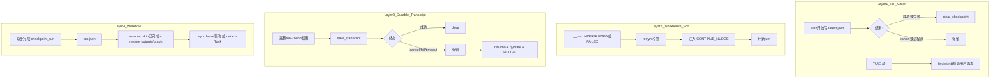
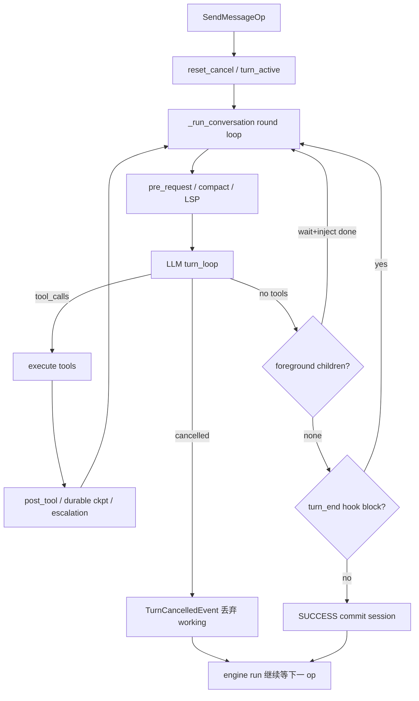
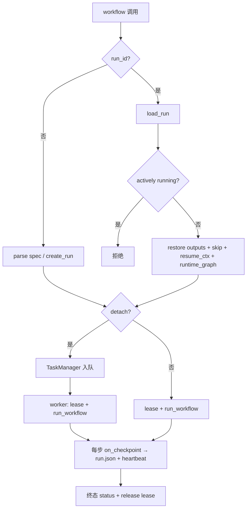

# 全系统断续重新跑逻辑审核

> 审核日期：2026-08-01。只读梳理，不改业务语义。  
> 用途：对齐「断了再跑」相关术语与边界，供后续改设计时对照。

## 结论

仓库里至少有 **四套**「断了再跑」机制，落盘位置、恢复粒度、清除条件都不同；排查或改设计时不要串线。

| 层级 | 机制 | 恢复粒度 | 落盘 |
|------|------|----------|------|
| TUI 主会话 | Crash checkpoint | turn **起点** 消息回填，不自动重跑 | `~/.deepseek/sessions/checkpoints/latest.json` |
| Workbench 线程 | Soft-resume + `CONTINUE_NUDGE` | 新 turn「接着说」 | threads store（非 transcript 文件） |
| Task / SubAgent | Durable transcript | **完整 tool-round** 真续跑 | `tasks/.../transcripts/` 或 `agents/runs/<id>/transcript.json` |
| Workflow | `run.json` DAG checkpoint | 已完成 step 跳过，从未完成节点继续 | `~/.deepseek/workflow/<run_id>/run.json` |

易混淆、**不负责**对话/工作流续跑的同名概念：

- **Capacity checkpoint**（`run_pre_request_checkpoint` 等）：内存容量/压缩
- **TurnCheckpointStore**：Workbench 工作区文件 rewind
- SQLite `checkpoints` 表：schema 有，代码侧未见读写

---

## 总览



---

## 1. Engine 单 turn 循环（原子节拍）

关键路径：`src/deepseek_tui/engine/orchestrator/core.py`

```
SendMessageOp
  → 拼 working_messages / TurnStarted / crash checkpoint
  → _run_conversation 多轮:
       drain steers
       → pre_request capacity / compact / LSP
       → LLM
       → 有 tools: 执行 → post_tool → on_turn_checkpoint → 再 LLM
       → 无 tools: 可能等子 agent handoff 再 LLM，否则 SUCCESS
  → 仅 SUCCESS 才 commit 到 session_messages
```

要点：

- **cancel / error 不能原地续同一 turn**：working 状态丢弃；外层 `run()` 仍可收下一条 op。
- Parent 等直接子 agent（#756）：模型无 tool_calls 时 wait → 注入 `<deepseek:subagent.done>` → **同一 turn 再跑一轮 LLM**。
- background 子 agent：parent 空闲后用 hidden `SendMessageOp` 开新 turn。



---

## 2. TUI Crash Checkpoint（会话级回填，非真续跑）

| 动作 | 时机 | 代码 |
|------|------|------|
| 保存 | 每个 turn 开始 | `engine/orchestrator/maintenance.py` `_save_crash_checkpoint` |
| 清除 | turn **未 cancel** 结束（成功或失败都清） | `orchestrator/core.py` → `state/session.py` `clear_checkpoint` |
| 恢复 | TUI 启动且无 `--resume`/`--fork` | `tui/session_restore.py` / `tui/app.py` |

路径：`user_checkpoints_dir() / "latest.json"`（通常 `~/.deepseek/sessions/checkpoints/latest.json`）。

限制：

- 全局单文件，多会话/多 workspace 会互相覆盖
- 恢复只 hydrate 消息，**不自动重跑未完成 turn**
- cancel 故意保留文件；数据清理会 prune 超过约 7 天的 stale checkpoint（`data_inventory`）

---

## 3. Durable Transcript（Task / SubAgent 真续跑）

契约写在 `src/deepseek_tui/tools/durable_transcript.py`：

> Checkpoint boundary: a completed tool-round (assistant + all tool_results).  
> Never resume mid-tool.

`CONTINUE_NUDGE`：

```text
Continue from the checkpoint above. Do not repeat tool calls whose
results are already in the conversation; finish the original objective.
```

| | Task | SubAgent |
|--|------|----------|
| 保存 | 完整 round 后 `on_turn_checkpoint`（`engine/dispatch.py`） | loop `_save_complete_checkpoint`；cancel 写上一完整 round |
| 恢复 | `resume_task` → hydrate + nudge 作 prompt | `manager.resume` → loop hydrate + ephemeral nudge |
| 清除 | 成功完成才 `clear_transcript` | loop 正常跑完才 clear |
| 路径 | `<TaskManager.data_dir>/transcripts/<task_id>.json` | `~/.deepseek/agents/runs/<agent_id>/transcript.json` |

```mermaid
sequenceDiagram
  participant Loop as TaskOrSubAgent
  participant Disk as transcript.json
  Loop->>Loop: assistant加全部tool_results
  Loop->>Disk: save round_complete
  Note over Loop: cancel mid-tool
  Loop->>Disk: 写回上一完整round
  Loop->>Disk: resume load
  Disk-->>Loop: messages加steps_taken
  Loop->>Loop: CONTINUE_NUDGE后下一LLM round
```

已知坑：

1. 无完整 round 就 cancel → 无 transcript → resume 退化为从原 prompt 重来
2. `round_complete` 字段预留 mid-round，当前实现恒为 True
3. Task 无 `data_dir` 时 checkpoint hook 空转
4. SubAgent 落盘前必须剥掉 ephemeral nudge，避免叠 nudge

---

## 4. Workbench Soft-resume（线程级「接着说」）

关键路径：`src/deepseek_tui/server/threads/manager.py`（`start_turn`）

上一 turn 为 `INTERRUPTED` / `FAILED` 且新 turn 非 hidden 时：

1. `_resync_warm_engine_from_store(thread_id)`
2. 在占住 turn slot 后注入 system-reminder 包装的 `CONTINUE_NUDGE`
3. 开**新 turn**

这不是 transcript 文件恢复，是会话语义上的「别重复已有 tool 结果」。`phase_bridge` 只做 UI 叙述，不参与 resume 控制流。

---

## 5. Workflow DAG Checkpoint（步骤级断点续跑）

关键路径：

| 职责 | 文件 |
|------|------|
| 调度 ready-set | `workflow/runtime.py` |
| 落盘 / lease / stop-intent | `workflow/store.py` |
| 工具入口 create/resume | `tools/workflow.py` |
| detach worker | `workflow/detach.py` |

### Run / 节点状态

- Run：`running → completed | failed | cancelled | interrupted | timed_out`
- 节点：`queued → running → done | error | skipped`

Lease：心跳新鲜度 `< 90s` 且 owner pid 存活视为活跃；无 lease 时退回 `updated_at < 300s` 启发式（`ACTIVE_RUN_STALE_SECONDS`）。

### Resume 注入

- 经 `prepare_workflow_resume`：保留成功 outputs；清空 failed/skipped 以便重试；恢复 `runtime_graph` / dynamic bags
- sync 与 detach 共用同一套 restore（显式 `resume_ctx` 参数，不再 setattr 到 slots Spec）
- `completed` 不可再 resume；整图重跑需新建 run

### `on_error`

| | `continue`（默认） | `fail_fast` |
|--|-------------------|-------------|
| step 失败 | 记 error，跳过普通后继 | 取消并发并抛 `WorkflowFailedError` |
| `partial` join | 有 ≥1 成功前驱仍可调度 | 同左（预算等硬失败仍抛） |

**无**自动重试；**无**公开「从某 step 重跑」API。loop 体内会清 body completed，那是循环语义，不是失败重试。

### Detach

1. `detach: true` → TaskManager 入队，立刻返回 `run_id` + `task_id`
2. Worker：`execute_detached_workflow` 持 lease → 同 resume 语义的 `run_workflow`
3. 无独立 attach；同步 `workflow({run_id})` 或再 detach 即续跑



---

## 6. 取消 / 失败 / 崩溃对照

| 场景 | Crash `latest.json` | Durable transcript | Workflow `run.json` |
|------|---------------------|--------------------|---------------------|
| 进程崩溃 | 保留 turn 起点 | 保留上一完整 round | 保留最近一次成功 checkpoint |
| 用户 cancel | 保留（不清） | 保留（SubAgent 写 cancel 快照） | `cancelled`；可再 resume |
| 失败 | **清除** | Task 保留 | `failed`；可再 resume（失败重试，成功跳过） |
| 成功 | 清除 | 清除 | `completed`；拒绝再 resume |

---

## 7. 关键代码索引

| 职责 | 路径 |
|------|------|
| Transcript 模型 / `CONTINUE_NUDGE` | `src/deepseek_tui/tools/durable_transcript.py` |
| Crash 写盘 | `src/deepseek_tui/engine/orchestrator/maintenance.py` |
| Crash 清盘 | `src/deepseek_tui/state/session.py` |
| Crash 恢复 | `src/deepseek_tui/tui/session_restore.py` |
| Task hydrate + checkpoint hook | `src/deepseek_tui/engine/dispatch.py` |
| Task 重入队 | `src/deepseek_tui/tools/task/manager.py` `resume_task` |
| SubAgent 存/恢 | `src/deepseek_tui/tools/subagent/loop.py` |
| Soft-resume | `src/deepseek_tui/server/threads/manager.py` |
| Workflow checkpoint / lease | `src/deepseek_tui/workflow/store.py` |
| Workflow detach | `src/deepseek_tui/workflow/detach.py` |
| Workflow 工具入口 | `src/deepseek_tui/tools/workflow.py` |
| 契约测试 | `tests/test_durable_resume.py`、`tests/workflow/*` |

---

## 8. 设计边界（改想法前先对齐）

1. **粒度**：turn 起点 / 完整 tool-round / DAG step / 单 tool 中途——当前系统**刻意不做 mid-tool resume**。
2. **失败是否重跑**：workflow resume 会重试失败/级联跳过（保留成功）；durable 是「从消息断点继续」；主会话失败会清掉 crash checkpoint。
3. **软续跑 vs 真续跑**：Workbench `CONTINUE_NUDGE` 靠模型自觉；Task/SubAgent/Workflow 有结构化状态恢复。
4. **同名陷阱**：capacity / crash / durable / workflow / file-rewind 都叫 checkpoint。
5. **单点全局态**：TUI `latest.json` 全局一份，多会话会覆盖。

---

## 9. Workflow 断续：已确认问题与修复（2026-08-01）

### 已修复（业界语义）

统一入口：`prepare_workflow_resume` / `apply_resume_plan_to_spec`（`workflow/store.py`）。

| 规则 | 行为 |
|------|------|
| 已成功 step / fanout·pipeline item | 保留 outputs，skip 不重跑 |
| 失败 step / 级联 skipped | resume 时清空，**重试**（CI re-run failed） |
| runtime_graph / dynamic / budgets | 保留 |
| sync 与 detach | **同一套** restore（含 `initial_graph` + `_resume_ctx`） |

附带：fanout/pipeline 失败与成功 item 均 checkpoint；pipeline resume 跳过已有 item outputs；nested dynamic 转发 `on_checkpoint`。

### 仍属设计边界

- `safe_checkpoint_run` 吞 I/O 异常
- lease 依赖 pid 心跳
- `completed` 不可再 resume
- 与 Task durable transcript 仍是两套机制
