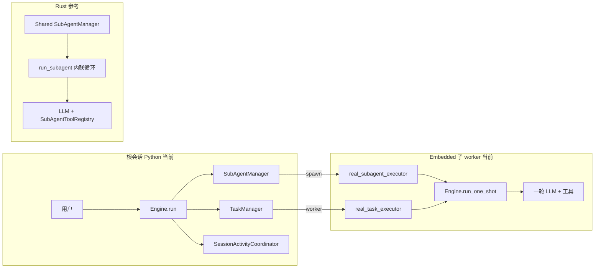

# Embedded Executor 与 Rust 子循环对照

本文说明 Python TUI 里 **embedded** 子 Engine 的定位：它解决什么问题、与改之前的实现差在哪、与 Rust 参考实现差在哪、以及若要做完整 parity 的演进方向。

---

## 一句话

| 模式 | 含义 |
|------|------|
| **根 Engine** | 用户会话：完整 `ToolRuntime` + `Engine.run()` + 活动协调器 + #756 |
| **Embedded Engine** | 子 agent / 后台 task 的**一次性** LLM 回合：复用 `Engine` 的 turn 逻辑，但**禁止**再长一棵 Task/SubAgent/MCP/hooks 树，且**不**调用 `Engine.run()` |
| **Rust `run_subagent()`** | 专用瘦循环 + 共享 `SubAgentRuntime` / `SubAgentManager`，从不复制整棵 session 运行时 |

---

## 架构对照（总览）



---

## 对照表 A：三种实现路径

| 维度 | 旧 Python（出问题前） | 当前 Python **embedded** | Rust 参考实现 |
|------|----------------------|---------------------------|---------------|
| 子 agent 入口 | `real_subagent_executor` | 同左 | `run_subagent_task` → `run_subagent()` |
| 子 task 入口 | `real_task_executor` | 同左 | `EngineTaskExecutor` / `run_task` |
| 子进程如何跑 LLM | `Engine.create()` + `engine.run()` + `send_message` | `Engine.create(embedded 配置)` + **`run_one_shot()`** | **`run_subagent()`** 内联多轮，无 `Engine::run` |
| 是否第二个 `Engine.run()` 循环 | ✅ 每个子任务都有 | ❌ 无 | ❌ 无 |
| 是否第二个 TaskManager | ✅ 常出现（`features.tasks=True`） | ❌ `tasks=False` | ❌ task 走根 runtime |
| 是否第二个 SubAgentManager | ✅ 常出现 | ❌ `subagents=False` | ❌ 共享 `SharedSubAgentManager` |
| 是否第二个 Activity 协调器 | ✅ `run()` 会启动 | ❌ 仅根 `run()` 启动 | ❌ 无对应物（mailbox drainer 在根 turn） |
| 子 agent 再 `agent_spawn` | ✅ 可能（嵌套爆炸） | ❌ 注册表无 subagent 工具 | ✅ 通过 `child_runtime()` + 共享 manager |
| hooks / MCP 在子路径 | ✅ 跟用户 config 走 | ❌ 强制关 | 子路径可控 / 精简 |
| 与父共享 SubAgentManager | ❌ 各建各的 | ❌ 子 Engine 无 manager | ✅ `Arc` 共享 |
| 与父共享 LLM client | ❌ 常 `DeepSeekClient::new` | ⚠️ 仍可新建 client（可优化） | ✅ `runtime.clone()` |
| #756 父 turn 等待 | 有代码但未稳 | ✅ 根 Engine `running_count` + completion 队列 | ✅ `parent_completion_tx` |
| Mailbox → UI | 有 mailbox，无 drainer | ✅ 根协调器 `try_emit` | ✅ per-turn drainer + `SubAgentMailbox` |
| 内存风险 | **极高**（指数嵌套） | **低**（单轮子 Engine） | **低**（设计目标） |

---

## 对照表 B：代码入口（Python）

| 组件 | 根会话 | Embedded 子 worker |
|------|--------|-------------------|
| 配置 | `ConfigLoader.load()` 全量 | `embedded_executor_config()`：关 tasks / subagents / mcp / hooks |
| 创建 | `Engine.create()` | `_create_embedded_engine()` → 同上，但用 embedded 配置 |
| 执行 | `Engine.run()` → `next_op` → `_handle_send_message` | **`Engine.run_one_shot(prompt)`** → 直接 `_handle_send_message_inner` |
| 收尾 | `shutdown_session()` / `shutdown()` | **`shutdown_session()`**（无 `engine_task`） |
| 源码 | `engine/engine.py` | `engine/embedded.py`, `engine/executors.py` |

---

## 对照表 C：能力矩阵（谁负责什么）

| 能力 | 根 Engine | Embedded 子 Engine | Rust 子 `run_subagent` |
|------|-----------|-------------------|------------------------|
| 用户发消息 / TUI 事件循环 | ✅ | ❌ | ❌ |
| `agent_spawn` | ✅ | ❌ | ✅（共享 manager） |
| `task_create` | ✅ | ❌ | N/A（task 在根） |
| `rlm` 工具 | ✅ | ❌（子 registry 无） | 按工具表 |
| 工具 + 审批 + LSP | ✅ | ✅（shell/file 等保留） | ✅（`SubAgentToolRegistry`） |
| 后台 mailbox 进度 | ✅ 协调器消费 | ❌ 不向根自动汇报* | ✅ 同一 `Mailbox` |
| 父收到 `<deepseek:subagent.done>` | ✅ #756 | ✅ 经 manager completion sink | ✅ `emit_parent_completion` |

\* 子 embedded Engine 内的工具结果不会自动进父 TUI；父侧依赖 **SubAgentManager** 的 completion 回调与 mailbox（在**根** runtime 的 manager 上）更新 UI。

---

## 对照表 D：Live 测试覆盖（`tests/test_live_session_activity.py`）

| 用例 | 验证点 | 主要走的路径 |
|------|--------|-------------|
| `test_subagent_spawn_handoff_and_mailbox` | spawn、#756 等待/恢复、mailbox 事件 | **根** Engine + embedded 子 executor |
| `test_rlm_progress_events` | RLM `on_progress` 回调 | **根** `RlmTool`（与 embedded 无关） |
| `test_task_create_background_activity` | `task_create` 后 `running_tasks` | **根** TaskManager + embedded task worker |

运行方式（一次一个）：

```bash
DEEPSEEK_RUN_LIVE=1 .venv/bin/python -m pytest \
  tests/test_live_session_activity.py::TestLiveSessionActivity::test_<name> -m live -v
```

---

## 对照表 E：若做到 Rust 级 parity（未做，供排期）

| 项 | 当前 embedded | 目标（Rust 对齐） |
|----|---------------|------------------|
| 子 LLM 循环 | 复用 `Engine._run_conversation` | 独立 `run_subagent()` / `SubAgentToolRegistry` |
| 配置方式 | feature 开关「关掉」嵌套 | 显式 `SubAgentRuntime` 句柄传入 |
| Client | 每子 Engine 可新建 | 复用父 `LLMClient` |
| 代码量 | 小（止血） | 大（结构重组） |
| 行为一致性 | 与 Rust 等价在「不嵌套 runtime」 | 与 Rust 等价在「循环实现」 |

---

## 设计原则（维护时）

1. **只有根会话可以 `Engine.run()`** — 长期 op 循环、Activity 协调器、#756 只属于根。  
2. **子 worker 只允许 `run_one_shot()`** — 一轮 prompt，用完即 `shutdown_session()`。  
3. **不要在 embedded 配置里打开 `tasks` / `subagents`** — 否则又回到「子会话里再长一棵树」。  
4. **Rust 是「专用子循环」；Python embedded 是「禁止长树的 Engine 折中」** — 两者目标一致，实现层级不同。

---

## 相关文件

| 文件 | 作用 |
|------|------|
| `src/deepseek_tui/engine/embedded.py` | embedded 配置裁剪 |
| `src/deepseek_tui/engine/executors.py` | `real_*_executor` + `_create_embedded_engine` |
| `src/deepseek_tui/engine/engine.py` | `run_one_shot`, `shutdown_session`, #756 |
| `src/deepseek_tui/engine/session_activity.py` | 根会话 mailbox / activity 协调器 |
| `docs/DeepSeek-TUI-main/crates/tui/src/tools/subagent/mod.rs` | Rust `SubAgentRuntime` / `run_subagent` |
