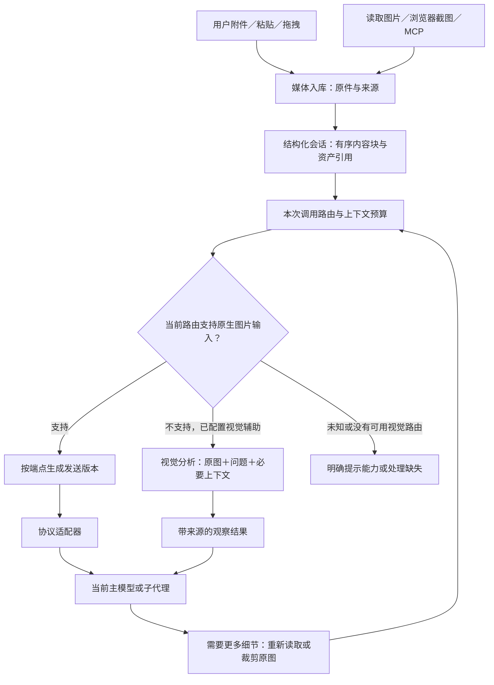

# 多模态接入调研与设计建议

日期：2026-09-09。状态：已落实静态图片第一阶段，其余部分仍为设计建议。

实现范围、使用方法和验证结果见 [MULTIMODAL_IMPLEMENTATION.md](MULTIMODAL_IMPLEMENTATION.md)。

本方案按“现有桌面应用接入多模态模型”理解需求，不涉及从零训练模型。依据是当前 DeepSeek 项目、用户提供的 Grok 源码及接口官方文档。Grok 部分为静态代码追踪，未编译运行；本次未调用付费模型接口，也未做模型质量排名。

## 1. 推荐决策

采用 **统一媒体资产 + 结构化消息 + 原生视觉优先 + 独立视觉分析作为兼容路径**。

- 图片输入首先成为可持久化、可引用的媒体资产，不能仅成为路径文字。
- 当前模型、接口均支持图片时，直接发送图片；不必再增加一次描述调用。
- 当前模型仅支持文字时，使用用户配置的视觉模型分析相关原图，再把有来源的观察结果提供给当前模型；支持追加问题和重新看图。
- 各模块通过完整的模型路由选择服务、协议和模型，不能只替换模型名称。
- 第一阶段完成静态图片、截图、多图和工具图片的完整生命周期。PDF、音频、视频分别扩展，不把一个 `vision=true` 当作所有媒体能力。

该方案适合保留现有文字主模型，同时逐步接入多服务商视觉能力。长期不强制所有图片先变成文字，也不强制所有任务切换到同一个多模态模型。

## 2. 官方接口中的输入形式

应用发送的是有顺序的文本、媒体内容块或远端文件引用。Base64 是传输编码，放在文字块里的 Base64 不等于媒体输入；本地路径也不等于服务端可访问的媒体。

| 接口 | 图片的表示方式 | 对本项目的意义 |
| --- | --- | --- |
| OpenAI Chat Completions | 用户 `content` 中的 `text` 与 `image_url`；后者包含 URL 或 data URL | 保留现有兼容接口，但补齐图片序列化 |
| OpenAI Responses | `input_text`、`input_image`，可用图片 URL、data URL 或支持的文件 ID | 单列协议，不能与 Chat Completions 混成一个 `openai` 开关 |
| Anthropic Messages | `image` 块的 `source`，支持范围依部署可包含 Base64、URL、Files API 引用 | 使用专门适配器；云平台与官方 API 的支持范围可能不同 |
| Gemini generateContent | `contents[].parts[]` 中的文本和内联媒体或文件引用 | 真正需要原生 Gemini 能力时再增加该协议适配器 |
| xAI | 官方视觉文档展示 Responses 风格的 `input_image`，支持 data URL 和远程图片 URL | 可先走已实现并验证的兼容协议，保留端点能力差异 |

依据：[OpenAI 图像输入](https://developers.openai.com/api/docs/guides/images-vision)、[Claude 视觉输入](https://platform.claude.com/docs/en/build-with-claude/vision)、[Gemini generateContent](https://ai.google.dev/api/generate-content)、[xAI 视觉输入](https://docs.x.ai/developers/model-capabilities/images/understanding)。表格描述接口结构，不表示其所有模型均支持这些输入。

### 工具返回的图片与用户图片不是同一种协议位置

- Anthropic 允许在 `tool_result.content` 中放图片块。[官方说明](https://platform.claude.com/docs/en/agents-and-tools/tool-use/handle-tool-calls)
- OpenAI Responses 的 `function_call_output.output` 可包含图片或文件对象数组。[官方说明](https://developers.openai.com/api/docs/guides/function-calling)
- OpenAI 官方 Chat Completions 的工具消息类型只声明文字及文字块数组，不能假定 `role=tool` 可直接携带 `image_url`。[官方 SDK 类型](https://github.com/openai/openai-python/blob/main/src/openai/types/chat/chat_completion_tool_message_param.py)
- MCP 工具结果本身支持文字、图片、音频、资源链接等内容。丢失图片通常是应用转换层的问题。[MCP 2025-06-18 工具规范](https://modelcontextprotocol.io/specification/2025-06-18/server/tools)

### PDF、音频和视频的处理边界

PDF 可通过支持的原生文件接口进入视觉模型。Claude 文档描述了页面图像与提取文字共同处理的流程。对不支持 PDF 的接口，本项目可自行按页提取文字、渲染页面，并保留页码；单纯 OCR 无法覆盖全部布局与图表信息。[Claude PDF 文档](https://platform.claude.com/docs/en/build-with-claude/pdf-support)

音频可以做转写，也可以直接交给支持音频的模型理解；转写文字不包含全部声学信息。视频可以走原生视频接口，或抽帧并附上时间戳与音轨转写。抽帧是近似方案，不能宣称覆盖未采样时刻。实时语音／视频还涉及持续流、打断和时序，应该单独设计会话传输。[Gemini 音频](https://ai.google.dev/gemini-api/docs/audio)、[Gemini 视频](https://ai.google.dev/gemini-api/docs/video-understanding)

## 3. Grok 实际实现及取舍

以下路径均来自 `/Users/fjw/Desktop/grok-build-main`。

### 值得借鉴的实现

1. **正常构建直接发送原图。** `turn.rs` 构造用户消息后调用 `add_image`。虽然有图片描述分支，但这份源码的 `is_cursor_harness()` 固定返回 `false`，因此不能把“全部先转文字”说成这个构建的默认行为。
   - [入口分支](/Users/fjw/Desktop/grok-build-main/crates/codegen/xai-grok-shell/src/session/acp_session_impl/turn.rs:1119)
   - [实际追加图片](/Users/fjw/Desktop/grok-build-main/crates/codegen/xai-grok-shell/src/session/acp_session_impl/turn.rs:1207)
   - [当前构建分支状态](/Users/fjw/Desktop/grok-build-main/crates/codegen/xai-grok-shell/src/session/acp_session_impl/session_mode.rs:41)

2. **会话结构认识图片，工具结果关联图片。** `ContentPart` 有 Text、Image；`ToolResultItem` 除文字还保存图片集合和调用 ID；各协议分别转换。
   - [消息类型](/Users/fjw/Desktop/grok-build-main/crates/codegen/xai-grok-sampling-types/src/conversation.rs:335)
   - [工具结果类型](/Users/fjw/Desktop/grok-build-main/crates/codegen/xai-grok-sampling-types/src/conversation.rs:246)

3. **图片在文字截断之前被提取。** 工具图片走单独通路，避免把大块编码送入工具文字、截断器和普通 hooks 序列化。
   - [工具图片桥接](/Users/fjw/Desktop/grok-build-main/crates/codegen/xai-grok-shell/src/session/acp_session_impl/tool_layer_images.rs:1)

4. **图片有持久化、预处理和字节预算。** 图像处理包含格式检查、分辨率与字节限制、压缩说明；会话还控制序列化后的请求体大小。预算使用高低水位，减少反复改动旧前缀；移除旧图时加入模型可见说明。
   - [图片保存](/Users/fjw/Desktop/grok-build-main/crates/codegen/xai-grok-shell/src/session/image_describe.rs:293)
   - [预处理](/Users/fjw/Desktop/grok-build-main/crates/codegen/xai-grok-shell/src/session/image_normalize.rs:1)
   - [请求字节预算](/Users/fjw/Desktop/grok-build-main/crates/codegen/xai-chat-state/src/image_budget.rs:1)

5. **图片描述与当前问题相关。** 备用描述模块组合近期用户问题和当前任务，并按图片内容、问题指纹等缓存；辅助模型解析的是完整采样配置。
   - [描述请求构造](/Users/fjw/Desktop/grok-build-main/crates/codegen/xai-grok-shell/src/session/image_describe.rs:117)
   - [辅助路由解析](/Users/fjw/Desktop/grok-build-main/crates/codegen/xai-grok-shell/src/agent/config.rs:4858)

### 不照搬的部分

- Grok 的 Chat Completions 适配器把图片放进工具消息，这是其端点兼容性假设，不能推广到所有 OpenAI 兼容服务。[代码](/Users/fjw/Desktop/grok-build-main/crates/codegen/xai-grok-sampling-types/src/conversation/chat_completions.rs:135)
- 描述模式逐张调用，再拼接文字。跨图对比应将有关联的多图共同交给视觉模型，避免过早隔离证据。[代码](/Users/fjw/Desktop/grok-build-main/crates/codegen/xai-grok-shell/src/session/acp_session_impl/prompt_build.rs:977)
- 描述缓存键没有包含模型和端点。我们的模型可切换，应增加完整路由、预处理版本、裁剪参数和问题指纹。[代码](/Users/fjw/Desktop/grok-build-main/crates/codegen/xai-grok-shell/src/session/image_describe.rs:245)
- 描述包裹提示里要求不告诉用户只拿到描述。本项目应在内部明确“原图观察”和“文字转述”，界面可显示实际使用的视觉模型，不能诱导主模型声称自己直接看过图。[代码](/Users/fjw/Desktop/grok-build-main/crates/codegen/xai-grok-shell/src/session/image_describe.rs:188)
- 1.5 MB、2000 像素边长、约 50 MiB 请求体等属于该项目的工程配置，不是跨服务商通用标准。不能在入库时永久把所有原图压到同一个最低阈值。

## 4. 推荐结构



路由选择先按已解析的配置与能力确定，不增加一个大模型专门猜“要不要看图”。是否继续裁剪、比较或追问，由处理任务的模型通过工具表达。

### 4.1 媒体资产：原件是依据，发送版本是派生物

建议新增小型 `media/` 模块，第一阶段只服务图片：

```text
MediaAsset
  asset_id, sha256, mime_type, byte_size, width, height
  storage_key, created_at

MediaAttachment
  attachment_id, asset_id, thread_id, turn_id
  source: upload | clipboard | local_file | tool
  tool_call_id?, original_name?
```

二进制文件与会话记录分开存储。建议通过 `config/paths.py` 新增路径解析函数，将文件放入用户数据目录的 `media/`，而非源代码工作区或临时目录。

- 内容哈希用于去重和校验；相同字节可以复用存储，但每次附件的顺序、来源、工具调用 ID 独立保存。
- 图片进入历史前完成持久化，原子写入；保存失败不得显示成“已发送”。
- 普通消息、SSE 和日志只引用资产与缩略图，不重复携带原图 Base64；Base64 在发往上游前生成。
- 派生版本按原图哈希、目标限制、处理版本、裁剪区域缓存。预览缩略图不直接充当模型输入。
- 供应商文件 ID 是可失效的传输缓存；必须按端点和凭据作用域绑定，不能跨服务商重用，也不能成为唯一原件。
- 文件预览与工具读取沿用现有文件授权边界；拥有资产 ID 不自动获得其他任务媒体访问权。
- 导出、导入、分叉、回滚和清理都要追踪媒体引用；只清理不再被保存记录引用的资产。

### 4.2 消息协议：保留有序内容块

第一阶段建议增加 `ImageBlock`，并让工具结果支持有序文字／图片内容：

```text
ImageBlock(type="image", asset_id, detail="auto", crop=None)

Message.content:
  TextBlock | ImageBlock | ThinkingBlock | ToolUseBlock | ToolResultBlock

ToolResultBlock:
  tool_use_id
  content: list[TextBlock | ImageBlock]
  is_error
```

`detail` 与 `crop` 表达本次观察意图；裁剪坐标定义在经方向校正的原图坐标系中。平台专属字段只在适配器中出现。

兼容迁移应接受旧的 `content: str`，加载时转换为一个 TextBlock。统一内容块是唯一事实来源；摘要、搜索、UI 卡片、工具去重等需要文字的调用点使用明确的 `text_content()` 投影，不把图片编码变成文字。

工具执行层 `ToolResult` 也需要同样的结构，或在短期过渡中集中转换；不能只在 API 客户端增加 ImageBlock，而让中间工具事件、持久化和恢复继续丢图。第一阶段不预先实现尚未使用的音视频块。

### 4.3 模型路由：每次调用解析完整组合

现有前端已经有 `ModelRef { providerId, modelId }`，应把语义贯通后端，而不是另造不同的编码习惯。[现有实现](/Users/fjw/Desktop/deepseek-tui-py-main/packages/workbench/src/shared/model-ref.ts:4)

```text
ResolvedModelRoute
  provider_id, model_id, protocol
  endpoint, credential_scope, config_revision
  request_defaults, capabilities

capabilities
  image_input: supported | unsupported | unknown
  tool_images: native | user_bridge | unsupported | unknown
  accepted_image_formats, image_limits, request_byte_limit
  context_window, max_output_tokens, reasoning_options
```

输入／输出能力分开维护。以后增加 PDF、音频、视频时分别声明。连接成功、模型名称含某品牌、出现在 `/models` 列表，都不能单独证明视觉能力。

显式端点／模型配置覆盖维护的已知配置；未知能力保留为未知。在设置中提供一次小图验证，记录验证模型、端点与时间；不能让普通文字连通性测试显示“视觉可用”。同一服务商的不同模型分别解析能力和请求参数。

各模块只传逻辑角色和目标 ModelRef，由统一解析器得到客户端、请求配置与能力。HTTP 连接可以复用，但模型能力不能固定在连接创建时。

| 模块 | 推荐继承规则 |
| --- | --- |
| 主对话 | 使用当前回合选择的完整路由 |
| 子代理 | 无覆盖时继承启动瞬间的完整路由；有覆盖时独立解析服务商与模型 |
| 后台任务 | 保存逻辑路由；执行时解析凭据，不在任务文件保存密钥 |
| 视觉辅助 | 使用独立配置的完整路由，无可用路由就明确提示 |
| 旁白 | 默认只用必要文字，可有独立路由 |
| 压缩／交接 | 保留资产引用；需要总结视觉证据时按该模块能力生成投影 |

切换模型在回合边界建立新的不可变路由快照，统一影响该回合新建的调用；已经运行的子代理保留其启动路由及使用记录。不要只修改 `engine.client`，留下子代理和请求参数仍指向旧服务。

### 4.4 两条视觉执行路径

**原生路径：** 当前模型收到用户问题、必要上下文和图像内容块。多图比较保留顺序与图片编号。普通工具循环也可读取图片、请求局部裁剪，获得新的图像结果。

**辅助路径：** 保留当前文字主模型，视觉模型读取任务相关原图，返回观察结果。用户附件可在主模型调用前自动处理；工具产生图片时走同一处理逻辑。仅对媒体内容作投影，不覆盖持久化的原始消息。

推荐将可重入的能力提供为 `inspect_image(asset_ids, question, crop?)`：

```text
VisualObservation
  asset_ids, route_ref, question, crop, transform_version
  observations, visible_text, uncertainties
```

按任务需要给出简短结构化观察，不要求每次长篇描述整图。比较任务将关联图片共同发送。缓存键包含图片集合与顺序、问题与上下文指纹、视觉路由、处理参数和模板版本；上次问“整体布局”的描述不能直接回答本次“右下角金额”。

观察结果是有来源的证据，不是新的系统指令，也不是已经验证的程序事实。截图中的代码、文字和模型观察都不能提升为系统指令。视觉辅助默认不授予 shell、发消息等执行工具。

两条路径不能互相递归调用形成无限循环。没有配置视觉辅助、视觉分析失败或结果为空时，保留待处理图片并明确说明；不去掉图片后伪装成成功。需要精确布局、跨图判断时，优先选择原生视觉主模型；文字主模型可以按需反复请求视觉观察。

### 4.5 协议适配策略

协议明确拆成 `openai_chat`、`openai_responses`、`anthropic_messages`；原来的 `openai` 配置迁移为 `openai_chat`。Gemini 原生协议在有对应需求时单列。

- 用户图片按各接口规定序列化。
- 原生支持工具图像的接口，图片留在对应工具结果中并保留调用 ID。
- Chat Completions 工具图像默认走受控桥接：先完整返回同批所有工具结果，再追加一条图像承载消息，标明来源工具和调用 ID。内部来源标记为工具观察；该消息不得写入真实用户请求清单，也不参与新的用户指令提取。该方案是兼容降级，优先使用可原生表达工具结果的协议。
- 只有经过单独验证的端点才开启 `role=tool` 原生图片扩展。
- 上游不支持时，明确走视觉辅助或报能力缺失；禁止以 `str(block)` 或 `json.dumps(payload)` 代替媒体输入。

### 4.6 图片处理与上下文

需要同时核算视觉 token、请求体字节数和单图限制，不能只统计文本 token。URL／文件 ID 缩短请求体，不代表视觉推理不占 token；本地资产去重也不等于上游自动免计费。

1. 入库阶段验证真实文件格式、尺寸和可解码性，保存原件。
2. 发送阶段按目标端点生成稳定的派生版本，处理方向、像素／字节限制。
3. 界面截图和图表尽量保留清晰文字；优先按需裁剪、分块，不统一低质量 JPEG 化。超长截图保留裁剪区域与原图的映射。
4. 若需要坐标操作，返回原图尺寸、发送尺寸、裁剪偏移和缩放关系，避免模型坐标直接误用于屏幕。
5. 预算优先保留当前任务必需的图片与近期关键截图；超出时先调分辨率或分页，必要时请求用户缩小范围，不静默删掉当前任务证据。
6. 旧图可从本次请求中移除，但保留资产和来源；写明“本次未包含原图，可重新读取”。避免只剩一句总结却误称仍能看见图。
7. 使用高低水位控制批量回收，缓存稳定的变换结果，减少连续截图导致每轮重写全部历史。

压缩后的摘要必须保留重要 asset_id、页码／裁剪区域、已观察事实和未确认事项；历史恢复从结构化消息重建。现有 `items.py` 从 `detail/summary` 还原文字的路径需要同步改造。[当前恢复逻辑](/Users/fjw/Desktop/deepseek-tui-py-main/src/deepseek_tui/server/threads/items.py:56)

## 5. 接入现有项目的顺序

| 阶段 | 改造范围 | 验收标准 |
| --- | --- | --- |
| 0：调用一致性 | 完整模型路由、子代理继承、切换快照；修正已发现的正式答案被思考覆盖 | 主对话、子代理、视觉辅助分别请求预期服务，结果通道不串 |
| 1：图片闭环 | MediaStore、ImageBlock、工具结果内容块、附件入库、两套现有客户端、历史恢复、基础预算、图片读取 | 图片真实进入请求；主对话与子代理均可看图；重启后仍可读取 |
| 2：文字主模型兼容 | 独立视觉路由、问题相关观察、重新看图工具、多图比较 | 文字主模型可完成图像任务并追问原图，辅助失败不伪装成功 |
| 3：协议和文档扩展 | Responses、端点文件缓存、PDF 原生／按页处理 | 工具图像原生回传；PDF 的文字、图片、页码关联完整 |
| 4：音视频 | 音频原生理解或转写；视频原生或带时间戳抽帧 | 明确采样覆盖与丢失信息，实时会话另行验收 |

阶段 1 的 OpenAI Chat 工具图片使用上文桥接，Anthropic 使用原生工具图片；Responses 不是静态图片上线的前置条件。基础持久化、预算和错误说明必须随第一阶段完成，不能留到最后。

主要落点：

- [前端附件入口](/Users/fjw/Desktop/deepseek-tui-py-main/packages/workbench/src/renderer/src/components/chat/FloatingComposer.tsx:245)：上传返回资产引用，支持真实图片粘贴；保留旧文本路径引用行为。
- [请求协议](/Users/fjw/Desktop/deepseek-tui-py-main/src/deepseek_tui/server/threads/models.py:246)：提供新的有序内容块请求形式；兼容 `prompt`，二者冲突时明确拒绝，不采用不透明的优先级。允许纯图片输入。
- [消息协议](/Users/fjw/Desktop/deepseek-tui-py-main/src/deepseek_tui/protocol/messages.py:60)、[工具结果](/Users/fjw/Desktop/deepseek-tui-py-main/src/deepseek_tui/tools/registry.py:52)、[MCP 转换](/Users/fjw/Desktop/deepseek-tui-py-main/src/deepseek_tui/mcp/execute.py:30)：统一媒体通路。
- [OpenAI Chat 序列化](/Users/fjw/Desktop/deepseek-tui-py-main/src/deepseek_tui/client/chat_messages.py:19)、[Anthropic 客户端](/Users/fjw/Desktop/deepseek-tui-py-main/src/deepseek_tui/client/anthropic.py:31)：按协议映射。
- [客户端工厂](/Users/fjw/Desktop/deepseek-tui-py-main/src/deepseek_tui/client/factory.py:39)、[回合管理](/Users/fjw/Desktop/deepseek-tui-py-main/src/deepseek_tui/server/threads/manager.py:3437)、[子代理循环](/Users/fjw/Desktop/deepseek-tui-py-main/src/deepseek_tui/tools/subagent/loop.py:510)：完整模型路由。
- `server/threads/items.py`、`tools/durable_transcript.py`、`engine/context.py`、`server/data_bundle.py`：恢复、压缩、预算和备份同步升级。

## 6. 必须覆盖的验收场景

1. 图片＋问题、纯图片、两张图比较，检查实际出站 JSON 中存在正确图像块与顺序。
2. 剪贴板截图、文件选择和拖拽进入同一入库通路；坏图／上传失败不能显示成发送成功。
3. MCP 返回“文字＋图片”和“只有图片”，两者均保留图片；大图编码不进入文本截断器。
4. 同批多个工具调用中只有一个返回图片，工具 ID、结果配对和桥接顺序正确。
5. 文字主模型调用独立视觉服务；继续追问局部细节时可以重新读取同一原件。
6. 切换服务商后主对话和新子代理使用新路由；已有子代理不被意外更改；能力和默认参数随路由解析。
7. 重启、分叉、上下文压缩、回滚、导出导入之后，媒体引用仍能解析；旧版纯文字记录可以读取。
8. 连续多轮截图触发请求字节或 token 预算，保留必要图片，对省略作明确标记，不产生 Base64 token 暴涨。
9. 大图、小字、超长截图、透明 PNG、错误扩展名、损坏图片、方向信息和重复图片的处理可解释。
10. 辅助识图失败、未知能力、上游文件 ID 失效时不伪装成功；实际请求模型、输入图片数量与辅助用量可追踪。

先做离线协议与生命周期测试，再用固定小型图像集进行真实模型验收：中文报错截图、界面前后差异、表格与图表、局部小字、多轮追问。没有真实图像任务的验证，不能仅凭 HTTP 200 宣称视觉能力完成。
