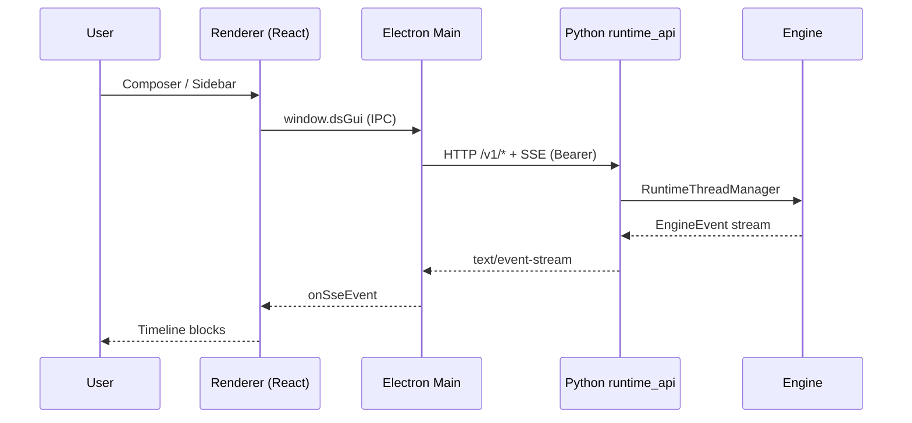

# DeepSeek Workbench — Architecture

> Companion to [`WORKBENCH_HANDOVER.md`](./WORKBENCH_HANDOVER.md). Stage 8 product surface.

## Components



| Layer | Path | Role |
|-------|------|------|
| Contract | `contracts/runtime-api.openapi.yaml` | Single truth for `/v1` JSON + SSE |
| Runtime API | `src/deepseek_tui/app_server/runtime_api/` | FastAPI routes, auth, approval bridge |
| Threads | `src/deepseek_tui/app_server/thread_manager.py` | Engine lifecycle, SSE events, trust_mode |
| Workbench | `packages/workbench/` | Electron host + React UI |
| Legacy | `app_server/legacy/` + `/legacy` mount | Old `{ok:true}` envelope (deprecated) |

## Request paths

- **Spawn**: Main process runs `python -m deepseek_tui serve --http --port 7878 --auth-token …`
- **Auth**: Bearer in `Authorization` header only (no query token)
- **Token file**: `~/.deepseek/runtime.token` — Python seeds if empty; GUI reads, never overwrites non-empty file
- **Approvals**: `ApprovalRequiredEvent` → `approval.required` SSE → GUI POST `/v1/approvals/{id}` → `ApprovalBridge` → `HttpApprovalHandler` blocks Engine until resolved
- **Session hydration**: `_ensure_engine_loaded` → `reconstruct_messages_from_turns` → `Engine.sync_session`
- **TUI import**: POST `/v1/threads/import-session` reads `~/.deepseek/sessions/*.json` into durable threads
- **Session catalog**: GET `/v1/sessions` merges TUI files + Workbench threads (`import_state`: `available` | `linked` | `native`)
- **TUI export**: POST `/v1/threads/{id}/export-session` writes TUI-compatible JSON; threads track `source_session_id` / `source_session_path`
- **Skills / tasks**: GET `/v1/skills`, GET/POST `/v1/tasks*` (bare JSON; tasks require `features.tasks=True`)
- **Steer**: GUI POST `…/steer` → `EngineHandle.steer()` (mid-turn queue)
- **User input**: `UserInputRequiredEvent` → SSE → POST `/v1/user-inputs/{id}`; pending via `GET /v1/user-inputs/pending`
- **Approvals**: `remember=true` → `ApprovalDecision.APPROVED_SESSION` (session cache)
- **Exec policy**: `config.approval_policy` → `ExecPolicyEngine` on Engine.create (TUI + HTTP)

## Verification

```bash
pytest tests/contract -q
./scripts/smoke-workbench-auth.sh
cd packages/workbench && npm run typecheck
```
