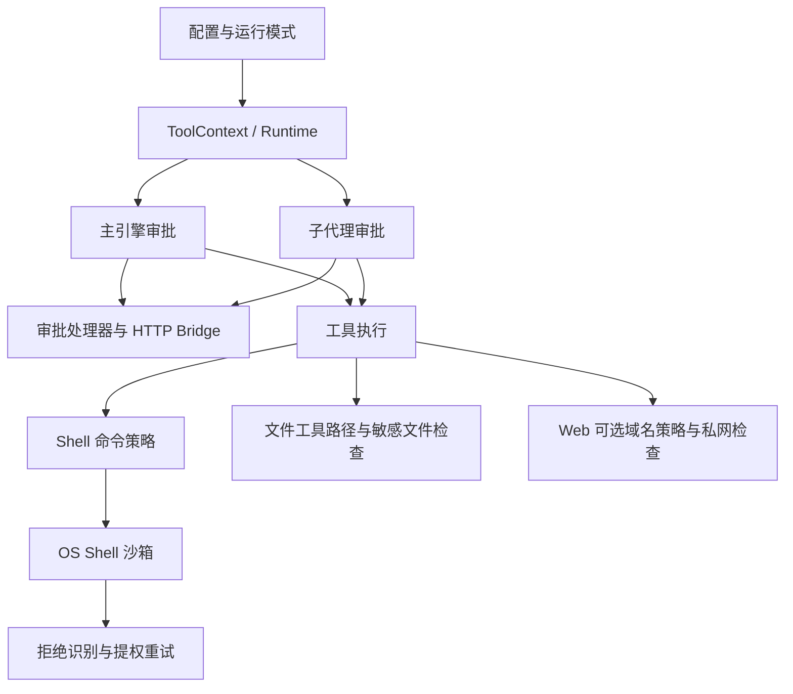

# 02 · 权限、审批与沙箱审核

审核基线：2026-09-27 当前工作区，包含已有未提交修改。本篇只新增审核材料，没有修改业务实现。范围为索引中的 9 个核心文件，以及它们在 Engine、子代理、Shell、Web、Task、HTTP 服务中的权限调用链；追踪关联代码不代表这些体系已完成整体审核。

## 结论

当前最值得修复的是**权限决策在不同执行入口之间失去一致性**。代码已经具备命令规则、审批门禁、会话授权、OS 沙箱和 HTTP 审批桥等基础，但这些机制的优先级及上下文继承分散在各处。同一操作换成子代理、经过引擎初始化、命中缓存或发生提权后，实际限制可能改变。

建议先做局部修复，再提取一个小的、可测试的权限决策入口。不建议立即重写权限系统、引入外部策略服务，或把 Shell 正则扩展成自制解释器。现有正常审批桥的生命周期管理、路径解析和环境过滤值得保留。

证据分级：**复现**表示本篇离线脚本直接验证；**静态**表示已追踪代码但没有执行真实 OS/网络场景；**设计取舍**表示代码或测试明确支持该行为，不能当作意外缺陷。P1 为优先修复，P2 为后续修复/接入前修复。优先级不等同于已证明外部可利用。

## 当前结构与边界



这里有三种不同问题：审批决定“是否询问/接受授权”，策略决定“操作是否被禁止”，沙箱限制“进程能访问什么”。批准不能自动意味着解除全部能力限制。当前实现存在几处把这些语义互相替代的情况。

还要明确：`ExecutionSandboxPolicy` 当前主要约束 Shell 子进程，不是所有 Python 工具的统一能力边界；私网 URL 检查也不等于域名授权策略。不能因为其中一层存在，就宣称所有执行路径均受保护。

## 已确认问题

### P01 · P1：引擎同步会覆盖显式只读配置（复现）

位置：[core.py:1345](/Users/fjw/Desktop/deepseek-tui-py-main/src/deepseek_tui/engine/orchestrator/core.py:1345)、[core.py:1877](/Users/fjw/Desktop/deepseek-tui-py-main/src/deepseek_tui/engine/orchestrator/core.py:1877)、[sandbox.py:371](/Users/fjw/Desktop/deepseek-tui-py-main/src/deepseek_tui/policy/sandbox.py:371)。

`create_tool_runtime` 正确创建 `read-only` 策略，随后 `Engine.create` 调用同步函数时不传配置中的 `sandbox_mode`，按 agent 模式重新生成 `workspace-write`。每轮开始也有相同同步。实际引擎初始化的离线结果是 `read-only → workspace-write`，不需要执行任何 Shell 命令。

建议：保留显式配置来源，统一计算有效策略；模式变化只修改未被显式约束的默认项。至少让创建、轮次同步、模式切换使用相同输入。验收需覆盖初始化后、第二轮后和模式切换后的策略，而不只测试独立工厂函数。

### P02 · P1：Shell 适配层丢失换行，导致 deny 规则失效（复现）

位置：[shell.py:932](/Users/fjw/Desktop/deepseek-tui-py-main/src/deepseek_tui/tools/shell.py:932)、[exec_policy.py:440](/Users/fjw/Desktop/deepseek-tui-py-main/src/deepseek_tui/policy/exec_policy.py:440)。

同一条 `echo ready\nprintf blocked`，配置 deny 为 `printf blocked`：直接交给规则引擎结果为 deny；经过真实 Shell preflight 则不拒绝。原因是先 `shlex.split`，再用空格连接，两个命令被改成一个字符串。启发式的 PROMPT 在此适配层映射为 ALLOW，又不能补回明确拒绝。

建议：原始命令字符串贯穿规则检查；展示/指纹所需的规范化与用于执行语义的文本分开。补适配层集成测试，包含换行、分号、引号内分隔符。这里证明的是具体规则丢失，不代表现有规则引擎能完整理解所有 Shell、脚本解释器和 stdin 程序。

### P03 · P1：`never` 硬拒绝在缓存和子代理路径中失效（复现）

位置：[tooling.py:816](/Users/fjw/Desktop/deepseek-tui-py-main/src/deepseek_tui/engine/orchestrator/tooling.py:816)、[loop.py:165](/Users/fjw/Desktop/deepseek-tui-py-main/src/deepseek_tui/tools/subagent/loop.py:165)。

- 主引擎先检查会话缓存，后检查 `NEVER_BLOCKED_PREFIX`。若已有授权缓存而策略收紧为 `never`，缓存可以绕过新拒绝。本篇构造旧缓存验证；不意味着全新 never 会话会自行生成授权。
- 子代理在 effective_auto 下直接跳过审批请求构建，未先检查 never。
- 非自动的子代理也将带 never 拒绝标记的请求交给 handler；handler 返回批准就执行，主引擎同场景会拒绝。

根因是硬拒绝被编码为供消费者识别的 reason 字符串，而各消费者的处理顺序不同。建议直接返回结构化决策，例如 `DENY / ALLOW / ASK`，硬拒绝先于缓存及 handler；说明文案不能承担控制流。允许无审批要求的读取并不违反 never，修复不应把所有工具一刀切禁用。

### P04 · P1：子代理实际上下文未继承命令策略（复现）

位置：[loop.py:478](/Users/fjw/Desktop/deepseek-tui-py-main/src/deepseek_tui/tools/subagent/loop.py:478)、[manager.py:603](/Users/fjw/Desktop/deepseek-tui-py-main/src/deepseek_tui/tools/subagent/manager.py:603)、[shell.py:932](/Users/fjw/Desktop/deepseek-tui-py-main/src/deepseek_tui/tools/shell.py:932)。

开启 exec_policy 并加载临时用户规则后，主上下文有 policy；捕获真实子代理循环创建的上下文则为 None。子代理构造时没有传递策略，运行时结构也没有显式承载它。Shell 检查在 policy 缺失时直接返回。因此主会话加载的硬规则没有到达子执行入口。

建议显式派生子权限：子能力上限不大于父能力上限，可以进一步收紧。继承不可变策略快照或同一受控策略提供者，而不是复制任意 metadata。此问题不表示 OS 沙箱同时消失，也不是已经证明完整沙箱逃逸。

### P05 · P1：提权请求用 tool_call_id 作共享主键，可发生串答（复现）

位置：[server/approval.py:235](/Users/fjw/Desktop/deepseek-tui-py-main/src/deepseek_tui/server/approval.py:235)、[tooling.py:1021](/Users/fjw/Desktop/deepseek-tui-py-main/src/deepseek_tui/engine/orchestrator/tooling.py:1021)。

ElevationBridge 直接覆盖相同 ID 的 Future，不检查重复。两个线程各注册 `same-id`，第二个覆盖第一个；回应这个 ID 会批准第二个请求，第一个仍等待。线程过滤只影响展示，未使主键隔离。模型工具调用 ID 不适合作为跨线程全局唯一授权标识。

建议由服务端生成独立 request_id，并绑定 thread、turn 和 tool_call_id；重复注册不能覆盖，旧答案不得解决后续请求。普通 ApprovalBridge 已有更好的唯一 ID 与生命周期模式，优先复用其约束。

### P06 · P2：提权发布顺序有竞争，取消/超时留下隐藏记录（复现）

位置：[tooling.py:1011](/Users/fjw/Desktop/deepseek-tui-py-main/src/deepseek_tui/engine/orchestrator/tooling.py:1011)、[server/approval.py:276](/Users/fjw/Desktop/deepseek-tui-py-main/src/deepseek_tui/server/approval.py:276)。

先 emit 事件、后 register Future。复现中 emit 的消费者立即答复，resolve 返回 False，因为记录尚未存在。随后调用者进入最长 600 秒等待。普通 UI 不一定每次触发，但快速自动客户端/回调可以触发。

取消或 wait_for 超时会把 Future 标记为 done，调用者没有 finally 删除映射；`cancel_for_thread` 又跳过 done Future，`list_pending` 隐藏它们。一次取消后 `_pending` 和 `_meta` 各残留 1 条。重复发生会累计内存与元数据，是已验证的资源生命周期问题，无需用吞吐跑分证明。

建议在发布前注册，用作用域保证成功、拒绝、发布失败、超时、取消都清理；线程清理删除所属记录，不以 Future 是否完成决定是否删除。

### P07 · P1：标为“网络”的提权同时新增工作区写能力（复现）

位置：[sandbox.py:330](/Users/fjw/Desktop/deepseek-tui-py-main/src/deepseek_tui/policy/sandbox.py:330)、[sandbox.py:363](/Users/fjw/Desktop/deepseek-tui-py-main/src/deepseek_tui/policy/sandbox.py:363)。

当前策略 read-only、拒绝信息包含 network 时，建议策略变为 `workspace-write(network_access=True)`；展示标签却仅是 network。用户看到的提权范围小于实际新增能力。

建议按权限差量提权：网络允许变化不应附带文件写变化，展示实际新增能力。另有静态风险：一般拒绝分支可建议 danger-full-access，拒绝识别依赖宽泛 stderr 文本；自动审批 handler 可自动批准提权。应定义是否允许自动审批突破显式能力上限，不能靠同一个 auto 布尔值推导。后两点本篇未做真实 OS 攻击验证。

### P08 · P2：自动化创建的会话授权指纹遗漏关键执行参数（复现）

位置：[approval.py:290](/Users/fjw/Desktop/deepseek-tui-py-main/src/deepseek_tui/tools/approval.py:290)。

指纹包括名称、时间表达式、prompt 与部分 delivery，却不包含 cwds、timezone、run_now、paused；同时存在 schedule 时 run_at 不进入指纹。逐项改变这些字段，键仍相同。直接影响是在用户选择会话授权后，换工作目录或立即执行等变化未必重新确认。schedule/run_at 的优先关系还应以最终规范化请求为准，不能把互斥的无效请求算作有效攻击。

建议针对**实际将执行的规范化请求**生成结构化键，包含权限相关参数与工作区身份。文件路径键、泛化工具名授权也需明确授权粒度：同名工具授权是否意味着任意目标；不能只靠 hash 长度解决语义遗漏。新增粒度应保持用户可理解，避免每个无关展示字段改变都触发确认。

### P09 · P2：可选域名策略的缓存与重定向边界不完整（复现，有接入前提）

位置：[network.py:118](/Users/fjw/Desktop/deepseek-tui-py-main/src/deepseek_tui/policy/network.py:118)、[web.py:694](/Users/fjw/Desktop/deepseek-tui-py-main/src/deepseek_tui/tools/web.py:694)、[web.py:743](/Users/fjw/Desktop/deepseek-tui-py-main/src/deepseek_tui/tools/web.py:743)。

本篇向 ToolContext 注入 NetworkPolicyDecider 后验证三点：

1. `approve(host)` 可覆盖策略中的 deny，因为 evaluate 先读缓存。
2. 首跳允许域名重定向到禁止域名时仍会访问目标。每跳私网检查确实存在，但没有每跳域名授权检查。
3. AnySearch extract 路径检查服务提供商的域名，未检查被请求提取的目标域名；如果域名策略表达的是内容访问限制，这个代理提取入口不满足同一语义。

重要前提：当前 runtime 默认 `network_policy=None`，配置里也没有完整启用此网络策略的路径，MCP 等路径未统一接入。故不能称其为“默认启用的全局网络防火墙被绕过”；它是组件的已确认缺陷与接入缺口。

建议先写清域名策略是限制直接连接、访问内容还是二者；缓存不应覆盖硬 deny，每次 redirect 重新决策；代理抓取同时考虑服务端点与目标资源。未接入的网络出口必须明确标识覆盖范围，不能让注释承诺大于实际实现。

## 需要明确的产品取舍

### 自动批准与无限能力耦合

[runtime.py:314](/Users/fjw/Desktop/deepseek-tui-py-main/src/deepseek_tui/tools/runtime.py:314) 明确把 auto/never-ask/yolo 映射到 trust_mode；代码注释和测试支持这种兼容语义。复现 `auto + 显式 read-only → trust=True + danger-full-access`。这是当前设计选择，不应伪装成偶然漏传参数。

建议把“是否需要交互”与“允许哪些能力”拆成两个正交设置，显式能力上限优先。迁移时兼容旧配置并展示实际生效值，不能只改后端含义而让用户不知情。此项与 P01 的无意覆盖分别处理。

### OS 沙箱不可用时降级执行

[sandbox.py:408](/Users/fjw/Desktop/deepseek-tui-py-main/src/deepseek_tui/policy/sandbox.py:408) 在无可用 OS 沙箱时记录警告并直接运行。现有测试认可此行为。离线模拟不可用状态，返回 sandboxed=False，虽然请求 read-only。脚本输出的 darwin 警告来自模拟，不是本机实际可用性检测结果。

若面向普通开发助手，可提供明确选择的兼容降级；若用户显式要求受限执行，建议失败关闭。实际保证应展示为 effective sandbox status。暂不建议为了形式上的通用性一次性实现所有平台后端。

### 文件工具与 Shell 沙箱是不同边界

在仅设置 read-only Shell policy 的 ToolContext 上直接调用 WriteFileTool，临时文件写入成功。该工具有路径、敏感文件与上层审批约束，但不消费 Shell policy；当前文档把后者定义为 Shell 沙箱，因此这项单独不能认定为违反已有工具契约。

若产品希望 read-only 表示“整个代理不能写”，就必须把文件写、Shell、MCP 及任务委派映射到共同能力规则；只修 Shell profile 不足以实现。建议先定义这个用户可见契约，再决定扩展范围。

## 逐模块评价

| 模块 | 可保留的设计 | 通用性、优雅性与扩展建议 |
|---|---|---|
| policy/__init__.py | 极小包入口，没有无谓注册或初始化副作用 | 保持简单，不需要为了“架构完整”添加工厂层。 |
| policy/command_safety.py | 把风险启发式与具体工具分离，可用于解释和提示 | 命令名称/正则不能证明任意 Shell 没有副作用；如 sort 的输出参数、构建工具执行项目脚本。保持提示职责，不能升级成安全边界。无需自行实现完整 Shell AST。 |
| policy/env_filter.py | 共享的环境变量过滤函数小而集中；Shell 与 MCP stdio 可复用 | 后缀/名称规则只能降低常见密钥泄露风险；显式 overrides 和 SSH_AUTH_SOCK 等保留项有能力语义。按调用方声明必要环境，先补边界契约，暂不需要环境策略框架。Hook 是否复用将在第03篇展开。 |
| policy/exec_policy.py | 规则加载与评估基本独立，deny/allow 可解释 | 最大问题是适配器改变输入，见 P02。规则模型应保留原始请求，决策返回类型与审批统一。无需把格式读取、审批 UI、Shell 解析合成一个大类。 |
| policy/network.py | 纯规则层和带缓存的 decider 分开，便于离线测试 | P09 及默认未接入说明模块能力尚未闭环。硬规则与临时授权分层；接入前明确 direct/代理/MCP 的覆盖。审计同步写文件存在阻塞可能，但本篇未测量其成本，不建议据此直接引入异步队列。 |
| policy/sandbox.py | 策略对象、命令准备结果、平台实现有一定分离，适合测试 profile 生成 | 同时承担模式映射、平台探测、profile、拒绝识别、提权建议，职责开始聚集。先修 P01/P07；随后把策略求值与平台执行适配拆开。每个平台真实隔离能力必须独立验收。 |
| tools/approval.py | 集中定义工具审批要求、指纹与展示材料，已有门禁枚举 | 领域决策、缓存粒度、产品说明混在一个较大模块，硬拒绝又通过文案传递。优先暴露统一结构化决策；展示可单向消费它。指纹归工具的授权语义所有，避免不断扩大全局工具名 switch。 |
| server/approval.py | 普通审批桥已有唯一标识、线程/任务归属与作用域清理，值得复用 | ElevationBridge 是较弱的平行实现，造成 P05/P06。可以共享小的 pending-request 生命周期机制，保留各业务 payload；不必做任意事件总线。 |
| utils/network_escalation.py | 主机超时计数及提示逻辑很小，避免重复网络失败；与权限无直接绑定 | 名称容易与权限提权混淆，可在未来调整为 timeout/retry hint。`_host_of` 用 netloc 而非 hostname，包含端口/用户信息，是否合并端口应按需求定义。无需为了几个计数引入服务对象。 |

关联模块也有值得保留的约束：项目级配置禁止覆盖部分敏感全局设置；Task 恢复检查执行授权范围；ToolContext 路径解析会 resolve 并检查工作区；Web 对每次重定向有私网检查；未知 MCP 工具不会仅凭工具自述获得只读信任。它们降低了局部风险，但不能替代上述入口之间的一致性。

`workspace/shell_write_guard.py` 的字符串/路径启发式适合工作区工作流提示，不应对外称为 OS 写隔离。完整工作区审核留到第12篇。Engine、子代理、Task 在此仅审核权限传播与决策部分。

## 三个方案及最小横向验证

| 方案 | 做法 | 收益 | 代价/局限 | 建议 |
|---|---|---|---|---|
| A 局部修复 | 保留现有模块；传递原始命令与显式策略、硬拒绝前置、补子上下文、修桥生命周期 | 改动范围小，直接覆盖已复现缺陷 | 调用者仍可能再次分叉 | 先做，作为可独立验收的小提交 |
| B 共享权限决策入口 | 小型权限快照＋结构化 decision；主/子/HTTP 消费同一决策，审批 broker 只负责交互 | 优先级与继承可统一测试，添加工具不再复制控制流 | 需定义资源/授权粒度，迁移会触及多个入口 | A 后逐步抽取，是当前推荐方向 |
| C 统一隔离执行服务 | 所有可产生副作用的工具经隔离 worker/进程执行 | 对跨语言工具和不可信扩展可提供更强边界 | IPC、状态、平台支持、性能和部署复杂度显著增加 | 有明确强隔离需求再评估，本篇不建议立即采用 |

推荐的决策顺序：规范化实际请求 → 检查硬规则与能力上限 → 匹配仍有效的精确授权 → 根据交互策略自动允许或询问 → 执行。子权限取父限制与子限制的交集；提权是独立、明确的能力变更，不是普通工具批准的副作用。

[permissions_compare.py](/Users/fjw/Desktop/deepseek-tui-py-main/docs/audits/2026-09-27/permissions_compare.py) 将真实主/子审批路径与仅十余行的 deny-first 决策原型横向比较。所有工具执行均替换为 mock。允许/拒绝表示门禁结果，不代表实际文件或命令执行。

| 场景 | 当前主入口 | 当前子入口 | deny-first 原型 |
|---|---|---|---|
| never / read | 允许 | 允许 | 允许 |
| never / write / handler 批准 | 拒绝 | 允许 | 拒绝 |
| never / write / auto | 拒绝 | 允许 | 拒绝 |
| never / write / 旧会话授权 | 允许 | 拒绝 | 拒绝 |
| on-request / shell / handler 拒绝 | 拒绝 | 拒绝 | 拒绝 |
| on-request / shell / handler 批准 | 允许 | 允许 | 允许 |
| on-request / shell / 会话授权 | 允许 | 拒绝 | 允许 |
| untrusted / write | 允许 | 允许 | 允许 |
| auto / shell | 允许 | 允许 | 允许 |

子入口没有接入主入口的会话缓存，因此两行缓存场景不是相同内部状态：这是现有接口差异，不是原型性能优势。是否继承某项父授权应按授权范围定义，不能简单共享整个缓存。untrusted/write 的结果来自当前 SUGGEST 规则，不是本篇替产品另设安全语义。

这个最小对比证明改变优先级能解决部分不一致，**不证明方案 B 已完成或最佳**，也未比较真实 OS 隔离或性能吞吐。这里最重要的是正确性和资源释放，没有证据支持为了速度更换策略算法。

## 验证与复现

[permissions_probe.py](/Users/fjw/Desktop/deepseek-tui-py-main/docs/audits/2026-09-27/permissions_probe.py) 包含上述特征化复现。它的断言确认当前问题仍可出现，不是修复后的回归测试；后续修复时需反转相关期望并移入正式测试。

```bash
PYTHONPATH=src .venv/bin/python docs/audits/2026-09-27/permissions_probe.py
PYTHONPATH=src .venv/bin/python docs/audits/2026-09-27/permissions_compare.py
```

两脚本均成功退出。只写临时目录，未执行模型调用或真实外网请求，未执行被检查的 Shell 命令。Web 使用 httpx MockTransport；域名测试替换私网 DNS 检查以独立检验域名规则，不用于证明真实 DNS/SSRF 边界。子代理在上下文建立后、模型执行前截获。真实文件写入仅发生在临时测试工作区。

相关现有测试总计 **264 passed、1 skipped、5 deselected**：

- 85 passed：test_approval_gate、test_approval_system、test_approval_lifecycle、test_approval_presentation、test_exec_policy_compound、test_command_safety、test_task_approval_bridge、test_task_resume_permissions、test_subagent_approval_escalate、test_elevation_and_jobs。
- 164 passed：test_project_config_security、test_env_filter、test_sensitive_files、test_agent_merge_approval；contract 下 test_exec_policy_config、test_approvals、test_http_approval_handler、test_approval_lifecycle、test_turn_approval_integration；workspace/test_shell_write_guard_matrix。
- 15 passed、1 skipped、5 deselected：test_seatbelt_sandbox，使用 `-k 'not TestSeatbeltIntegration'` 排除真实 OS 集成类。没有验证跨平台沙箱，也没有运行整库全量测试。

测试全绿与这些问题可以共存：现有测试更多覆盖单组件行为，本篇重点检查跨入口、输入转换、取消竞争及授权范围。它们不是对本次缺陷不存在的证明。

## 建议实施顺序与验收

1. **先守住策略语义**：修 P01–P04；同一请求在主、子入口不能因包装方式改变硬规则；显式只读跨创建/轮次/模式保持有效；原始复合命令保留语义。
2. **修授权身份与生命周期**：修 P05/P06；并发相同 tool_call_id 不串答，快速回答不丢失，发布失败/取消/超时后映射均清空。
3. **收窄授权变化**：修 P07/P08；网络提权不新增文件写；更换实际工作区或立即执行需按授权粒度重新确认。
4. **决定产品契约后接入网络和能力上限**：处理 P09 及 auto/降级取舍，再逐步形成方案 B。保持现有普通审批桥、工具 API 可用，避免大范围同步重写。

下一篇审核 Hook：事件触发与顺序、取消/超时、环境继承、退出码和输出契约，以及 Hook 对工具请求和权限语义的影响。
