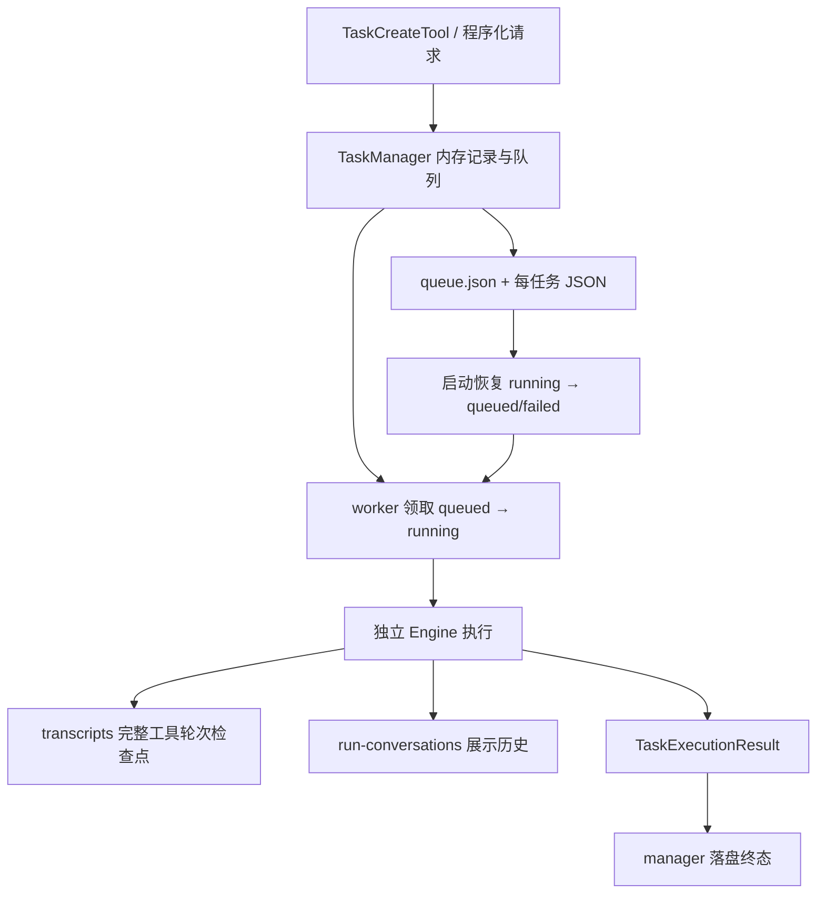

# 04 · 持久化 Task 与恢复机制审核

基线：2026-09-27 当前工作区，包含已有未提交改动。本篇完整阅读 9 个核心文件，共约 2,633 行，并追踪 Engine 任务执行器、检查点及运行时装配。仅新增审核文档和实验脚本，未修改业务实现。

## 总体判断

当前 Task 在**单管理器、存储正常、协作式取消**条件下有较完整的执行闭环：队列、状态、审批桥、检查点和展示历史都有明确实现。恢复权限的二次比对、取消后等待清理、工具轮次检查点也是值得保留的设计。

但“用户级共享队列”“重启可恢复”要求的所有权与提交协议尚不完整。最严重的是多管理器会重复执行同一任务；其次是存储错误留下可执行的半提交状态、worker 无监督退出，以及缓存被当成历史索引。这些问题不能通过增加几个状态枚举或把 JSON 写入线程池解决。

建议先明确单一调度所有者，修正失败提交和恢复边界，再决定继续采用文件存储还是使用 SQLite。不要仅因跑分快就迁移数据库；迁移应解决领取、状态和查询的一致性。

证据分类：**复现**为附带脚本验证；**静态**为完整调用链证据，未模拟真实断电；**取舍**为需要确定产品契约的行为。P1 优先修复，P2 后续修复。

## 当前执行与落盘结构



这实际上是三份不同目的的持久化数据：任务调度记录、模型恢复上下文、用户展示历史。分离本身合理，但当前没有共同的 execution attempt/version 或提交边界来协调它们。

状态枚举支持 queued、running、completed、failed、canceled、timed_out；后三种异常终态可手动恢复，completed 不可恢复。启动时，较新的 running 自动重新入队，超过两小时的 running 标记 failed。这个时间窗口只表示年龄，不表示已经确认原执行者死亡。

## 主要问题

### T01 · P1：多个管理器可重复领取同一任务

**复现。** [manager.py:102](/Users/fjw/Desktop/deepseek-tui-py-main/src/deepseek_tui/tools/task/manager.py:102)、[store.py:158](/Users/fjw/Desktop/deepseek-tui-py-main/src/deepseek_tui/tools/task/store.py:158)、[runtime.py:208](/Users/fjw/Desktop/deepseek-tui-py-main/src/deepseek_tui/tools/runtime.py:208)

默认存储在用户级目录，不同项目或独立 TUI/进程可能打开同一目录。管理器只有对象内的 asyncio.Lock，没有目录排他锁、租约、owner 或原子领取协议。

实验让 A 开始执行一个等待事件的假任务，再用 B 打开同一存储。B 将 A 的 running 当作重启遗留任务转回 queued，两个 executor 收到完全相同的 task_id。实验使用同一进程内两个独立管理器，足以证明对象锁无法保护共享目录；没有调用真实模型或重复真实业务操作。

这也允许旧管理器全量写回覆盖另一个管理器的较新记录，cron 的“最多一个运行”计数同样只在单对象范围内成立。

建议二选一：

- 当前只需一个调度器：启动时取得进程级/跨进程目录锁，其余客户端通过它查询和提交；不能启动第二个恢复器。
- 明确支持多个调度器：使用事务式 claim、owner、lease 和 attempt fencing；恢复必须依据过期执行所有权，不能仅依据 status/started_at。

不要把 stale 时间调大作为修复，它不能区分活执行者与崩溃执行者。

### T02 · P1：提交失败留下“调用方认为失败、内存仍可执行”的任务

**复现。** [manager.py:205](/Users/fjw/Desktop/deepseek-tui-py-main/src/deepseek_tui/tools/task/manager.py:205)、[manager.py:780](/Users/fjw/Desktop/deepseek-tui-py-main/src/deepseek_tui/tools/task/manager.py:780)

add_task 先修改内存队列和记录，再持久化。模拟任务文件写入抛 OSError，调用方收到失败，但 `_pop_next_task` 随后仍能领取该任务。调用方重试可能产生第二个任务。

`_persist_all_locked` 注释称全量写“保证多文件间一致”，实际先写 queue，再逐个写任务，各次 replace 独立。单个文件完整不等于多文件事务；恢复重建队列可修复部分次序差异，但无法提供请求级的提交确认语义。

建议定义清晰提交点：提交成功后才能发布可执行内存状态；失败时回滚或标记明确的不可执行状态。重试支持请求幂等键。文件方案可用单写者＋日志/恢复协议，SQLite 可用事务；简单调整写入顺序不能覆盖所有失败窗口。

### T03 · P1：存储异常会杀死 worker，缺少健康状态与监督

**复现。** [manager.py:612](/Users/fjw/Desktop/deepseek-tui-py-main/src/deepseek_tui/tools/task/manager.py:612)、[manager.py:625](/Users/fjw/Desktop/deepseek-tui-py-main/src/deepseek_tui/tools/task/manager.py:625)、[manager.py:702](/Users/fjw/Desktop/deepseek-tui-py-main/src/deepseek_tui/tools/task/manager.py:702)

executor 的异常会被翻译为任务失败，但领取、终态落盘的异常不在这个保护范围。模拟领取阶段的写入故障，`_worker_loop` 以 OSError 结束；内存记录已转 running。默认只有一个 worker，后续任务可能无人执行。shutdown 只专门捕获 CancelledError，遇到已失败 worker 也可能中途抛出。

建议区分业务失败和存储不可用：存储故障暂停领取、对外呈现调度器异常状态并有限重试，不要把未持久化的结果标成“已处理”。为 worker 加监督和关闭时的异常汇总，但不要无条件重启后盲目重跑副作用。

### T04 · P1：检查点与完成记录之间存在重复执行窗口

**静态，未做真实崩溃注入。** [core.py:3360](/Users/fjw/Desktop/deepseek-tui-py-main/src/deepseek_tui/engine/orchestrator/core.py:3360)、[dispatch.py:873](/Users/fjw/Desktop/deepseek-tui-py-main/src/deepseek_tui/engine/dispatch.py:873)、[dispatch.py:1000](/Users/fjw/Desktop/deepseek-tui-py-main/src/deepseek_tui/engine/dispatch.py:1000)

检查点在整个工具轮次结束后写入。这保证保存的对话通常有成对的工具调用/结果，是优点；但某个工具完成外部副作用后、轮次检查点完成前崩溃，恢复仍只能看见旧轮次，无法知道刚才已经做了什么。提示词“不要重复已有结果”不能覆盖未保存的结果。

另一个明确窗口：任务引擎成功后先删除 transcript，再返回结果，由 manager 写 completed。若在两者之间崩溃，磁盘仍是 running，检查点却不存在；重启会从原 prompt 开始。

建议将“至少一次恢复”作为当前实际能力说明；敏感副作用用工具级幂等键、执行意图/结果记录或恢复时复核。先持久化带 attempt_id 的完成结果，再清理检查点；恢复时识别已提交完成的 attempt。不要承诺仅靠对话检查点实现 exactly-once。

还应说明 steps_taken 已保存但 Task 恢复并未据此扣减新的轮次预算；多次 resume 是否重置预算属于产品规则，不能让字段存在制造“累计预算已恢复”的错觉。

### T05 · P2：坏记录隔离不完整，恢复格式缺少严格验证

**复现。** [store.py:86](/Users/fjw/Desktop/deepseek-tui-py-main/src/deepseek_tui/tools/task/store.py:86)、[durable_transcript.py:55](/Users/fjw/Desktop/deepseek-tui-py-main/src/deepseek_tui/tools/durable_transcript.py:55)

- 一个结构合法的 JSON 把 checklist 写成非空 list，就会触发 AttributeError；`_load_state` 的捕获列表未包含它，一个坏文件能阻断整个队列启动。
- transcript 的 schema_version=999 被照常接受，没有迁移或拒绝逻辑。
- cursor.steps_taken 为无效字符串会抛 ValueError；load_transcript 只捕获读取和 JSON 语法错误。
- dicts_to_messages 遇到无效消息会告警并继续丢弃；告警是改进，但丢弃后仍需校验 tool_use/tool_result 配对，而不是默认残余对话可安全恢复。

建议在加载边界做结构验证，区分缺失、损坏、不支持版本和正常记录；坏记录隔离并向用户报告。未来 TaskRecord 版本当前会让整个启动失败，这是已有保守设计，但应与“单坏记录不影响其余任务”的注释统一。不要用包住全部异常然后默默返回空来掩盖数据丢失。

### T06 · P2：恢复加载发生在资源清理保护区之外

**复现。** [dispatch.py:873](/Users/fjw/Desktop/deepseek-tui-py-main/src/deepseek_tui/engine/dispatch.py:873)、[dispatch.py:964](/Users/fjw/Desktop/deepseek-tui-py-main/src/deepseek_tui/engine/dispatch.py:964)

Engine/client/runtime 创建成功后，加载 transcript 的代码位于初始化 try/except 之后、执行阶段 try/finally 之前。用合法 JSON 但错误 steps_taken 触发恢复异常，三个模拟资源的 shutdown/close 调用都为 0。

建议资源创建后立即纳入统一生命周期作用域，例如 AsyncExitStack，涵盖初始化后绑定、恢复、事件采集和运行。之前的初始化取消测试只能证明 Engine.create 期间的保护，未覆盖这段间隙。

### T07 · P2：内存缓存被当作完整历史索引，查询结果随读取变化

**复现。** [manager.py:221](/Users/fjw/Desktop/deepseek-tui-py-main/src/deepseek_tui/tools/task/manager.py:221)、[manager.py:245](/Users/fjw/Desktop/deepseek-tui-py-main/src/deepseek_tui/tools/task/manager.py:245)、[manager.py:768](/Users/fjw/Desktop/deepseek-tui-py-main/src/deepseek_tui/tools/task/manager.py:768)

终态记录超过 50 条会被逐出内存，list/count 只遍历内存。实验磁盘有 51 条完成记录，列表返回 50；读取那条已逐出的记录后，列表变成 51。缓存回填没有再执行淘汰，因此连续读取旧任务还会突破原内存上限。启动则先加载全部历史，直到后续完成任务才发生淘汰。

前缀解析先只看缓存。如果缓存中一个候选、磁盘上还有同前缀记录，会返回缓存对象而不是报告歧义；取消/恢复使用同类解析时，不能依赖用户前缀唯一性。

建议持久化索引负责 list/count/prefix，缓存只负责加速。文件方案至少分离轻量全量索引与有限详细记录；SQLite 可直接分页查询。多实例情况下还需数据版本，防止缓存对象重写旧状态。

### T08 · P2：全量落盘造成二次方写放大，并阻塞事件循环

**复现与最小对比。** [manager.py:780](/Users/fjw/Desktop/deepseek-tui-py-main/src/deepseek_tui/tools/task/manager.py:780)、[utils/__init__.py:33](/Users/fjw/Desktop/deepseek-tui-py-main/src/deepseek_tui/utils/__init__.py:33)

每次新增、领取、取消、收尾都写 queue 和所有内存任务；写入包含序列化、fsync、replace，并在 asyncio.Lock 内同步执行。连续新增 N 个未完成任务，文件写次数为 N(N+3)/2。仅减少单次 JSON 大小解决不了这个增长关系。

Task timeline 单项详情有截断、live_text 有上限，值得保留；但 timeline 条目数和 RunConversation 历史仍持续增长。RunConversation 流式写有 250ms 节流，却仍每次重写全部历史，并在工具事件上直接保存。

建议脏记录更新＋独立队列/事务，历史分页或追加日志后定期压缩。即便放到线程，也要保持有序单写者/版本控制；把共享可变记录直接交给任意 to_thread 可能产生新的写回竞态。

### T09 · P2：执行结果 detail 未被保存，公共数据模型与行为不一致

**复现。** [models.py:302](/Users/fjw/Desktop/deepseek-tui-py-main/src/deepseek_tui/tools/task/models.py:302)、[manager.py:702](/Users/fjw/Desktop/deepseek-tui-py-main/src/deepseek_tui/tools/task/manager.py:702)

自定义 executor 返回 summary='short'、detail='long durable result'，任务完成后 result_detail_path=None，artifacts 也为空。manager 只存 summary，detail 丢弃。

当前真实任务执行器主要返回 detail=None，因此这是扩展接口的确定缺陷，不应夸大成“所有真实任务最终答案都丢失”。建议保存 detail 为 artifact 并记录路径，或删除没有兑现的字段并收紧接口契约。不要让接入新 executor 的开发者猜测哪些字段有效。

## 权限、取消与展示历史的架构取舍

### 保存的执行范围与运行配置并不是同一份快照

`resume.py` 对 workspace/mode/allow_shell/trust_mode/auto_approve 做比较，manager 在锁内复查 expected_scope；这是正确的防止检查后变更措施。工具 schema 也没有把这些敏感选项交给模型自由设置，新任务限定在当前工作区内，默认 auto_approve=False。

但 `_execution_configs` 只存在内存中，重启或终态淘汰后恢复使用当前管理器配置/磁盘配置。实验显示原 read-only config 在恢复领取时变成新管理器的 workspace-write config。执行器还明确将审批/沙箱重新映射为任务记录中的几个布尔值，所以不能把保存的 Config 当作完整授权快照。

这是设计边界：不持久化 API key 是正确的，但路由、插件、命令规则等非秘密配置也可能改变。建议保存非秘密的执行契约及版本/摘要，凭据通过引用重新解析，恢复时显示重要差异。不能为“完全复现”把原始 Config（含密钥）直接写盘。Hooks 在任务执行器中被显式禁用，也应纳入用户可见覆盖范围。

### 取消已有改进，但关闭仍依赖执行器合作

_execute_cancellable 会取消执行任务并 await 清理；cancel_task 最多等待 10 秒，超时可能仍返回 running。这比提前报告 canceled 更准确。真实 Shell 后代终止已有测试。

不过 shutdown 直接等待所有 worker，若 executor 吞掉取消或清理永远不结束，就没有统一关闭上限。建议区分 cancel_requested、清理中与已停止，设置可观察的关闭预算；超时后不要谎称进程一定结束。正常关闭把 running 变 canceled、启动不自动恢复 canceled，是当前行为，应确认是否符合“关闭后下次继续”的产品预期。

### 展示历史应是投影，不应拖垮任务执行

RunConversation 有稳定 block_id 和独立 attempt 前缀，恢复会把旧 running 工具块标记 interrupted，这些设计有价值。其文件位于全局 run-conversations，而非 TaskManager.data_dir；自定义任务存储并不会自动迁移展示历史。

load_run_conversation 只校验 blocks 是 list，不校验每项；构造时会调用 block.get。展示文件坏结构可能导致事件采集器异常。执行器直到 turn 结束才等待 collector 的结果，长流在 collector 提前退出后还可能填满事件队列。这一条是静态风险，本篇未运行长流故障实验。

建议展示投影损坏可隔离重建；并发运行 turn/collector 时监督两者终止，任一失败应有明确处理；展示存储失败不应被误判成业务已完成。任务终态、展示终态与检查点应携带共同 attempt_id，避免跨次混淆。

## 逐模块评价

| 模块 | 优点 | 通用性、优雅性与扩展建议 |
|---|---|---|
| task/__init__.py | 重导出保持调用兼容，职责清楚 | 清理过时 stub 注释可后续做；测试专用私有导出不应变成长期公共接口 |
| task/models.py | dataclass 与状态枚举直观，终态/可恢复判断集中 | 增加 attempt/version/owner 需基于调度协议；不要先堆状态。文件头项目级目录描述与实际用户级目录不一致 |
| task/store.py | 单独反序列化，队列损坏后可重建；坏 JSON 有隔离尝试 | 结构验证、迁移、索引与恢复所有权要明确；存储加载不宜擅自认定所有 running 已失去执行者 |
| task/manager.py | 业务执行器可注入，单对象锁使状态变化易追踪，取消清理有闭环 | 调度、缓存、持久化、UI 进度积聚；先提取小型 store 接口与提交协议，不需要通用工作流引擎 |
| task/resume.py | 权限比较纯函数、范围摘要简单，锁内复核正确 | 明确范围不等于完整运行环境；后续纳入策略版本，保持凭据引用与能力约束分离 |
| task/helpers.py | 工具参数解析、输出摘要、嵌套限制复用 | `_forward_to_task_manager` 创建未持有任务，异常/关闭难管理；Git 辅助进程缺超时取消，后续调用使用时沿用公共 runner；避免继续添加无关功能 |
| task/tools.py | 创建、查询、停止统一用户入口，路径 resolve 与防嵌套较明确 | task/agent/process 的兼容分支开始变多，内部适配器可分离；`task_output` 归档路径直接修改 TaskRecord 并访问 manager 私有锁，应用公开原子更新方法。归档属于写副作用，需明确 READ_ONLY 标签表达的是用户工作区还是全部存储 |
| durable_transcript.py | 恢复上下文与展示历史分离；完整工具轮次是合理检查点 | 加严格 schema、配对检查和 attempt 标识；不能用部分消息丢弃代替恢复完整性验证 |
| run_conversation.py | block_id 稳定、streaming 节流、恢复标注 interrupted | 增加 schema 与大小管理、统一目录生命周期；全历史重写和 O(n) 查工具块可在长任务中累积，先测量实际量级再决定索引/日志化 |

不建议把上述九个模块合成“大 TaskService”。真正需要集中的是提交、领取和恢复契约，展示模型和工具适配仍可保持独立。

## 三个存储方案与最小横向对比

| 方案 | 能解决什么 | 仍需解决什么 | 判断 |
|---|---|---|---|
| A 单写者文件存储＋脏记录/日志 | 保留易检查 JSON，降低写放大，以目录锁避免双调度 | 多文件恢复协议、索引、幂等和崩溃完成窗口 | 短期侵入最小，适合确定只有一个执行服务 |
| B SQLite 任务表＋事务领取＋事件/结果表 | 原子状态变更、索引分页、并发 claim 更自然 | 租约、外部副作用幂等、迁移和模型检查点协议 | 用户级跨项目队列长期更合适，但不是加数据库就自动 exactly-once |
| C 独立后台服务＋客户端 API | 多界面共用一个生命周期，UI 关闭不终止调度 | 服务管理、认证、版本兼容及部署成本 | 有常驻后台需求时采用，可在内部使用 A 或 B |

[tasks_compare.py](/Users/fjw/Desktop/deepseek-tui-py-main/docs/audits/2026-09-27/tasks_compare.py) 使用隔离临时目录，比较**仅入队**三种实现。JSON 使用现有 write_json_atomic；SQLite 使用 WAL、synchronous=FULL，每次入队一个事务。原型验证数量和队列记录，不包含生产迁移、领取、取消或真实崩溃恢复。

| 入队数 | 当前全量 JSON | 只写新增记录＋队列 | SQLite 事务原型 |
|---:|---:|---:|---:|
| 20 | 50.49ms / 230 次文件写 | 7.55ms / 40 次文件写 | 2.20ms / 20 次提交 |
| 60 | 355.82ms / 1,890 次文件写 | 19.75ms / 120 次文件写 | 4.76ms / 60 次提交 |

60 项时，当前最慢单次入队为 13.29ms；这一同步时间发生在事件循环线程。测试不含大量既有历史，实际长历史可能更慢，但本篇不推算生产值。

这是本地单次测量，文件写次数与 SQLite 提交次数不是等价 I/O 单位，各平台断电持久性也未验证。可信结论是当前存在可避免的二次方写放大，不能据此直接宣称生产吞吐提升几十倍。只写脏记录原型仍不是多文件事务。

推荐 A 中的单所有者与错误提交修复立即实施；若保留跨项目、跨界面任务管理目标，再逐步迁移 B。C 是进程生命周期选择，不是独立的存储格式竞争者。

## 验证与限制

[tasks_probe.py](/Users/fjw/Desktop/deepseek-tui-py-main/docs/audits/2026-09-27/tasks_probe.py) 成功复现：双管理器重复执行、失败入队仍可领取、存储错误结束 worker、坏嵌套结构阻断加载、缓存改变列表及前缀解析、detail 丢弃、恢复换用新配置、未来 transcript 版本被接受、恢复异常未关闭资源。

```bash
PYTHONPATH=src .venv/bin/python docs/audits/2026-09-27/tasks_probe.py
PYTHONPATH=src .venv/bin/python docs/audits/2026-09-27/tasks_compare.py
```

这些断言确认当前缺陷，不是修复后的正确期望。两脚本只使用临时文件、假 executor 和模拟资源，无模型、外网或 Shell 执行。并发复现结束后清理两个管理器。

现有测试 **79 passed，1 warning**：test_task_queue_recovery、test_task_stop_cleanup、test_durable_resume、test_durable_resume_trigger_api、test_task_model_config、test_task_resume_permissions、test_task_approval_bridge、test_task_user_input_bridge、test_task_unified_tools、test_task_tool_result_content，以及 contract/test_tasks。运行时隔离 DEEPSEEK_HOME 和插件目录。

警告为 `BaseSubprocessTransport.__del__` 在事件循环关闭后尝试清理管道，pytest 报 PytestUnraisableExceptionWarning。该测试组包含真实临时 Shell 的停止测试；警告归属的测试名不一定是资源最初分配位置，本篇未进一步定位来源。因此不能称为“全部无警告通过”，也不把它直接算作新增已定位缺陷。

未跑全库测试、未验证断电、跨主机共享目录、Windows 或真实长模型流。T04 的崩溃窗口及展示采集器风险按静态证据报告。

## 建议实施顺序与验收

1. **所有权与领取**：第二个管理器不能把活任务恢复；跨进程竞争只允许一个 attempt 进入执行，旧 owner 不能覆盖新 owner 结果。
2. **提交与故障处理**：入队失败不可悄悄执行；每个持久化点注入错误后，任务可解释、worker 健康状态可见，恢复不靠猜测。
3. **完成与检查点协议**：先记录完成结果后清理检查点；副作用完成但检查点未写的恢复场景明确采用幂等或人工复核。
4. **格式与资源边界**：坏记录隔离、严格 transcript 验证；恢复异常仍关闭所有已创建资源。
5. **查询与性能**：历史查询不依赖缓存命中；前缀解析全量唯一；消除全量写放大后再测真实任务负载。

下一篇：子 Agent 与协作，重点检查委派、能力继承、并发调度、邮箱、等待/取消和恢复的一致性。
