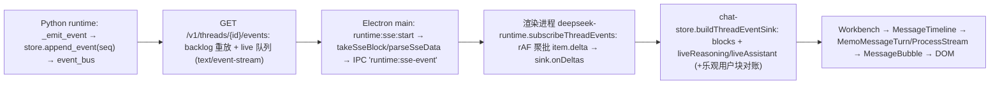

# 主会话消息展示链路端到端追踪（验证并覆盖前一轮报告）

> 只读调查，未修改任何源文件（唯一写入即本文件）。
> 所有行号来自当前工作树，已用 `read_file` / `grep_files` 逐条核对。
> 标注约定：**【确认】**= 读代码/跑命令直接得到；**【推测】**= 由代码推演得出，未实测。

---

## 0. 先更正前一轮报告的元信息（重要）

前一轮报告（本文件原内容）的若干前提与当前磁盘状态不符，先纠正，后续结论均以当前状态为准。

### 0.1 工作区并没有「未提交改动」，两个文件都已在 HEAD 中

任务线索称「`use-tail-anchor-scroll.ts`（已修改）和同名 `MessageTimeline.scroll.test.ts`（已删除）」为未提交改动。实测：

```
$ git rev-parse HEAD          -> 6cad71191adfe4abefe3288a11dbcf4f5d07c8ed
$ git status --porcelain      -> (空)
$ git diff HEAD --stat        -> (空)
$ git hash-object use-tail-anchor-scroll.ts   -> 3b1510c5…  == HEAD:该文件
$ git hash-object MessageTimeline.scroll.test.ts -> c21eb189… == HEAD:该文件
```

**【确认】** 分支 `build_0918`，工作树干净、与 HEAD 一致。`MessageTimeline.scroll.test.ts` **没有** 被删除，它正是 `6cad7119` 新增（+105 行）并已提交；`use-tail-anchor-scroll.ts` 的改动也已提交（不是未提交）。

因此本报告中「未提交改动带来的差异」应改述为 **`6cad7119` 相对其父提交 `1c4a8f9f` 的差异**（见 §3.3）。

### 0.2 前一轮报告的行号普遍偏移，不可直接采信

抽查三处（前一轮报告 → 实际）：

| 符号 | 前一轮报告 | 实际 | 结论 |
|---|---|---|---|
| `groupProcessRows` | `message-timeline-logic.ts:175-199` | `166-192` | 偏 ~9 行 |
| `planProcessRenderChunks` | 同文件 `346 起` | `259-293` | 偏 ~87 行 |
| `upsertUserBlock` | `chat-store-runtime-helpers.ts:228-248` | `272-292` | 偏 ~44 行 |
| `upsertFinalAnswerBlock` | 同文件 `289-299` | `333-360` | 偏 ~44 行 |
| `selectThread` | `chat-store.ts:2233-2322` | `2301-2380` | 偏 ~68 行 |
| `MessageTimeline` 挂载点 | `Workbench.tsx:1650/1755/1825/1906` | `1656/1768/1832/1909` | 偏 6-13 行 |

**【确认】** 前一轮报告的行号整体不可用（疑似来自旧版本）；本报告全部重取。

### 0.3 前一轮报告的一处实质结论错误（计时账本 key 迁移）

前一轮「潜在问题 4」称 `onUserMessage` reconcile 乐观块 id 时不迁移 `turnStartedAtByUserId`，会留下孤儿 `u-<t>` 键、计时显示退化。

**【确认】纠正**：该路径实际是自愈的。
- SSE 先到：`onUserMessage` 直接把 `currentTurnUserId` 设成 runtime itemId，并写 `turnStartedAtByUserId[ev.itemId]`（`chat-store.ts:830-834`）；随后 HTTP 返回时 `sendMessage` 走 `userMessageItemId !== userBlockId` 分支（`chat-store.ts:2694-2709`），此时 `blocks` 里已无 `u-<t>` 块、`turnStartedAtByUserId[userBlockId]` 为 `undefined`，迁移分支直接短路（`2706-2707`）。
- HTTP 先到：迁移分支正常执行（`2707-2709` 把键从 `u-<t>` 搬到 runtime id）。
两种时序都不会留下孤儿键。

### 0.4 前一轮报告漏掉的关键事实

1. **`phase_bridge` / `onPhaseNarration` 整条链路在当前 live 路径上是死代码**（§2.5）。
2. **`item.delta` 的 payload 在写盘前会被截断，且截断后 `delta`/`kind` 字段直接消失**（§5.1）。
3. `tests/test_presentation_reducer.py`、`tests/test_live_presentation.py` **约束的是 Python TUI（Textual）展示层，不是 Workbench GUI**（§4）。
4. `contracts/sse-event.schema.json` 的 `item.completed` / `turn.diff.updated` 分支**没有任何测试校验**（§4）。

---

## 1. 完整链路（模型 delta → 屏幕）



### 1.1 Python runtime：事件产生与持久化

- **统一出口**：`manager._emit_event` **先** `store.append_event`（分配 seq 并落 JSONL）**再** `event_bus.send(record)`，保证「已持久化的事件一定已被广播」的顺序：`src/deepseek_tui/server/threads/manager.py:6583-6597`。
- **seq 分配**：在「每线程写锁 + 全局 `_seq_lock`」内递增 `_state.next_seq`，并按 `CHECKPOINT_EVENT_INTERVAL` / `CHECKPOINT_MAX_INTERVAL_S` 周期性写 `state.json`：`src/deepseek_tui/server/threads/store.py:359-375`；随后按需对 noisy payload 做截断（`384-387`），再 append JSONL 一行（`400-407`）。`events_since` 逐行 parse、坏行跳过：`store.py:419-445`。
- **广播**：`AsyncBroadcast.send` 对每个订阅队列 `put_nowait`；队列满时**丢最旧一条**再塞最新（避免慢消费者阻塞）：`src/deepseek_tui/server/threads/broadcast.py:18-36`。
- **文本 delta 的产生**：`_monitor_turn` 消费引擎事件流：
  - `TextDeltaEvent` → 首片时落一个 `AGENT_MESSAGE`/`IN_PROGRESS` item，`metadata` 直接打上 `agent_segment = mid_turn_preface`，发 `item.started`，然后 `delta_batcher.append(...)`：`manager.py:5541-5576`。
  - `ThinkingDeltaEvent` → 同理落 `AGENT_REASONING` item + `item.started` + append：`manager.py:5578-5606`。
  - `ToolCallEvent` → **先 `flush_delta_batch()`**，再 finalize 未闭合的 reasoning/message（`agent_segment = mid_turn_preface`）：`manager.py:5608-5613`。
- **服务端 delta 聚批**：`TurnDeltaBatcher`（`src/deepseek_tui/server/metrics.py:229-301`）按 `(item_id, kind)` 累加文本，`FLUSH_INTERVAL_S = 0.05`（`metrics.py:226`）后 flush 成**一条** `item.delta`，payload 为 `{"delta": <合并后的整段>, "kind": kind}`（`metrics.py:293-299`）。`flush_delta_batch()` 额外在 emitted>0 时落一次 seq checkpoint（`manager.py:5494-5497`）。
- **持久化文本**：`finalize_open_reasoning`（`manager.py:5213-5238`）与 `finalize_open_message`（`5240-5278`）把累积文本写进 `item.detail/summary` 并发 `item.completed`（`metadata` 带 `agent_segment` / `process_intent`）。
- **item.delta 走 `_emit_item_delta`**：`manager.py:4779-4793`（顺带记 latency trace 计数）。

### 1.2 SSE 端点

- `stream_thread_events`：**先订阅再读 backlog**（避免空档丢事件），backlog 逐条 `yield sse_frame`，再进入 live 循环；按 `thread_id` 过滤、按 `last_seq` 去重；`heartbeat_seconds`（默认 15s）超时发 `: keepalive`；断连时 `is_disconnected()` 退出并在 `finally` 退订：`src/deepseek_tui/server/routes.py:49-84`。
- `sse_frame` 输出 `event: <name>\ndata: <json>\n\n`：`routes.py:44-46`。
- `data:` 里的 JSON 就是契约文档定义的对象（含冗余 `event` 字段）：`runtime_event_payload`，`routes.py:32-41`。
- HTTP 入口校验 `since_seq`（非负整数，否则 400）：`routes.py:601-624`，`StreamingResponse(media_type="text/event-stream")` 在 `624`。

### 1.3 Electron 传输层（main + preload）

- preload 暴露四个通道：`startSse/stopSse` 走 `invoke('runtime:sse:start'|'stop')`，`onSseEvent/onSseEnd/onSseError` 分别是 `ipcRenderer.on('runtime:sse-event'|'sse-end'|'sse-error')` 并返回退订函数：`packages/workbench/src/preload/index.ts:171-197`。
- main 侧 `ipcMain.handle('runtime:sse:start')`：`ensureRuntime` → 以 `AbortController` 建流 → `fetch(${base}/v1/threads/{id}/events?since_seq=…)`（`main/index.ts:1213`）→ `takeSseBlock` 切帧（`411-425`）、`parseSseData` 只取 `data:` 行后 `JSON.parse`（`393-409`）→ 逐帧 `safeWebContentsSend(wc, 'runtime:sse-event', …)`：`packages/workbench/src/main/index.ts:1196-1291`。
  - 同一 `streamId` 重复 start 会 abort 旧流（`1202-1207`）；`runtime:sse:stop` 置 `stoppedByClient` 并 abort（`1293-1301`）。
  - **注意**：`parseSseData` 忽略 `event:` 行，只靠 data 里的冗余 `event` 字段——这正是 schema 描述里写明的原因（`contracts/sse-event.schema.json:5`）。

### 1.4 渲染进程传输层 + delta 批处理

- `subscribeThreadEvents(threadId, sinceSeq, sink, signal)`：`packages/workbench/src/renderer/src/agent/deepseek-runtime.ts:1636-1641`（接口声明 `types.ts:565-570`）。
- **第一层聚批（客户端 rAF）**：`pendingDeltas` 累积，`scheduleDeltaFlush` 用 `requestAnimationFrame` 合并成一批交给 `sink.onDeltas(batch)`；`flushPendingDeltas` 在 cancel 后立即同步 flush：`deepseek-runtime.ts:1679-1699`。
- **顺序保证**：收到任何非 `item.delta` 事件前先 `flushPendingDeltas()`（`1761`），流结束/出错时 `finish()` 也先 flush（`1713-1719`）。
- `item.delta` 分支：`kind === 'subagent_message'` → `onSubagentTextDelta`（`1745-1753`）；`agent_message`/`agent_reasoning` → push 进 `pendingDeltas` 并调度 flush（`1754-1757`）；**其它 kind 的 delta 被静默丢弃**（`1758`）。
- **续传/重连**：`nextSinceSeq = max(nextSinceSeq, eventSeq)`（`1731-1733`）；`onSseEvent` 先比对 `streamId`（`1721-1722`）；`cleanup()` 会摘掉三个监听并在 abort 时 `stopSse`（`1701-1711`、`2260-2264`）；4xx（非 408/429）视为致命直接 `onError`，其余指数退避 750ms→5s，连续 6 次失败上报错误：`1660-1661`、`2283-2305`。
- 事件映射（同一 `onSseEvent` 回调内）：`item.started` → 用户消息 `onUserMessage` / 工具 `onTool(running)` / `request_user_input` → `onUserInput`（`1763-1797`）；`item.completed|failed` → 用户消息对账、phase bridge、status/compaction → `onSystemStatus`、error、`final_answer` → `onFinalAnswer`、其余 `agent_message|agent_reasoning` → `onLiveSegmentComplete`、工具 → `onTool`（`1799-1923`）；`turn.diff.updated` → `onTurnDiffUpdated`（`1926-1971`）；`turn.completed` → `onTurnComplete`（`1973-2008`）。
- **快照（另一条到达形态）**：`getThreadDetail` 的实现把 `detail.items` 直接 hydrate 成 `ChatBlock[]`，含 `agentSegment`（`1172-1173`）、`processIntent`（`1172`）、reasoning 的 `narration`（`1187-1193`）。

### 1.5 渲染进程状态存储（chat-store）

唯一规范化入口是 `buildThreadEventSink(set, get)`：`packages/workbench/src/renderer/src/store/chat-store.ts:787-1522`（注意它**不捕获 threadId**）。状态字段见 `store/chat-store-types.ts`（`blocks/liveReasoning/liveAssistant/lastSeq/busy/currentTurnId/currentTurnUserId/turnStartedAtByUserId/turnDiffByTurnId` 等；初始化默认值 `chat-store.ts:255-256`）。

- `onSeq`：`lastSeq` 更新 + 清「流恢复中」错误（`792-798`）。
- `onDeltas`（**核心**，`838-922`）：
  - reasoning delta 累积进 `liveReasoning`，并记账 `turnReasoningFirstAtByUserId` / `LastAtByUserId`（`874-889`）；
  - `agent_message` delta 到达时，若 `liveReasoning` 非空则**先把 reasoning 固化成独立块**（`appendLiveReasoningBlock`）再清空，然后累积 `liveAssistant`（`896-901`）；
  - 返回时按需生成新 `blocks`/`liveReasoning`/`liveAssistant` 引用（`909-920`）；`lastSeq` 取批内最大 seq（`846-853`）；
  - `busy` 为 false 但有 `currentTurnId` 时自动恢复 `busy=true`（`859-861`）。
- `onUserMessage`（`799-837`）：先 `flushLiveBlocks`，再用 `currentTurnUserId` 对账乐观块（`805-817`），`upsertUserBlock` 兜底，置 `busy/currentTurnId/currentTurnUserId/turnStartedAtByUserId`。
- `onTool`（`940-1012`）：按 `itemId` 命中则**原位更新**且 `meta` 浅合并（保留 `item.started` 时的 `tool_input`，`975-979`）；未命中则先 `flushLiveBlocks` 再 append（`988-1011`）。
- `onLiveSegmentComplete`（`1364-1383`）：`agent_reasoning` 且 `liveReasoning` 非空 → 用 **live 文本** 落块（`1367-1371`，**忽略了事件里的 `text`**）；`agent_message` → `completeAssistantProgress`（`330-345`），把 durable 文本按 `mid_turn_preface` 落块。
- `onFinalAnswer`（`1385-1393`）：`upsertFinalAnswerBlock`（`chat-store-runtime-helpers.ts:333-360`，会先删同 id 的 reasoning 临时块）并清 live 两字段。
- `onPhaseNarration`（`1394-1427`）：见 §2.5（当前无生产端）。
- `onTurnComplete`（`1448-1495`）：`flushLiveBlocks` → 清 `currentTurnId`（保留 `lastCompletedTurnId`）→ `expireTurnApprovals` + `finalizeOrphanSubagentBlocks` → 通知/轮询 → `reloadActiveThreadBlocks` → `refreshThreads` → `drainQueuedMessages`。
- `flushLiveBlocks`（`397-415`）：把 `liveReasoning` 固化为 **新生成 id `r-${now}`** 的 reasoning 块、清 `liveAssistant`。
- `selectThread`（`2301-2380`）：abort 旧 SSE → `getThreadDetail` 快照 → 判 `busy` → 挂计时/ diff 账本 → `set(...)` → 建新 sink 并以 `latestSeq` 重开订阅。
- 乐观发送：先插 `u-${now}` 块（`2513`），HTTP 返回后用 `reconcileOptimisticUserBlock` 迁移 id/turnId/modelLabel 并同步迁移计时键（`2694-2709`）；重开发订阅用 `seqAtSend = lastSeq`（`2670`、`2753`）。

### 1.6 React 组件 → DOM

- `Workbench.tsx:297-336` 用 `useShallow` 订阅（含 `blocks`/`liveReasoning`/`liveAssistant`，`306-308`）；四处布局各自挂载 `MessageTimeline` 并传 `blocks/liveReasoning/live={liveAssistant}`：`Workbench.tsx:1656-1659`、`1768-1771`、`1832-1835`、`1909-1912`。另有一处把 live 文本合进块数组的 memo：`398-408`。
- `MessageTimeline`：`groupTurns(blocks)` → `visibleTurns.slice` → `MemoMessageTurn`（`MemoMessageTurn` 用逐字段浅比较自定义 memo：`MessageTimeline.tsx:1184-1198`）。
- `MessageTurn` 内拆轨：`processBlocks` / `assistantContentBlocks` / `turnFileChanges` / `systemBlocks`（`997-1063`）；正文轨 → `MessageBubble`（`1154-1164`），live 回答 → 额外 `MessageBubble(id='live-assistant')`（`1166-1171`）；过程轨 → `WorkMetaRow` + `ProcessStream`（`1107-1131`）。
- `MessageBubble`：assistant → `<div id="block-<id>">` + `AssistantMarkdown`（`3093-3117`）；`ApprovalBubble` 形态的 `approval` 块返回 `null`（`3137-3139`），pending `user_input`/`elevation` 也返回 `null`（`3130-3132`、`3143-3145`）。
- Markdown 渲染：`AssistantMarkdown` → `Suspense` 包 `LazyStreamdownAssistant`（`224-246`）；**只有 live 气泡** 打开 `parseIncompleteMarkdown`（`3094` → `message-timeline-logic.ts:208-210`）；reasoning 用 `BoundedReasoningMarkdown`（`ReactMarkdown`，`248-258`）；超长文本由 `useBoundedText` 截断 + 「展开」（`186-222`）。

---

## 2. 渲染端组装逻辑

### 2.1 delta 批处理是「两层 + 一次性」的

| 层 | 位置 | 批大小 | 语义 |
|---|---|---|---|
| 服务端 | `metrics.py:263-301`（0.05s 定时 flush） | 按 `(item_id, kind)` 合并整段 | 减少 JSONL 行数与 SSE 帧数 |
| 客户端 | `deepseek-runtime.ts:1682-1699`（rAF） | 一帧内的所有 delta | 一帧一次 `set()` |
| 状态层 | `chat-store.ts:873-908` | 逐条串行应用 | 同一 rAF 批内 reasoning→message 的分段顺序 | 

**【确认】** 服务端 `TurnDeltaBatcher` 的三个不变量由测试锁定：合并成一条（`tests/test_turn_latency_and_delta_batch.py:149-166`）、`0.05s` 定时 flush（`170-186`）、flush 与 emit 并发不崩（`190-212`）。这三条测试已本地跑通（见 §6）。

### 2.2 消息规范化 / 合并 / 时间线

- **规范化只在 store 发生**，且是「按 id upsert，未命中追加到尾部」：`upsertUserBlock`（`chat-store-runtime-helpers.ts:272-292`，未命中 `[...blocks, nextBlock]`）、`upsertFinalAnswerBlock`（`333-360`）、`appendLiveReasoningBlock`（`chat-store.ts:268-296`）、`appendLiveAssistantBlock`（`298-327`）。
- **时间线分组不做排序**：`groupTurns`（`MessageTimeline.tsx:881-911`）纯线性扫描——`user` 开新 turn、`system` 成为独立分隔 turn（内部 subagent 交接文案被 `continue` 丢弃，`892-894`）、其余块归入当前 turn；**渲染顺序 = `blocks` 数组顺序**（无 `createdAt` 排序）。
- **分页**：`AUTO_COLLAPSE_THRESHOLD=24`、`TURN_PAGE_SIZE=18`（`166-167`）；`visibleTurns` 只取尾部 N 个 turn（`301-308`），顶部按钮/触顶滚动加载更早（`311-322`、`330-332`、`528-534`），并靠 `pendingPrependRef` + rAF 补偿 `scrollTop` 以免跳变（`514-526`）。
- **per-turn 派生**：`resolveTurnDiffId` 选 turn-diff 快照（`719-724`，实现 `lib/turn-mutation-view.ts`）；`processing = (busy && isLatestTurn) || turnPending || hasLiveStream`（`717-726`）；`isLive = currentTurnUserId === turn.user.id`（`705`）；`live*` 只传给最新 turn（`732-733`）。
- **memo 边界**：`MemoMessageTurn` 逐字段比较（`1184-1198`），是「流式期间历史 turn 不重渲染」的关键。

### 2.3 工具调用的配对投影

- **审批/提权 → 工具行** 的配对是 `toolGateIds`（`block.id` ∪ `meta.tool_call_id`）→ `findPendingToolGate` 在全量 blocks 里找 `status==='pending'` 且 id 命中的 approval/elevation：`lib/tool-gate.ts:12-36`。`ProcessStream` 用它算出 `interactiveToolIds`（`MessageTimeline.tsx:2040-2042`），这类行**永不折叠**、在折叠态下**必须可见**（`2048-2050`）。
- **todo → 内联卡**：`isTodoToolBlock` + `todoSession.anchorBlockId` 决定内联渲染位置，其余 todo 工具行返回 `null`（隐藏）：`2157-2185`。
- **subagent → 汇总卡**：`buildSubagentSummaryForTurn`（`1581-1620+`）把 turn 内所有 subagent 块与编排工具行收进一张 `SubagentSummaryPanel`（`2187-2196`），`visibleExecutionBlocks` 负责剔除被收纳的行（`1633-1650`）。
- **只读探针折叠**：`isMergeableProbeBlock`（`message-timeline-logic.ts:149-159`，file_change / todo / subagent 编排一律不折）→ `groupProcessRows` 把**相邻**可折块并成 `tool_batch`（`166-192`，非可折块是天然边界）→ `planProcessRenderChunks` 再按 `MIN_COLLAPSIBLE_WORK_UNITS=2` 决定是否包一层可点开的 `work_summary`（`259-293`）。

### 2.4 正文 vs reasoning/思考分段

- 块级：`isProcessBlock`（`935-945`）把 `reasoning/tool/approval/elevation/user_input/subagent/system` 划入过程轨。
- assistant 块级：`splitThink` 先从正文里剥离 `<think(?:ing)?>…</think>`（未闭合也吃，`message-timeline-logic.ts:16-25`），剥出的 `think` 变成 `<id>-think` 的 reasoning 块（`MessageTimeline.tsx:1004-1007`）。
- **正文/过程的路由完全靠持久化元数据**，不靠位置或文本形状：`placeAssistantContentBlock` 只看 `agentSegment === 'final_answer'`（`message-timeline-logic.ts:93-107`），未打标的 assistant 块留在过程轨。测试锁定：`MessageTimeline.test.ts:135-173`。
- live 文本：`liveProcessText = [liveReasoning, liveThink]` 追加成 `live-reasoning` 过程行（`1030-1032`）；`liveContent` 进正文大气泡、**不重复进过程轨**（`1065-1071`、`1166-1171`）。
- 折叠态可见性：`isVisibleWithoutExecutionDetails`（`228-233`）= assistant 有文本 / reasoning **有 narration** / tool 仍在 running；由 `MessageTimeline.test.ts:567-579` 锁定。
- 思考指示符只落在最后一个「后面没有更多工作」的 thinking 行：`trailingThinkingIndicatorId`（`73-91`），测试 `MessageTimeline.test.ts:417-471`。
- 长 mid-turn preface 折叠：`clipMidTurnPrefaceText`（`213-225`，阈值 `1200`），渲染在 `MidTurnPrefaceLine`（`1978-2002`，class `ds-process-narration`）。

### 2.5 narration 的生成与渲染（前一轮报告完全漏掉这一层的关键变化）

**当前 live 路径的 narration = 「mid_turn_preface 上的结构化 `process_intent`」，不是 `phase_bridge` STATUS item。** 【确认】

- 生成侧（Python）：
  - 模型自己给了 preface → `build_process_intent(scope='pre_tool', source='primary_model', …)` 直接打进该 agent_message item 的 `metadata.process_intent`（`manager.py:6148-6173`）。
  - 模型没给 preface → `ensure_opening` 落一条固定开场 intent（`source='runtime'`，`manager.py:5315-5330`）。
  - 都没有 → `persist_round_intent('')` 落一条 **空文本 + 结构化 intent** 的不可见 frame（`5280-5313`），随后 `schedule_intent_fill` 让 narration 服务异步补文本，补上后**改写同一 item** 并重发 `item.completed`，`metadata.process_intent.source = 'narration_service'`（`5431-5476`）。
- 契约侧测试：`tests/contract/test_monitor_turn_agent_segments.py:39-119`（primary_model 的 intent 断言 + `narrator.assert_not_awaited()`，即模型已给词就不再调 narration 服务）、`230-318`（工具失败证据进入 narration、narration_service frame 恰好一条、final answer 恰好一条）、`324-389`（开场序言唯一、且早于第一个 tool item）。已本地跑通。
- 渲染侧：`readProcessIntent`（`deepseek-runtime.ts:626-646`）→ `onLiveSegmentComplete(…, processIntent)` → `completeAssistantProgress` 里 `source === 'narration_service'` 时走 upsert-only（不消耗更新的 live 回复）：`chat-store.ts:330-345`；渲染走 assistant 分支的 `MidTurnPrefaceLine`：`MessageTimeline.tsx:2212-2217`。
- **`phase_bridge` / `onPhaseNarration` 已无生产端**：全仓 `grep -rn "\"phase_bridge\"\|'phase_bridge'"` 只有常量定义 `server/phase_bridge.py:51`，`PHASE_BRIDGE_METADATA_KEY` 没有任何调用点；`after_reasoning_id` 同理只在 `phase_bridge.py:52` 与消费端 `deepseek-runtime.ts:616` 出现。因此：
  - `isPhaseBridgeItem`（`deepseek-runtime.ts:611-618`）恒为 false → `onPhaseNarration`（`chat-store.ts:1394-1427`）在 live 路径**不会被调用**；
  - 快照 hydrate 里 `narrationByReasoningId`（`deepseek-runtime.ts:1108-1114` → `1187-1193`）永远为空 → **reasoning 块的 `narration` 字段在真实数据里不会再被填充**；
  - `ReasoningEntry` 的 narration 分支（`MessageTimeline.tsx:2270-2282`）与 `reasoningNarrationFromBlocks`（`message-timeline-logic.ts:120-127`）成为兼容旧历史/旧快照的遗留路径。
  - `MessageTimeline.ui.test.ts:158-180` 里那条 `narration` 断言是测试自行构造 `narration` 字段驱动的，**不能证明生产端会产出它**。

### 2.6 6cad7119 对渲染组装的两处改动（已提交）

- 折叠态过滤从 `standaloneIds`（含 firstReasoning）改为 `interactiveToolIds`（`MessageTimeline.tsx:2046-2053`）：折叠的历史 turn 不再漏出「思考」标题行。
- `openingReasoning` 增加 `showExecutionDetails &&`（`2073`）：展开时才保留首个思考的标题。测试 `MessageTimeline.ui.test.ts:158-180` 锁定「折叠态 `ds-process-reasoning` 为 null / `narration` 存在时 `ds-process-narration` 为 2」。

---

## 3. 滚动与锚定（`use-tail-anchor-scroll.ts`）

### 3.1 机制全貌

`MessageTimeline.tsx:368-374` 调用 `useTailAnchorScroll`，传入 `sentUserId = currentTurnUserId`、`threadId`、以及共享的 `stickToBottomRef` / `userScrolledAtRef`。

- **发送即锚定**：`sentUserId` 变为新值时置 `holdRef=true`、`releasedByUserRef=false`、`stickToBottomRef=false`（`use-tail-anchor-scroll.ts:62-69`）；同时 `MessageTimeline` 在 `currentTurnUserId` 变化时也把 stick 关掉（`434-439`）。
- **测距与留白**：`measure()` 用 `contentOffset`（按 `--ds-ui-scale` 归一到内容坐标，`21-32`）量出用户气泡与整个 turn 的盒子，`contentAfterUser` 之后交给纯函数 `computeTailAnchorSpacerPx`（`message-timeline-logic.ts:299-309`：`max(0, viewportH - inset - userH - contentAfterUser)`，inset 16px）得到 spacer 高度，并由 `MessageTimeline.tsx:791-797` 渲染成 `.ds-tail-anchor-spacer`。
- **钉住**：仍处 hold 且用户未滚动时，`container.scrollTop = computeTailAnchorScrollTop({userOffsetTop})`（`use-tail-anchor-scroll.ts:119`，即把用户气泡放在 inset 下方 16px 处）。
- **交接给 stick-to-bottom**：当 spacer 降到 ≤ 8px（`shouldReleaseTailAnchor`，`message-timeline-logic.ts:320-328`）→ `holdRef=false`、`stickToBottomRef=true`、`scrollTop = scrollHeight`（`112-116`）。
- **重测时机**：`ResizeObserver` 观察容器与 `.ds-timeline-stack`（`122-128`），依赖数组含 `spacerPx`（`129`）→ 每次改 spacer 都会重整一轮（由 1px 阈值 `96-98` 防抖）。
- **stick-to-bottom 与冷却**：`pinTimelineToBottom` 在 `holdRef` / `!stick` / 「350ms 内用户刚滚过」三种情况下直接返回（`MessageTimeline.tsx:376-384`）；触发点有两条：对 `.ds-timeline-stack` 的 `ResizeObserver`（同帧钉底，`404-414`）与 `[blocks, live, liveReasoning]` 的 `useLayoutEffect`（`416-418`）。
- **用户滚动的判定**：`scroll` 事件只更新 `stickToBottomRef`（距底 <96px 视为贴底）+ 触顶加载（`324-333`）；`wheel/touchmove/keydown` 才被当作「用户正在滚」并记 `userScrolledAtRef`（`335-366`）。
- **展开行不跳动**：`releaseStickOnExpandClick` 在 pointerdown 命中 `button/[aria-expanded]/summary` 时释放 stick 与 tail-anchor（`386-399`），否则 ResizeObserver 会把刚展开的行顶出视口。
- **跨线程/跳转**：线程切换重置 stick 并直接跳到底（`420-432`）；`scrollToBlockId` 用 rAF 缓动（280ms ease-out），**超过一屏时先传送到距目标一屏处**再动画（`441-494`）。
- **QueryTrail 高亮的测量被 250ms 节流**，且滚动热路径只读缓存 + 外置 store，不触发 React 重渲染（`560-642`）。

### 3.2 会触发可视跳变 / 内容跳动的条件（清单）

1. **tail-anchor 交接**：spacer 耗尽那一帧 `scrollTop = scrollHeight`，是一次性瞬移（`use-tail-anchor-scroll.ts:112-116`）——设计如此，但表现为「跳到底部」。
2. **spacer 被重建**（6cad7119 之前的 bug）：释放后若 turn 高度回落，`measuredSpacer` 重新变大 → 下方凭空出现大片空白。现由 `nextSpacer = holdRef.current ? measuredSpacer : Math.min(spacerPx, measuredSpacer)` 挡住（`use-tail-anchor-scroll.ts:91-98`）：**释放后只能缩不能涨，只有新的 send 才能再涨**。`MessageTimeline.scroll.test.ts:78-89` 锁定这个不变量（跑通，见 §6）。
3. **用户滚动后再来的 resize 把位置抢回去**：`markUserScroll` 新增 `tailAnchorHoldRef.current = false; stickToBottomRef.current = false`（`MessageTimeline.tsx:338-344`）——因为 tool/subagent 更新可能远在 350ms 冷却之后到达，仅靠时间戳判不出手势。`MessageTimeline.scroll.test.ts:91-105` 锁定（wheel/touchmove/PageUp 三种手势）。
4. **分页阈值跨越**：`turns.length` 越过 `AUTO_COLLAPSE_THRESHOLD=24` 时，`useEffect` 把 `visibleTurnCount` 重置为 18（`505-507`）→ 上部内容被整段移除，视口内容下跳。
5. **busy 时展开全部 turn**：`busy` 变化时 `setVisibleTurnCount(max(count, turns.length))`（`509-512`）→ 上方插入内容，当前阅读位置被推走（有 `pinTimelineToBottom` 兜底，但仅在贴底时）。
6. **加载更早 turn 的 rAF 补偿**：`pendingPrependRef` 在 `requestAnimationFrame` 里才修正 `scrollTop`（`514-526`），补偿前存在一帧错位；另外「首屏填不满就继续加载」的 effect（`528-534`）会连锁触发多次 prepend。
7. **`turn-${index}` React key**：无 user 块的 turn 用 index 作 key（`729`），而 `visibleTurns` 的起点随 `hiddenTurnCount` 变化（`306-308`）→ 揭示更早 turn 时这些 key 漂移、整段 turn 重挂载（`workExpandedOverride` 等本地状态丢失，`987-988`）。
8. **Markdown 懒加载**：正文走 `lazy()` + `Suspense`（`132-134`、`224-246`），首次解析有 fallback 纯文本 → 富文本的替换帧，长消息可见一次「重排」。
9. **`live-assistant` 块被 durable 块替换**：`onFinalAnswer`/`onLiveSegmentComplete` 用新 id 落块并清 live（`chat-store.ts:1379-1391`），时间线上是「一个块消失、另一个出现」，高度差在 `pinTimelineToBottom` 生效前提下才被吸收。
10. **图片/mermaid/代码高亮异步撑高**：`blockCacheRef` 的 `scheduleMeasure` 注释明确写了 streaming/mermaid 会导致内容 reflow（`610-626`），此时若 `stickToBottom` 为 false（用户手动上滚过），视口内容会向下漂。

### 3.3 6cad7119 相对 1c4a8f9f 的滚动改动的净效果

`git show 6cad7119` 显示 4 个文件：新增 `MessageTimeline.scroll.test.ts`（+105）、`MessageTimeline.tsx`（+11/-2 附近）、`MessageTimeline.ui.test.ts`（±12）、`use-tail-anchor-scroll.ts`（+7/-2）。滚动相关的净变化就是上文 §3.2 的第 2、3 条：**（a）释放后 spacer 单调不增；（b）任何真实滚动手势立刻释放 hold 与 stick**。

**【推测】** `MessageTimeline.scroll.test.ts:91-105` 确实能区分修复前后（用 mock 的 `getBoundingClientRect`/`scrollHeight` 推演：无 `tailAnchorHoldRef.current = false` 时 `measure()` 会把 `scrollTop` 改成 `userOffsetTop - 16 = 84`，而断言要求保持 20）。未做「检出旧版本再跑测试」的实测。

---

## 4. 契约与不变量（谁约束了谁）

| 文件 | 约束对象 | 约束内容（行号） |
|---|---|---|
| `contracts/sse-event.schema.json` | SSE `data:` JSON 形状（**Python 侧**） | 顶层必填 `seq/timestamp/thread_id/event/payload`（`8`）、`additionalProperties:false`（`7`）、`seq>=1`、`thread_id` 前缀 `^thr_`（`10-23`）；`payload` 允许任意字段（`48-52`）；仅对 `approval.required`（`55-79`）、`user_input.required`（`80-95`）、`turn.diff.updated`（`96-134`）、`item.completed`（`135-179`）给出细化形状 |
| `tests/contract/test_contract_schemas.py` | 上述 schema | `27-45` 只断言 `approval.required` 的 required 三字段与六个可选键、`user_input.required` 的三字段；`48-64` 断言顶层 required ⊆ `runtime_event_payload()` 输出且 `event` 冗余字段存在。**`allOf` 里的 `turn.diff.updated` / `item.completed` 分支完全没有测试**（**【确认】** 读全文件后确认无第三处引用） |
| `packages/workbench/.../chat/MessageTimeline.test.ts`（46 test） | 纯函数 + DOM 组装 | 见 §2 各处：`splitThink`（`33-73`）、`placeAssistantContentBlock`（`135-173`）、`groupProcessRows`（`275-415`）、`trailingThinkingIndicatorId`（`417-471`）、`planProcessRenderChunks`（`472-522`）、tail-anchor 数学（`523-563`）、折叠可见性（`567-579`） |
| `.../chat/MessageTimeline.ui.test.ts`（5 test） | 端到端 DOM 断言（happy-dom） | 完成后仍保留进度、命令/失败只在展开后可见（`28-81`）；静默编辑轮次被折叠成 1 个 `ds-work-summary`、延迟 narration **只插入一次**（`84-125`）；失败的 subagent 汇总在历史 reload 后保持安静（`128-156`）；折叠历史隐藏首个思考标题（`158-180`） |
| `.../chat/MessageTimeline.scroll.test.ts`（5 test） | 滚动不变量（happy-dom + mock RO） | 长 turn 收起不重建空白（`78-89`）；wheel/touchmove/keydown 之后到来的更新不抢回滚动位置（`91-105`） |
| `tests/test_turn_latency_and_delta_batch.py` | 服务端聚批 + 延迟账 | `149-166` 合并成一条 `item.delta`；`170-186` `0.05s` 定时 flush；`190-212` 并发 flush 安全；`22-147` first-response 超时分层、`end_to_end_ms` 冻结/回落 |
| `tests/test_presentation_reducer.py` | **Python TUI（Textual）** 的 batch 生命周期 | `TurnPresentationReducer` 只在 `src/deepseek_tui/tui/app.py:173` 被实例化，**与 Workbench GUI 渲染链路无关**；它约束「批在最后一个 tool 结果回来后才 done」（`34-53`）、乱序结果（`56-68`）、失败转 partial_fail+recover phase（`71-84`）、审批/拒绝不可折叠（`87-101`）、重复/未知结果忽略（`104-110`）、取消（`113-124`） |
| `tests/test_live_presentation.py` | **Python TUI** 的真机 smoke（`@pytest.mark.live`） | 需要 API key（`33-34`）；断言 intent 行、3 个并行 read 折叠成 1 个 batch、最终回答含标记（`87-91`） |
| `tests/contract/test_monitor_turn_agent_segments.py` | **Python runtime → GUI 的 agent 分段/narration 契约** | 见 §2.5；这是 narration 与 `agent_segment` 的真正契约测试 |

**【确认】** `test_presentation_reducer.py`/`test_live_presentation.py` 约束的是 TUI，前一轮报告把它当作 Workbench 渲染契约依据是**错的**。

---

## 5. 风险（读代码确认的机制，附行号）

### 5.1 `item.delta` 的超长批次会被整条丢弃（新增发现）

- 写盘前 `is_noisy_event_name('item.delta')` 为真 → `truncate_event_payload(payload, max_chars=2048)`：JSON 序列化超过 2048 字符时返回值**只有** `{_truncated, _original_chars, preview}`，**`delta` 和 `kind` 键消失**：`src/deepseek_tui/server/data_inventory.py:37-49`、`92-104`；调用点 `store.py:384-387`。
- 截断发生在 `append_event` 内，而 `_emit_event` 是 **append 之后再 `event_bus.send(record)`**（`manager.py:6593-6596`）→ **live SSE 帧与持久化的 JSONL 用的是同一份被截断的 payload**。
- 渲染端 `const delta = (payload.delta as string) || ''`、`kind` 取不到 → 直接 `return`：`deepseek-runtime.ts:1743-1758`。于是这一批文本**静默丢失**。
- 影响面差异：
  - `agent_message`（正文/preface）在一次 turn 结束时会被 durable 文本覆盖（`completeAssistantProgress` 用事件 `text`，`chat-store.ts:330-345`），所以主要影响**流式过程中的显示完整性**，turn 结束后自愈（`reloadActiveThreadBlocks`）。
  - `agent_reasoning` **不会自愈**：`onLiveSegmentComplete` 只用 `s.liveReasoning`，完全忽略事件里的 durable `text`（`chat-store.ts:1367-1371`）→ 该 reasoning 块在 turn 结束前一直是残缺文本；turn 结束后的 reload 快照才会修好。
- **【推测】** 触发频率低（需 50ms 内合并出 >2KB 文本，或 flush 被 emit 阻塞较久），但对长思考爆发是真实路径。

### 5.2 `onLiveSegmentComplete(agent_reasoning)` 忽略 durable 文本

同 5.1，但这条是独立的设计缺口：`deepseek-runtime.ts:1875-1881` 明明传了 `(it.detail ?? it.summary)` 作为 `text`，`chat-store.ts:1364-1372` 却不用它。任何「live 累积文本 ≠ 服务端 durable 文本」的情形（截断、断线重连后从中间续读、乐观清空）都会让 reasoning 块停在残缺状态，直到下一次快照。

### 5.3 `onTurnComplete` 的全量 reload 与迟到事件互相覆盖

- `reloadActiveThreadBlocks` 的写回只防「线程已切换」（`chat-store.ts:447`），**不校验 `lastSeq`**，直接整体替换 `blocks` 与 `lastSeq`（`448-465`）；而 turn 结束后 SSE 订阅并没有被 abort（`chat-store.ts:1448-1495` 未 abort），因此 reload 之后仍可能有迟到事件落进来。
- 大部分通路按 id upsert 不会重复；**唯一会产生新 id 的是 `flushLiveBlocks`**（`chat-store.ts:404` 用 `r-${now}`）——若 reload 已把同一段 reasoning 落进快照，而 `liveReasoning` 尚未清空，late 事件触发 flush 就会追加一条内容重复、id 不同的 reasoning 块。
- **【推测】** 需要 reload 与 late 事件在同一窗口竞争，命中率取决于服务端 reload 延迟；未实测复现。

### 5.4 sink 闭包不带 threadId

`buildThreadEventSink(set, get)` 的签名里没有 threadId（`chat-store.ts:787-790`），所有回调直接写全局 state。缓解确实存在：渲染进程按 `streamId` 过滤事件、`abort` 时同步 `cleanup()` 摘监听（`deepseek-runtime.ts:1721-1722`、`1701-1711`、`2260-2264`）。
**【推测】** 因此跨线程写脏需要「事件已被 IPC 派发、abort 还没执行到 cleanup」的竞态窗口，比前一轮报告描述的严重程度低；但这是「无纵深防御」结构——一旦将来出现 sink 复用或 abort 丢失，没有任何一层能拦住。前一轮报告把它列为 1 号风险，**应降级**。

### 5.5 `upsertUserBlock` / `upsertFinalAnswerBlock` 未命中即尾部追加

`chat-store-runtime-helpers.ts:282`、`359`，配合 `groupTurns` 的无排序线性分组（`MessageTimeline.tsx:881-911`），任何「id 未登记」的迟到事件都会把气泡插到会话末尾而非原位（例如跨线程竞态、或 rewind 后旧事件的 id 已不在 blocks 中）。

### 5.6 性能：每个 rAF 批产生新 blocks 引用，多订阅者全量重扫

`onDeltas` 每个批次都换 `blocks`/`liveAssistant` 引用（`chat-store.ts:909-920`）→ `Workbench` 的 `useShallow`（`Workbench.tsx:297-336`）与 `OperationContextDock` 的三个 `useMemo`（`OperationContextDock.tsx:190/194/196`，依赖均为 `blocks`）随之重算；timeline 靠 `MemoMessageTurn` 兜住，但 dock 的提取函数对大数组是每批全扫，长会话有卡顿风险。**【推测】** 未做 profiling。

### 5.7 `contracts/sse-event.schema.json` 的校验覆盖不足

`item.completed` / `turn.diff.updated` 的细化形状没有测试兜底（§4），schema 与实现漂移不会被 CI 发现。缓解：把 schema 段当成文档；或在 `test_contract_schemas.py` 里加 `jsonschema.validate`（该文件 `27-29` 的注释解释了为何当前不使用 `jsonschema`——CI 里 `attrs` 不一定装）。

---

## 6. 复核命令与实测结果

| 命令 | 结果 |
|---|---|
| `git status --porcelain` / `git diff HEAD --stat` | 空（工作树干净） |
| `git show --stat 6cad7119` | 4 files：+新增 scroll.test.ts、MessageTimeline.tsx、ui.test.ts、use-tail-anchor-scroll.ts |
| `npx vitest run …/MessageTimeline{,.ui,.scroll}.test.ts`（cwd `packages/workbench`） | **3 files / 56 tests passed**（含 6cad7119 新增的 5 条滚动测试） |
| `.venv/bin/python -m pytest tests/test_presentation_reducer.py tests/test_turn_latency_and_delta_batch.py tests/test_live_presentation.py tests/test_presentation_edge_cases.py -q` | **36 passed**（其中 `test_live_presentation.py` 真机跑通：`intent_cells=1, batch_cells=1, batched_actions=3, final_marker=True`） |
| `.venv/bin/python -m pytest tests/contract/test_monitor_turn_agent_segments.py -q` | **8 passed** |
| `.venv/bin/python -m pytest tests/contract/test_contract_schemas.py -q` | **4 passed** |

---

## 7. 未完成 / 需要什么才能推进

- **未做**：把工作树回退到 `6cad7119^` 实跑 `MessageTimeline.scroll.test.ts` 以证明它真的能捕获旧 bug（属「推测」的 §3.3）；需要建临时 git worktree 或 `stash`，会改动 `.git` 元数据，本次按只读约束未做。
- **未做**：`OperationContextDock` 的全量重扫没有 profiling 数据支撑，仍是推测。
- **未做**：`item.delta` 截断（§5.1）与 turn 完成竞态（§5.3）都只做了静态推演，缺少可复现的最小用例或日志证据。
- **建议下一步**（供父会话决定）：如需实证 §5.1，可在 `tests/contract/` 加一条用例，构造 2KB+ 的 `{"delta": ...}` payload 走 `store.append_event`，断言产出记录里 `payload.delta` 消失。
