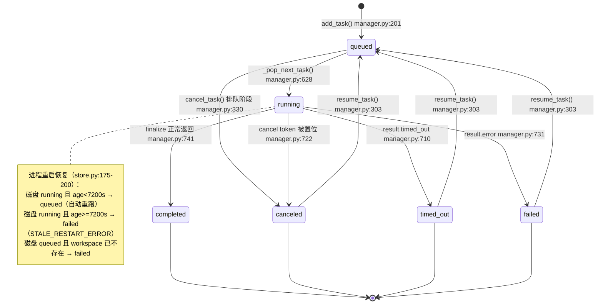
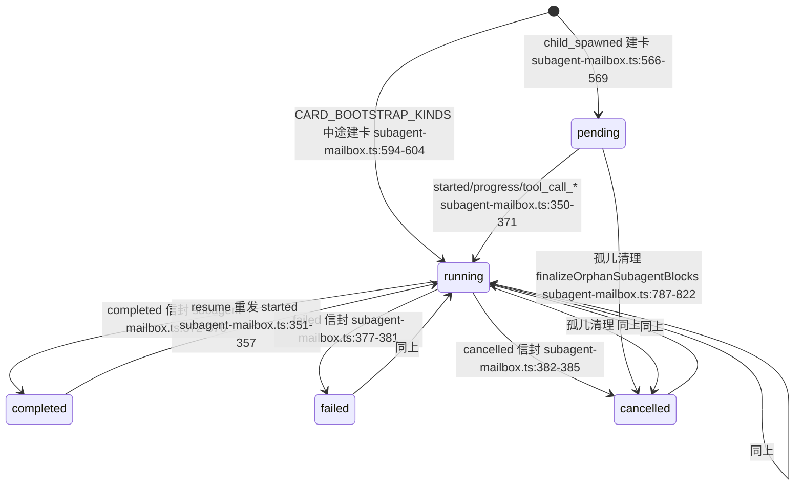

# Task / Subagent 状态更新流程分析报告（第 2 轮复核版）

> **只读调查**：除本报告外未修改任何仓库文件。所有行号均经本轮重新打开文件核对，与上一版报告不同的地方以本轮为准，修正清单见第 7 节。
> 基线：`HEAD = 6cad7119`，`git status --porcelain` 输出为空（工作树干净，无未提交改动），核对时间 2026-09-20。
> 证据类型标注约定：**【读码】**＝直接读源码确认；**【实测】**＝本轮实际运行命令/测试得到；**【推断】**＝由已确认事实推导，未端到端验证。

---

## 1. 结论摘要（一句话各自）

- **Durable Task**：状态机完全由 `src/deepseek_tui/tools/task/manager.py` 独占迁移（`queued→running→completed/failed/canceled/timed_out`），每个任务一个 JSON 文件持久化；**没有 SSE/推送通道**，UI 靠「工具块元数据快照 + 2s/1.5s 两路 HTTP 轮询」呈现。
- **Subagent**：引擎内 `SubAgentManager` + `Mailbox`（进程内 `asyncio.Queue`）产生信封 → `SessionActivityCoordinator`（0.4s 轮询）转成 `SubAgentMailboxEvent` → `RuntimeThreadManager._monitor_turn` 落库为 `status` TurnItem 并推 `subagent.mailbox` SSE 事件 → Electron 主进程转发为 IPC → 渲染层归约为 `subagent` ChatBlock 卡片；状态真正的权威副本在 `~/.deepseek/agents/registries/<workspace>.json`，**但它不通过 HTTP 暴露给 UI**。

---

## 2. Q1 状态机

### 2.1 Task 状态机（读码确认）



不可用状态：**没有 `blocked`、`pending`、`interrupted` 状态**（`TaskStatus` 只有 6 个成员，`tools/task/models.py:45-51`）。UI 侧的 `pending/blocked` 不是 Task 状态。

### 2.2 Subagent 状态机（后端权威 `SubAgentStatusKind`）

```mermaid
stateDiagram-v2
    [*] --> running : SubAgent.__init__ agent.py:77 ; spawn 落盘 manager.py:229
    running --> cancelled : cancel() manager.py:256-257
    running --> cancelled : _drive_agent CancelledError manager.py:438-441
    running --> cancelled : 返回时 cancel token 已置位 manager.py:457-458
    running --> failed : _drive_agent 捕获异常 manager.py:448
    running --> completed : _drive_agent 正常返回 manager.py:460
    completed --> running : resume() / send_input() _reopen_terminal_locked manager.py:272
    failed --> running : resume() / send_input() manager.py:272
    cancelled --> running : resume() / send_input() manager.py:272
    interrupted --> running : resume() / send_input() manager.py:272
    cancelled --> [*]
    completed --> [*]
    failed --> [*]
    note right of interrupted
      重启加载：磁盘 running → interrupted
      manager.py:568-569（SUBAGENT_RESTART_REASON）
    end note
```



- `interrupted` 是**只在重启加载时产生**的终端状态（`types.py:33,404`；`manager.py:566-570`），没有代码在运行期把它写给活着的 agent。
- 内存上限：`_MAX_TERMINAL_AGENTS_IN_MEMORY = 30`（`tools/subagent/types.py:28`），超出后按 `started_at_ms` 升序淘汰内存对象（`manager.py:483-495`），registry 文件随之重写；transcript 不删（只有 `close()` 会删 transcript，`manager.py:332-348`）。

### 2.3 UI 卡片状态机（`SubagentLifecycle`，与后端词汇不同）

`packages/workbench/src/renderer/src/lib/subagent-mailbox.ts:6`：`pending | running | completed | failed | cancelled`。**没有 `interrupted`**。



fanout（rlm/swarm）卡不存自身状态，由 worker 聚合：任一 `failed`→`failed`；有 `running/pending`→`running`；全 `completed`→`completed`；全 `cancelled`→`cancelled`；混合终态→`cancelled`（`subagent-mailbox.ts:640-651`）。

### 2.4 状态转移表

#### Task（`TaskStatus`，`tools/task/models.py:45-67`）

| 源状态 | 目标状态 | 触发条件 | 代码位置 | 持久化 |
|---|---|---|---|---|
| — | queued | `add_task()` | `src/deepseek_tui/tools/task/manager.py:201`（入队 :214-217） | 是：`tasks/{id}.json` + `queue.json`（`_persist_all_locked` :765-775 → `store.write_json_atomic` :779/:784） |
| queued | running | worker 取到且 `status is QUEUED` | `tools/task/manager.py:628` | 是（:655） |
| queued | canceled | `cancel_task()`（排队阶段） | `tools/task/manager.py:330` | 是（:352） |
| running | （不变，仅记 `cancel_requested` + 置 token） | `cancel_task()`（运行阶段） | `tools/task/manager.py:342-350`，token 置位 :356 | 是（:352 落 timeline） |
| running | canceled | 收尾时 `cancel.is_set()` | `tools/task/manager.py:721-729` | 是（:750） |
| running | failed | `result.error` 非空 | `tools/task/manager.py:730-739` | 是（:750） |
| running | timed_out | `result.timed_out` | `tools/task/manager.py:709-720` | 是（:750） |
| running | completed | 正常返回 | `tools/task/manager.py:740-749` | 是（:750） |
| canceled/timed_out/failed | queued | `resume_task()`（清 error、重入队） | `tools/task/manager.py:290-320` | 是（:317） |
| completed | —（拒绝） | `resume_task()` 抛 `RuntimeError`；`queued/running` 同样拒绝 | `tools/task/manager.py:290-297` | — |
| 磁盘 running → queued | 重启恢复且 `age < STALE_RUNNING_TASK_SECONDS(7200)` | `_load_state()` + `_is_stale_running_task()` | `tools/task/store.py:175-200`；阈值 `models.py:40` | 是（重启后 `start()` 全量落盘 :111-112） |
| 磁盘 running → failed | 重启恢复且 `age >= 7200s`，error=`STALE_RESTART_ERROR` | `store.py:176-188` | 同上 | 是 |
| 磁盘 queued → failed | workspace 路径已不存在 | `tools/task/store.py:206-219` | 同上 | 是 |
| 终态 | （仅内存淘汰，磁盘保留） | 终态数 > `_MAX_TERMINAL_IN_MEMORY(50)` | `tools/task/manager.py:753-763`；常量 `models.py:34` | 磁盘不删 |
| — | 高频进度（timeline/live_text） | `record_tool_timeline` / `record_live_text` | `manager.py:529-558` / `:560-569` | 是（单任务增量写，注释见 :765-772） |

【实测】重启恢复分支（`store.py:175-219`）本轮用内联脚本直接调用 `_load_state` 验证：

```
task_fresh -> queued | queue: ['task_fresh'] | err: None          # age=60s 的 running
task_stale -> failed | err: Task interrupted (stale after restart) # age=7260s 的 running
task_ws    -> failed | err: workspace not found: /nonexistent/xyz  # queued 但目录不存在
```

**未查到**任何直接覆盖 `_load_state` 恢复分支的测试（`grep -rn "Recovered from restart|_load_state" tests/` 只命中 `test_tool_profiles_and_time.py:71-106` 对 `_is_stale_running_task` 的单元测试，不含端到端恢复）。

#### Subagent（后端 `SubAgentStatusKind`）

| 源状态 | 目标状态 | 触发条件 | 代码位置 | 持久化 |
|---|---|---|---|---|
| — | running | 对象构造 | `tools/subagent/agent.py:77` | 是：spawn 时 `_persist_best_effort()` `tools/subagent/manager.py:229` → `_persist_state` :506-537 → `user_subagents_state_path(workspace)`（`tools/runtime.py:142-145,152-156`） |
| running | cancelled | `cancel()`（幂等，仅当仍 RUNNING） | `tools/subagent/manager.py:250-265` | 是（:258） |
| running | cancelled | driver 收到 `CancelledError` | `tools/subagent/manager.py:435-444` | 是（:440） |
| running | cancelled | 执行返回但 cancel token 已置位 | `tools/subagent/manager.py:455-458` | 是（:467） |
| running | failed | driver 抛异常（含 executor 抛错） | `tools/subagent/manager.py:445-453` | 是（:449） |
| running | completed | driver 正常返回 | `tools/subagent/manager.py:459-466` | 是（:467） |
| 任意终态 | running | `resume()` | `tools/subagent/manager.py:307-330`（重置在 `_reopen_terminal_locked` :267-277） | 是（:277） |
| 任意终态 | running | `send_input()`（非 interrupt 亦可） | `tools/subagent/manager.py:279-305` | 是（:277） |
| running | running（拒绝） | 对 RUNNING 调 `resume()` 抛 `RuntimeError("already running")` | `tools/subagent/manager.py:318-319` | — |
| 磁盘 running → interrupted | 进程重启加载 | `_load_state()` | `tools/subagent/manager.py:566-570` | 是（下次任何变更重写） |
| 终态 | （仅内存淘汰） | 终态数 > 30 | `tools/subagent/manager.py:483-495` | registry 重写 |

【实测】`tools/subagent/manager.py:566-570` 的 running→interrupted 同理**没有测试覆盖**（`grep -rn "SubAgentStatus.interrupted" tests/` 仅在 `test_handoff_ledger.py:49`、`test_soft_resume_reminder.py:32` 手工构造快照，不是加载路径）。

---

## 3. Q2 事件传递（谁产生 → 走什么通道 → 契约在哪）

### 3.1 Subagent：SSE（HTTP）→ Electron IPC → 渲染层

1. **产生**（引擎内，同进程）：`Mailbox.send` 入 `asyncio.Queue(maxsize=512)`，全局单调 `seq`；**队满时丢最旧一条**（`tools/subagent/mailbox.py:172,183-207`）。消息种类 9 种（`mailbox.py:16-25`）：`started/progress/tool_call_started/tool_call_completed/child_spawned/completed/failed/cancelled/token_usage`。
2. **转引擎事件**：`SessionActivityCoordinator._run` 每 `PollIntervalSecs=0.4` 排空 mailbox，逐条 `try_emit(SubAgentMailboxEvent(seq, message))`（`engine/cycle.py:404,479-497`；事件定义 `engine/events.py:113-118`）。`try_emit` 队满即静默丢弃（`engine/handle.py:163-175`），队列容量 `EVENT_CHANNEL_CAPACITY=1024`（`server/threads/models.py:14`，实际用于 `server/threads/broadcast.py:14`）。
3. **落库 + 广播**：`RuntimeThreadManager._persist_subagent_mailbox` 写一条 `TurnItemRecord(kind=STATUS, status=COMPLETED, summary="subagent:{agent_id}", detail=json({"seq","message"}), metadata={"subagent_mailbox": True})`，再 `_emit_event(..., "subagent.mailbox", mailbox_payload)`（`server/threads/manager.py:4795-4826`）。载荷结构由 `_mailbox_message_payload` 定义（`manager.py:193-212`，16 个键，多余的键为 null）。
4. **SSE 帧**：`GET /v1/threads/{id}/events?since_seq=`（`server/routes.py:594-624`）→ `stream_thread_events` 先重放 backlog 再直播，`: keepalive` 每 15s（`routes.py:49-84`）；帧体 `sse_frame`/`runtime_event_payload`（`routes.py:32-46`）＝ `{seq,timestamp,thread_id,turn_id,item_id,event,payload}`，与 `RuntimeEventRecord`（`server/threads/models.py:158-170`）一致。
5. **IPC 桥**：主进程 `ipcMain.handle('runtime:sse:start')` 用 `fetch` 读 SSE 流并按块 `safeWebContentsSend(wc, 'runtime:sse-event', {streamId, data})`，另有 `runtime:sse-end` / `runtime:sse-error`；`runtime:sse:stop` 中断（`packages/workbench/src/main/index.ts:1196-1301`；URL 组装 :1213，帧切分 :1242-1254）。preload 暴露 `startSse/stopSse/onSseEvent/onSseEnd/onSseError`（`packages/workbench/src/preload/index.ts:171-197`）。
6. **渲染层订阅**：`window.dsGui.onSseEvent(...)`（`renderer/src/agent/deepseek-runtime.ts:1721-1734`，维护 `nextSinceSeq`），`ev === 'subagent.mailbox'` 时转 `sink.onSubagentMailbox({seq, message})`（`deepseek-runtime.ts:2155-2165`）；断线重连带 `since_seq`（`startSse(threadId, nextSinceSeq, streamId)` :2272，退避与上限 :2288-2304，finally `stopSse` :2300）。
7. **hydrate 重放**：线程详情里 `kind==='status' && metadata.subagent_mailbox===true` 的 item 被识别（`deepseek-runtime.ts:684-687`），`readSubagentMailboxFromItem` 还原信封（:713-742），逐条重放同一归约器（:1232-1243）。

**除 SSE 外没有第二通道**（无轮询、无 IPC 直推）。

### 3.2 Task：无推送，两条读路

- **通道 A（快照进对话块）**：Task 工具结果元数据里的 `tasks` 由 `task_tool_metadata_from_result` 归一化写入工具块 `metadata["tasks"]`（`server/threads/items.py:430-467`，单任务字段 `_normalize_task_entry` :420-427；来源端 `tools/task/tools.py:342-350` 返回 `{tasks, agents, processes}`）。前端 `extractTasksFromBlocks` 按 task id 去重，取「最后一次触碰它的 task 工具块」的状态（`renderer/src/lib/extract-tasks-from-blocks.ts:99-108`，成员限定 `TASK_TOOL_NAMES` :29-36，**故意排除 `task_list`** :23-28）。
- **通道 B（轮询覆盖）**：`useLiveTasks` 在「存在 active 任务」时每 `POLL_INTERVAL_MS=2000` 打 `GET /v1/tasks?limit=100` 覆盖状态，全部终态后停表（`renderer/src/hooks/use-thread-tasks.ts:11,238-255,267-313`）。
- **通道 C（详情轮询）**：`useTaskRunDetail` 只轮询「当前可见的那一个」task，`GET /v1/tasks/{id}`，非 active 即停，间隔 1500ms，并有 `state.id === taskId` 回读校验防错位（`renderer/src/hooks/use-task-run-detail.ts:14-37`）。
- **通道 D（侧栏活跃指示）**：模块级共享轮询 `GET /v1/tasks?limit=100`，间隔 `ACTIVE_THREADS_POLL_MS=3000`，只取 queued/running 的 `threadIds`/`taskIds`（`use-thread-tasks.ts:132-236`）。
- 后端 HTTP：`GET /v1/tasks`、`GET /v1/tasks/{id}`、`POST /v1/tasks/{id}/cancel`、`POST /v1/tasks/{id}/resume`（`server/routes.py:1115-1150`）；另有 legacy `server/app.py:373-388` 同路径变体。
- 引擎侧虽然有 `SessionActivityEvent(running_subagents, running_tasks)`（`engine/events.py:130-135`，发射点 `engine/cycle.py:455-477`），**但服务端完全不消费它**（`grep -rn "SessionActivityEvent" src/deepseek_tui/server/` 无命中），唯一消费者是 TUI（`tui/app.py:863`，另 `tui/app.py:799-803` 消费 `TurnCompleteEvent.running_subagents`）。**结论：Workbench 的活跃度不来自 `session.activity` 事件。**

### 3.3 契约定义位置与缺口

| 契约文件 | 覆盖内容 | 缺口（本轮核实） |
|---|---|---|
| `contracts/sse-event.schema.json` | 根对象 7 字段，`additionalProperties: false`（:5-53）；`subagent.mailbox` **只出现在 `event.examples`**（:44） | **没有 `allOf` 分支定义 `subagent.mailbox` 的 payload 形状**（现有分支只有 `approval.required` :56-79、`user_input.required` :81-95、`turn.diff.updated` :97-134、`item.completed` :136-179）；也未提及 `session.activity` |
| `contracts/runtime-api.openapi.yaml` | `/v1/tasks`（:646）、`/v1/tasks/{task_id}`（:669）、`/v1/tasks/{task_id}/cancel`（:685）、`/v1/threads/{thread_id}/events`（:485） | **缺** `/v1/tasks/{task_id}/resume`（代码 `routes.py:1143`）、`/v1/threads/{tid}/agents/{aid}/resume`（`routes.py:1459`）、`/v1/threads/{tid}/active`（`routes.py:1268`）；task 响应 schema 只写 `type: object`，未定义状态枚举 |

---

## 4. Q3 UI 消费点

### 4.1 归并位置

| 位置 | 作用 | 关键行 |
|---|---|---|
| `renderer/src/agent/deepseek-runtime.ts` | SSE 解析、hydrate 时把 `status/subagent_mailbox` item 重放成卡片 | :684-687, :713-742, :1232-1243, :2155-2165 |
| `renderer/src/lib/subagent-mailbox.ts` | 唯一归约器：信封 → `SubagentCardState` → `subagent` ChatBlock | :548-614（applyMailboxMessage）、:628-638（touched 语义）、:726-770（subagentBlockFromCard）、:688-724（反向重建） |
| `renderer/src/store/chat-store.ts` | 落地到 `blocks`；`onSubagentMailbox` 每次从 blocks 重建卡片表再 upsert **全部 touched 卡片**（含父卡/占位 fanout） | :1288-1345（核心 upsert 循环 :1316-1342）、`emitPetEvent` 宠物联动 :1289-1306 |
| `renderer/src/components/chat/TaskActivity.tsx` | 对话内「任务/智能体」折叠条：聚合状态、单条点开、多条约开列表 | 组装 :30-54，渲染 :56-103；**用法在 `components/chat/OperationContextDock.tsx:592`**，数据源 :194-196 |
| `renderer/src/components/right-sidebar/RunPanel.tsx` | 右栏 run 详情/切换/恢复 | 状态优先级 :75，树切换 :156-164，resume :88-107 |
| `renderer/src/hooks/use-thread-tasks.ts` | `resumeTask` / `resumeThreadAgent` / 各轮询 | :82-99、:102-130、:238-313 |
| 侧栏（Chats/Pinned/Projects） | 用 `useThreadsWithActiveTasks` 打「有后台任务」标记 | `SidebarChatsSection.tsx:54` |
| `renderer/src/components/chat/FloatingComposer.tsx` | 「有活跃 durable task」时改变输入框行为 | :425-428 |

**没有独立的 Agents/Tasks 面板组件**：`components/` 下只有 `chat/TaskActivity.tsx`（对话内）与 `right-sidebar/RunPanel.tsx`（右栏）；`components/kanban/` 是项目看板，不消费 `/v1/tasks`（`grep -rln "extractTasksFromBlocks|/v1/tasks"` 只命中 chat/right-sidebar/sidebar 四处，无 kanban）。

### 4.2 UI 状态与后端真实状态是否一一对应

**Task：基本对应，但有窗口期。** UI 的 task 状态是「工具块快照 + 2s 列表覆盖」的合成（`extract-tasks-from-blocks.ts:99-108` + `use-thread-tasks.ts:310-313`），因此：

- 一个刚 `task_create` 的任务，在第一次 2s 轮询返回前会显示工具块里的 `queued`，即使后端已 `running`；工具块元数据若来自 `task_create` 的初始返回则永远停在创建时状态（`items.py:456-459` 单任务归一化），靠轮询纠正。
- `RunPanel` 的 task 状态优先用 detail 轮询结果 `detail?.status ?? option?.status`（`RunPanel.tsx:75`），detail 走 `GET /v1/tasks/{id}`，与列表轮询不同源、周期不同（1500ms vs 2000ms），极端下有 500ms 级的不一致窗口。

**Subagent：名称词表不对齐 + 存在长期不更新场景。**

- 后端 5 态含 `interrupted`（`types.py:401-406`），UI 只有 `pending/running/completed/failed/cancelled`（`subagent-mailbox.ts:6`、`extract-subagents-from-blocks.ts:4`）。`interrupted` 只在 `terminalResidualStatus` 里被当作失败类降级（`subagent-mailbox.ts:830-840`），从未作为卡片状态出现 → 重启后 registry 里的 `interrupted` 在 UI 不可见。
- UI 的卡片状态**完全等于最后一条被持久化的 mailbox 信封**；只要信封没落库，UI 就与后端真实状态脱节（详见第 5 节 R3/R8）。
- UI 的「忙碌」判定额外依赖卡片状态：`hasPendingRuntimeWork` 把 `subagent.status==='pending'|'running'` 视为待处理（`renderer/src/store/chat-store-runtime-helpers.ts:214-223`），这就是必须做孤儿清理（否则输入框一直卡 busy）的原因。

---

## 5. Q4 终态路径

### 5.1 完成 / 失败 / 取消分别走哪里

| 终态 | 后端产生点 | mailbox 信封 | 落库/推送 | 前端落点 |
|---|---|---|---|---|
| completed | `manager.py:459-466` → `_persist_best_effort` | `MailboxMessage.completed(agent_id, summary)` `manager.py:477-478` | 信封经 coordinator → `_persist_subagent_mailbox` | `subagent-mailbox.ts:372-376` |
| failed | `manager.py:445-453`（含 executor 抛错） | `MailboxMessage.failed(agent_id, str(exc))` `manager.py:450-451` | 同上 | `:377-381` |
| cancelled | `manager.py:250-265`（显式 cancel）/ `:435-444`（task 被取消）/ `:456-458`（收尾发现 token 已置位） | `MailboxMessage.cancelled(agent_id)` `:262`/`:442`/`:475` | 同上 | `:382-385` |
| 取消（task 侧） | `TaskManager.cancel_task` 置 token → 收尾 `TaskStatus.CANCELED` | 无（task 无 mailbox） | 仅落盘 | 2s 轮询 |

**Turn 收尾三重兜底**（`TurnCompleteEvent` 与 `TurnCancelledEvent` 两条出口都有，顺序固定）：`_cancel_orphan_subagents` → `_flush_pending_subagent_mailbox` → `_reconcile_subagent_cards`（`server/threads/manager.py:6102-6110` 取消出口、`:6212-6219` 完成出口）。

- `_cancel_orphan_subagents`：本 turn 见过的、仍是 RUNNING 的子代理一律 cancel，卡面诚实显示 `cancelled`（`manager.py:4870-4907`）。
- `_flush_pending_subagent_mailbox`：把 coordinator 还没排空的信封补落库（`:4828-4868`），跳过 `skip_ids`（foreign）。
- `_reconcile_subagent_cards`：以 manager 权威快照重发终态信封，`seq=0`（`:4909-4954`，`seq=0` 发射点 :4954）。docstring 自认动机是 `try_emit` 丢事件会让卡永久卡在 running（`:4916-4925`）。
- 这两条出口都有测试：`tests/contract/test_subagent_mailbox_sse.py:255-329`（丢终态信封仍收敛）、`:332-407`（中断出口也 reconcile）。【实测】`pytest tests/contract/test_subagent_mailbox_sse.py -q` → **6 passed**。

### 5.2 `deepseek:subagent.done` 如何注入、是否影响父会话

- 载荷构造：`build_completion_payload`＝「一行摘要 + `<deepseek:subagent.done>{json}</deepseek:subagent.done>` + 子代理完整报告（带截断指针）」（`tools/subagent/completion.py:98-131,168-186`，上限 `_MAX_PAYLOAD_CHARS=32768`）。
- 触发源：`SubAgentManager._notify_parent_completion` 只在 `spawn_depth == 1`（直系子代理）且 sink 已接时触发（`tools/subagent/manager.py:416-427`），三条终态路径都会调用（:443/:452/:480）。接线上：`engine/orchestrator/core.py:1356` `attach_parent_completion_sink(engine._enqueue_subagent_completion)`。
- **两条注入路径**：
  1. **前台（turn 内 handoff）**：`_handle_subagent_turn_handoff`（`core.py:2747-2809`）：先等 `running_foreground_count()` 归零（超时 `handoff_timeout_secs`，默认 600s，`tools/subagent/manager.py:66`），把 `SUBAGENT_HANDOFF` 台账 + 每条 `SUBAGENT_DONE` 作为 reminder 追加进 `messages`，返回 True 让 turn 继续（:2797-2809）。**确实会延长/续跑父 turn**，测试 `tests/test_session_activity_integration.py:135-152`（实测通过）。
  2. **后台（父 idle 时）**：仅当 agent 是 `background=True` 才 `_schedule_idle_subagent_completion_delivery`（`core.py:2382-2383`），空闲后 `_deliver_subagent_completions_when_idle` 以 `SendMessageOp(hidden=True, internal_kind=SUBAGENT_BACKGROUND_DONE_KIND)` 发起**一次新的隐藏 turn**（`core.py:2399-2447`；kind 常量 `engine/handle.py:24`；origin 映射 `core.py:1989-1993`）。→ **会影响父会话：它消费一次模型调用、产生一条新 turn**，只是 `hidden=True` 不在 UI 里显示为用户消息。
- 去重/抑制：`_consumed_subagent_completions` 保证同一 agent 不被重复注入（`core.py:2560-2639`，`agent` 的 `wait/result/cancel` 与 `task_output/task_stop` 会标记已消费；`resume` 会先把 id 从集合里移除以便新完成能再送达 :2582-2596）；完成队列 `maxsize=64`，满则丢并 `logger.error`（`core.py:468,2373-2381`）。
- 子代理完成不会改写用户的提问或转写内容：`tui/sanitize.py:9-19` 会把 sentinel 从展示文本中剥离。

### 5.3 `resume` / `send_input` 对终态 agent 做了什么

- `resume(agent_id)`：只拒 RUNNING（`RuntimeError("already running")`），其余终态（completed/failed/cancelled/interrupted）一律「重开」——`_reopen_terminal_locked` 把 status 置回 running、清空 `result/structured_result`、换新 `cancel_token`、重置 `started_at_ms`（`tools/subagent/manager.py:267-277`，调用 :320），重发 `started` 信封（:323-328），再 `asyncio.create_task(_drive_agent(agent))`（:329）。**是真正的重启执行，不是复用运行中的 task。**
- `send_input(agent_id, text, interrupt)`：若 agent 非 RUNNING，先做同一套「重开」（:291-293），把输入放进 `input_queue`，`interrupt=True` 时置 `interrupt_event`（:294-296）；仅在「发生过重开」时重发 `started` 并新建 driver task（:298-305）。
- **transcript 复用**：driver 最终会调 `run_subagent_loop`，它按 `~/.deepseek/agents/runs/<agent_id>/transcript.json` 恢复（`tools/durable_transcript.py:70-78`；`tools/subagent/loop.py:494-520`），条件是 `existing.messages 非空 && round_complete && owner_id == agent.id`，满足则注入历史消息并沿用 `steps_taken`；否则退回「用原始 prompt 从零开始」（legacy）。Task 侧同构：`engine/dispatch.py:832-845` 恢复 `task_transcript_path` 对应 transcript。测试：`tests/test_durable_resume.py:28-50`（roundtrip）、`tests/test_send_input_resumes_terminal_agent.py:29-39`（completed agent 被 send_input 拉回 running 并再次 completed）。【实测】两者均在 `pytest tests/test_durable_resume.py tests/test_durable_resume_trigger_api.py -q` 组合中通过（27 passed, 3 skipped）。
- 服务端入口 `ThreadManager.resume_subagent` 会先 `_ensure_engine_loaded(thread)` 再取该线程的 manager 调 `resume`（`server/threads/manager.py:2679-2700`；路由 `routes.py:1459-1465`），返回快照 JSON。【实测】`tests/test_durable_resume_trigger_api.py:131-195` 断言返回 `status.kind == "running"`、二次调用抛 `already running`。
- **文档与代码不一致（本轮新发现）**：`server/threads/manager.py:2684-2688` 的 docstring 声称「completed 不能 resume」，但 `SubAgentManager.resume` 只拒 RUNNING（`tools/subagent/manager.py:316-320`，其自身 docstring :313-315 明确「A completed report does not block this」）。以代码为准。

---

## 6. Q5 竞态、不同步与重启可见性

> R1–R7 沿用上一版编号以便对照（复核结论见第 7 节），R8–R10 为本轮新增。

### R1 事件队列静默丢弃（确认）
`try_emit` 队满丢事件（`engine/handle.py:163-175`），容量 1024（`server/threads/models.py:14`）。丢的是 `progress/tool_call_*` 就永久丢失（mailbox 已排空，无法重放）；丢的是终态信封由 turn 收尾 reconcile 兜住（`manager.py:4909-4954`），但 reconcile 只覆盖 `seen_subagent_ids`（本 turn 见过的 agent），且只在 turn 正常收尾时执行。

### R2 mailbox 满丢最旧一条（确认，机理补充）
`mailbox.py:198-206` 队满时 `get_nowait()` 丢最旧。前端吸收能力是不对称的：
- 「started 无 id → completed 有 id」方向 OK：`findToolStepIndex` 会按 `step+name` 找到临时行并提升 id（`subagent-mailbox.ts:183-189,238-253`），有测试（`subagent-mailbox.test.ts:213-245`）。
- 「completed 有 id → started 无 id」方向**会多出一行**：completed 行 id 为 `tool-<call_id>`，随后无 id 的 started 只按 `tool-<step>-<name>` 查不到 → push 新行（`subagent-mailbox.ts:175-192,250-252`）。此外若两封信封都带 id 但顺序颠倒，started 会把 `ok` 覆盖回 `null`（`:227-249`，`row.ok = null`）→ 已完成行回退成「运行中」。**无测试覆盖这两个方向**【推断】。

### R3 上一个 turn 遗留的 subagent 信封被当 foreign 丢弃（确认，且是本轮最重要的行为差异来源）
`_monitor_turn` 在本 turn 开始时把 manager 已知 agent 全量标记 foreign（`manager.py:5506-5519`，`known_agent_ids()` = `set(self._agents)`，`tools/subagent/manager.py:378-386`），此后：mailbox 事件直接 `continue`（`manager.py:6051-6053`）、flush 跳过（:6106/:6216）、reconcile 只遍历 `seen_subagent_ids`（:6108/:6218）。有专门测试：`tests/contract/test_subagent_mailbox_sse.py:150-220`。【实测】通过。

**受影响场景**（推断，机制已被测试证实）：
- `background=True` 子代理在 turn 结束后才完成：终态信封进 handle 队列但无人消费 → 父会话 idle 时被隐藏 turn 唤醒，该 turn 开始时它已在 `known_agent_ids` → 终态被丢弃 → UI 卡片停在 running，最终由 `finalizeOrphanSubagentBlocks` 强改 `cancelled`（`subagent-mailbox.ts:787-822`）。即**「后台子代理实际 completed，UI 显示 cancelled」**。
- **UI 触发的 resume（R8）** 同理。

### R4 双轮询窗口不一致（确认）
同一 task 同时被 2s 列表轮询（`use-thread-tasks.ts:303`）与 1.5s 详情轮询（`use-task-run-detail.ts:29`）覆盖，终态判定来源不同（list vs detail）。`useTaskRunDetail` 有 `cancelled` 标志与 `state.id === taskId` 回读校验（`:22-37`）避免串扰。

### R5 hydrate 时「看似活跃」→ 跳过孤儿清理（确认，行号修正）
`threadStatusLooksActive` 为真时不做孤儿清理（`chat-store.ts:436-438`、`:2198-2200`、`:2338-2340`），随后靠 `reconcileStaleBusy` 用 `GET /v1/threads/{id}/active`（provider 实现 `deepseek-runtime.ts:821-824`，路由 `routes.py:1268-1274`）确认；确认失败才清 busy 并补跑孤儿清理（`chat-store.ts:478-499`）。另有 turn 完成出口直接调用（`:1470`）。若该确认请求一直失败（后端不可达），stale running 卡会保留到下一次 turn 完成。

### R6 `seq=0` 合成信封（确认）
reconcile 用 `seq=0` 重发终态（`manager.py:4954`），前端 `nextStepId` 对 `seq<=0` 走「最大数字后缀 +1」回退（`subagent-mailbox.ts:201-213`），保证步骤 id 唯一（有测试 `subagent-mailbox.test.ts:321-341`、`:299-319`）。无 seq 的 progress 重复只能靠文本归一化去重（`:302-330`）。

### R7 状态词汇不一致（确认）
后端 `interrupted`（`tools/subagent/types.py:404`）不在 UI `SubagentLifecycle`（`subagent-mailbox.ts:6`）与 `DockSubagentStatus`（`extract-subagents-from-blocks.ts:4`）中。它只被 `terminalResidualStatus` 认识（`:830-840`），也只被服务端 soft-resume 提醒认识（`server/threads/soft_resume.py:15,41-42`，`_RESUMABLE_AGENT_KINDS = {failed, cancelled, interrupted}`）→ **模型能被告知「有 interrupted 子代理可恢复」，UI 却看不到这个状态**。

### R8【新增】进程重启后 resume/send_input 必定失败（实测复现）
机制：`agent.loop_runtime` 只在 spawn 时注入（`tools/subagent/manager.py:222`），`_reopen_terminal_locked` 不补；而 `_load_state` 重建 agent 时未传 `loop_runtime`（`manager.py:549-562`）；`real_subagent_executor` 首行就要求它非空，否则 `RuntimeError("Sub-agent loop runtime is missing; Engine.create must call SubAgentManager.attach_loop_runtime")`（`engine/dispatch.py:1025-1030`）。而 `attach_loop_runtime` 只设置 manager 级 `_loop_runtime`（`manager.py:103-105`），不会回填已存在的 agent。

本轮内联脚本复现（同一 registry 文件，第二个 manager 模拟重启）：

```
m1 status: completed
restored status: completed | loop_runtime: None
after resume: failed | msg: Sub-agent loop runtime is missing; Engine.create must call SubAgentManager.attach_loop_runtime
```

即：重启后 registry 里 restored 的 agent，`resume()` 会立刻把它变成 `failed`。UI 侧链路（推断）：turn 中断后卡片被孤儿清理成 `cancelled` → RunPanel 出现恢复按钮（`RunPanel.tsx:88-91`，仅 `failed|cancelled` 可恢复）→ 点击 → 后端立刻 failed。这也让「跨重启 true-resume」的卖点（`manager.py:308-315` docstring、`durable_transcript.py:1-5`）在当前代码下不成立。

### R9【新增】软恢复提醒无法列出跨重启的子代理
`_build_soft_resume_reminder_text` 用 `sub_mgr.list_agents()`（`manager.py:4343-4347`），而 `list_agents` → `list_filtered(include_archived=False)` 会跳过 `session_boot_id != self._session_boot_id` 的 agent（`manager.py:157-178` 与 `:410-414`）。registry 恢复的 agent 保留旧 `session_boot_id`（`:559,570`）→ 重启后它们对提醒不可见，只有 tasks 部分还能列出。**读码确认。**

### R10【新增】重启可见性总览（含后台进程）

| 实体 | 重启后是否持久 | 恢复行为 | UI 可见性 |
|---|---|---|---|
| durable Task | 是（`tasks/{id}.json` + `queue.json`，`tools/task/store.py:154-239`） | running 年轻→重新排队（executor 用 transcript 续跑，`engine/dispatch.py:832-845`）；running 超龄→failed；workspace 丢失→failed | 可见（2s 轮询 /v1/tasks）；重启后 `queued` 的旧任务若不在本会话工具块内，`TaskActivity` 不会显示（成员限定 task 工具块，`extract-tasks-from-blocks.ts:23-36,99-108`） |
| Subagent | registry 是（`~/.deepseek/agents/registries/<workspace>.json`）、transcript 是（`~/.deepseek/agents/runs/<id>/transcript.json`） | 磁盘 running→`interrupted`（`manager.py:566-570`）；但对它的 resume 会因 R8 失败 | **不可见**：无 HTTP 接口列出 registry（`grep "/agents" routes.py` 只有 resume），UI 只能看到 turn item 里的卡片，且卡片会被孤儿清理改成 `cancelled` |
| 后台 shell 进程 | **否**：纯内存 | — | 重启即从列表消失（`tools/shell.py:1259-1264` 明确写明 "everything is lost on restart"） |

**同源风险**：`/v1/tasks` 未透传 `since`（`server/threads/manager.py:221-243` 支持，但 `routes.py:1116-1120` 与 `server/app.py:373-378` 都没接），UI 侧靠「只认会话内 task 工具块引用的 id」规避历史任务刷屏；一旦别的调用方直接渲染 `/v1/tasks`，会看到跨会话的陈旧 failed 记录。

---

## 7. 对上一版报告的逐条复核结论

工作树已无未提交改动，上一版提到的 `use-dock-subagents.ts` 删除已在提交 `43d0c5ca`（"feat(workbench): replace task run dialog with right sidebar runs panel"）落地，因此其 §5 描述的是「当时的改动态」，本轮按现状重写为第 4 节。

| # | 上一版结论 | 复核结论 | 证据 |
|---|---|---|---|
| 1 | Subagent 状态产生/传输链路（manager→mailbox→coordinator→SSE→渲染） | **正确**，行号整体偏移 | 本轮重定位：`manager.py:231-241`、`cycle.py:404,479-497`、`manager.py:4795-4826` |
| 2 | mailbox 上限 512、满丢最旧 | **正确** | `mailbox.py:172,198-206` |
| 3 | `try_emit` 队满静默丢、容量 1024 | **正确** | `engine/handle.py:163-175`、`server/threads/models.py:14` |
| 4 | 「同时发 SessionActivityEvent（running 计数）」暗示供 UI 使用 | **需更正**：`SessionActivityEvent` 不被服务端消费，Workbench 拿不到；仅 TUI 用 | `grep SessionActivityEvent src/deepseek_tui/server/` 无命中；`tui/app.py:863`、`:799-803` |
| 5 | turn 收尾三连 `_cancel_orphan_subagents/_flush/_reconcile`，行号 `6109-6117/6022-6030/4806-4851` | **正确但行号错** | 实际 `manager.py:6102-6110`（取消出口）、`:6212-6219`（完成出口）、`:4870-4907`、`:4828-4868`、`:4909-4954` |
| 6 | foreign 过滤行号 `5460-5473`、`5973-5975`、flush 跳过 `6026` | **行号错** | 实际 `manager.py:5506-5519`、`:6051-6054`、`:6106` |
| 7 | Subagent 终态行号（`415-420`/`423-429`/`451-456`） | **行号错** | 实际 `manager.py:435-444`（cancelled）、`:445-453`（failed）、`:459-478`（completed/cancelled 信封） |
| 8 | 重启后磁盘 running→interrupted 行号 `542-548` | **行号错** | 实际 `manager.py:566-570` |
| 9 | Task 转移行号（`191`/`282`/`590`/`665-707`） | **行号错**（结论对） | 实际 `manager.py:201`（queued）、`:303`（resume→queued）、`:628`（running）、`:709-749`（四终态） |
| 10 | 重启恢复 `task/store.py:167-186` | **行号错且不完整** | 实际 `store.py:175-219`，还含 workspace 丢失→failed 分支，并用内联脚本【实测】 |
| 11 | UI 侧 `use-dock-subagents` 已删除、职责拆到共享选择器 + run-panel | **正确**（已提交） | `git log --diff-filter=D -- .../use-dock-subagents.ts` → `43d0c5ca`；`extract-subagents-from-blocks.ts:102-120`、`run-panel-store.ts:19-22` |
| 12 | 「dock 行点击改 `openRunPanel`（OperationContextDock.tsx:206,252）」 | **需更正**：dock 行点击已内聚到 `TaskActivity`，dock 只在 :592 把 `openRunPanel` 作为 `onOpen` 传入 | `OperationContextDock.tsx:592`；`TaskActivity.tsx:65-68,86` |
| 13 | `useLiveTasks` 2s、`useTaskRunDetail` 1.5s、会话内成员限定 | **正确** | `use-thread-tasks.ts:11,303`；`use-task-run-detail.ts:29`；`extract-tasks-from-blocks.ts:29-36,99-108` |
| 14 | R1–R7 风险清单 | R1/R2/R4/R5/R6/R7 **成立**（R2/R6 机理已细化）；R3 **成立且需扩展**（新增 R8 同源：UI resume 场景） | 见第 6 节 |
| 15 | `resume_subagent` 「completed 不可恢复」 | 上一版未提，但代码内 docstring 如此声称 → **需以代码为准**：只有 RUNNING 不可恢复 | `server/threads/manager.py:2684-2688` vs `tools/subagent/manager.py:313-320` |
| 16 | 未提及 TaskActivity、IPC 通道名、契约缺口、重启后 resume 失败 | **缺失，本轮补齐** | 第 4.1 节、第 3.1 节、第 3.3 节、R8/R9/R10 |

---

## 8. 证据边界（【推断】与未覆盖项）

- **【推断】** R3 的「UI resume 后卡片不更新」与「后台子代理显示 cancelled」两条端到端后果：机制（foreign 过滤 + 孤儿清理）均有通过的测试/读码支撑，但**没有把两者串起来的端到端测试**，本轮也未运行整机 GUI。
- **【推断】** R2 中「completed 先到、started 后到 → 多一行 / ok 回退」：由读码推导，测试里只覆盖了反方向。
- **未覆盖的测试缺口**：`_load_state` 的 task 重启恢复分支、subagent 的 running→interrupted 加载分支、`real_subagent_executor` 在重启后 resume 路径（R8）——本轮用内联脚本补了第 1 与第 3 项的行为观察，但没有留下回归测试（本轮只读，不新增测试文件）。
- 本轮**未**验证：多窗口并发 SSE、`handoff_timeout_secs` 超时后的注入形态、`_evict_terminal_agents` 淘汰后 `resume` 的 KeyError 行为。
- **未验证的推测**：`TaskManager.shutdown()`（`manager.py:118-130`）中途取消 worker 时磁盘 status 是否会停在 running（取决于 finalize 是否来得及跑完）；若停在 running，下次启动按 age 决定重排队或 failed。

---

## 9. 本轮执行的命令（可复现）

```bash
# 1) 基线
git rev-parse --short HEAD            # 6cad7119
git status --porcelain | wc -l        # 0

# 2) 后端契约/集成测试
.venv/bin/python -m pytest tests/contract/test_subagent_mailbox_sse.py -q          # 6 passed
.venv/bin/python -m pytest tests/test_session_activity_integration.py \
  tests/test_live_session_activity.py tests/test_durable_resume.py \
  tests/test_durable_resume_trigger_api.py tests/test_subagent_mailbox_narration.py -q
                                                                                   # 27 passed, 3 skipped

# 3) 渲染层测试
cd packages/workbench && npx vitest run \
  src/renderer/src/lib/subagent-mailbox.test.ts \
  src/renderer/src/components/chat/TaskActivity.test.ts \
  src/renderer/src/hooks/use-task-run-detail.test.ts \
  src/renderer/src/lib/run-activity.test.ts                                        # 4 files, 27 tests passed

# 4) 内联脚本（不落文件）
#    a) _load_state 重启恢复三态
#    b) 重启后 resume 失败（R8）
```

**本轮写入的唯一文件**：`scratch/subagent-status-report.md`（本报告，覆盖写入）。未做任何源码/配置改动。
